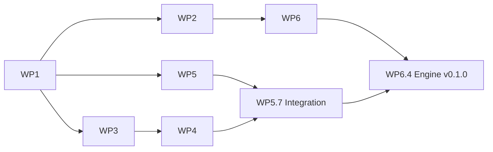

# Plan-0001: Phase P0 — Fundament (Repos, CI, Grimoire-Grundgerüst)

- **Status:** Abgeschlossen (2026-09-15)
- **Datum:** 2026-09-14
- **Autor:** Lupus Malus Deviant (PO) / Claude (Ausarbeitung)
- **Basis-PRD:** [PRD-0002 Grimoire Engine](../prd/0002-grimoire-engine-architektur.md), [PRD-0017 Plattform & CI](../prd/0017-plattform-ci-distribution.md); Phasendefinition: [PRD-0000 §5](../prd/0000-index-fiends-n-patrons.md)
- **Verantwortlich:** Lupus Malus Deviant (PO + Entwickler, mit Coding-Agenten)

> **Zeitmodell-Hinweis:** Das Projekt plant in Phasen statt Kalenderdaten (Register E19).
> Schätzungen sind **fokussierte Arbeitstage** (nicht Kalendertage); Meilensteine sind
> Zustands-Gates ohne Datum.

## Umsetzungsstand

| WP | Stand | Nachweis / Bemerkung |
|----|-------|----------------------|
| WP1 | erledigt | Beide Repos angelegt und gepusht (private GitHub-Repos `LupusMalusDeviant/grimoire` und `LupusMalusDeviant/fiends-n-patrons`); gepinnte Toolchain 1.98.1; Fenster-Bibliothek winit (Engine-ADR-0001); Lizenzentscheid aus WP1.4 nachgetragen am 2026-09-15: Alle Rechte vorbehalten, `LICENSE` und `license-file` in beiden Repos ([ADR-0012](../adr/0012-lizenz-alle-rechte-vorbehalten.md), schließt P0-Rest R-09) |
| WP2 | erledigt, mit Abweichung | Engine-CI grün auf Windows, Linux, macOS (Läufe 34883182308 und 34893513991), Standalone-Gate grün; Spiel-CI vor dem Pin grün (Lauf 34883301947). WP2.4 Branch-Schutz nicht möglich (siehe Abweichungen). Laufzeit: Windows beim ersten Lauf mit kaltem Cache 15:46 min, mit warmem Cache 2,7 min |
| WP3 | erledigt | Desktop- und Headless-Runner, atomares Dateisystem, Monitorwahl und Start ohne Fokus, Drosselung bei minimiertem Fenster, `shutdown` auch bei macOS-`Cmd+Q`; Fenster-Beispiel unter Windows auf Bildschirm 2 geprüft |
| WP4 | erledigt | wgpu-Kontext, instanzierter Sprite-Pass mit einem Draw-Call; Offscreen-Tests rendern in CI auf WARP (Windows), lavapipe (Linux) und Metal (macOS). Der Fensterpfad mit echter GPU ist noch nie gelaufen und wartet auf eine Testsitzung mit dem PO |
| WP5 | erledigt | Eigenes ECS, Fixed-Timestep-Simulation, Seed-RNG, Replays, Snapshots; Determinismus-Gate mit Golden-Hash identisch auf drei Plattformen; Fassade `grimoire` mit `App`, `GamePlugin` und Hauptschleife |
| WP6 | erledigt | OF-2.1 entschieden (Engine-ADR-0004 **akzeptiert** mit CI-Nachweis), OF-2.2 entschieden (Engine-ADR-0006 **akzeptiert**: paralleler Scheduler als erster P1-Schritt; ersetzt das abgelehnte Engine-ADR-0003), OF-17.1 als ADR-0009 (akzeptiert). Release `Grimoire v0.1.0` veröffentlicht (Release-Lauf 34894065040). WP6.4: Engine-Tag `v0.1.0` existiert remote (Commit `93bed40`). WP6.3: Das Spiel pinnt `v0.1.0` über den Git-Tag; Deploy-Key (read-only) und Secret `GRIMOIRE_DEPLOY_KEY` eingerichtet am 2026-09-15; Spiel-CI-Lauf 34903989101 auf `00d6683` grün auf Windows, Linux und macOS, mit Engine-Zugriff über SSH in allen drei Jobs und bestandenem goldenem Endhash (`golden_final_hash_for_seed_42`) auf allen drei Plattformen. |

**Abweichungen vom ursprünglichen Plan**

- Zusätzliche Blatt-Crate `grimoire_core` für stabiles Hashing und deterministische Mathematik (Engine-ADR-0005).
- Beispiele liegen je Crate (`grimoire_platform/examples/window.rs`, `grimoire_render/examples/instancing.rs`, `grimoire/examples/sim_loop.rs`) statt nummeriert in einem Ordner.
- Parallele Arbeitsstränge laufen in temporären Git-Worktrees unter `<Arbeitsordner>\_wt\` und werden nach Review in `main` zusammengeführt.
- Die Umstellung des Spiels auf die Git-Tag-Abhängigkeit (WP6.3) setzt einen remote existierenden Engine-Tag voraus: Cargo lädt die Original-Quelle auch dann, wenn ein lokaler `[patch]` sie ersetzt.
- Der Golden-Run des Spiels (`crates/fnp_sim_harness/tests/determinism.rs`) läuft über 3.600 Ticks (eine Minute der P0-Demo „Beschwörungskreis“), nicht über die 10.000 Ticks aus WP5.6 und den Erfolgskriterien. Das 10.000-Tick-Gate mit Doppellauf gehört zur Engine-Demo-Sim (WP5.6) und liegt im Engine-Repo. Der Spiel-Test prüft zusätzlich die Integration über die Fassade und bleibt kurz, weil er in jedem CI-Lauf auf drei Systemen läuft.
- Die Spiel-CI bricht bei fehlendem Engine-Zugriff ab (außer bei Pull Requests ohne Secrets), statt die Cargo-Schritte mit Warnung zu überspringen (ADR-0009, „Umsetzung“). Der Determinismus-Test läuft zusätzlich im Release-Profil in Nightly und Release.
- WP3.1 nennt die Traits `EventPump` und `RawInputSource`. Umgesetzt wurde stattdessen das Callback-Modell `AppHandler`/`PlatformContext` mit den Enums `PlatformEvent`/`RawInputEvent`, weil winit 0.30 den Event-Loop über `ApplicationHandler` treibt (Engine-ADR-0001).
- WP2.4 Branch-Schutz ist nicht umsetzbar: Die GitHub-API antwortet für beide privaten Repos mit 403 „Upgrade to GitHub Pro or make this repository public“. Ersatzregel bis zur PO-Entscheidung (OP-1): lokale Pflichtprüfungen vor jedem Push und `gh run watch --exit-status` für jeden Push. Derselbe Befund deutet auf den Free-Tarif; ein Engine-Push kostet dort rund 80 abrechenbare Actions-Minuten (macOS zählt zehnfach).
- Der Nightly-Workflow ist noch nie gelaufen; der plattformübergreifende Vergleich im Release-Profil ist deshalb noch nicht belegt. Der Debug-Vergleich läuft in jeder CI.
- *Nachtrag 2026-09-15 (Veröffentlichung):* Beide Repos sind jetzt öffentlich und unter denselben Namen neu angelegt; die bisherigen privaten Repos sind archiviert. Damit sind Rulesets verfügbar (WP2.4): `main` ist in beiden Repos gegen Force-Push und Löschen geschützt, direkte Pushes bleiben erlaubt, Pflicht-Checks gibt es nicht. Die Ersatzregel (lokale Pflichtprüfungen vor jedem Push, `gh run watch --exit-status` für jeden Push) gilt deshalb weiter. Gehostete Standard-Runner verbrauchen keine Actions-Minuten mehr, die Minutenangabe zum Engine-Push oben ist gegenstandslos. Die Spiel-CI holt die Engine anonym über HTTPS; Deploy-Key und Secret aus WP6.3 sind gelöscht, und die Unterscheidung nach vorhandenem Secret entfällt.

## Kontext / Motivation

Nichts existiert: kein Repo, keine CI, keine Zeile Engine. Phase P0 legt das Fundament so, dass
alle späteren Phasen auf verlässlichen Garantien bauen — insbesondere die zwei teuersten
Nachrüst-Eigenschaften: **Determinismus** (ADR-0005) und die **Standalone-Engine-Grenze**
(ADR-0002). Definition of Done aus PRD-0000 §5: *Beide Repos + CI-Matrix grün; Grimoire öffnet
Fenster, rendert instanzierte Sprites, fixed-timestep ECS-Loop mit Determinismus-Test.*
Aufbaustrategie: „Sichtbares zuerst" — parallel dazu die unsichtbaren Garantien als Test-Gates.

## Ziele

- Zwei Repos (`grimoire`, Spiel = `Prototype`) mit grüner CI-Matrix (Win/Mac/Linux) ab dem ersten Push (PRD-0017 FR-01).
- Grimoire öffnet ein Fenster und rendert ≥ 10.000 instanzierte Sprites (wgpu-Pfad steht; Vorstufe zum P1-Bullet-Ziel).
- Fixed-Timestep-Sim-Loop (60 Hz) über eigenem ECS-Grundgerüst mit seedbarem RNG und InputFrame-Konsum (PRD-0002 FR-04/05/08, PRD-0013-Basis).
- Determinismus-Test grün in CI: identischer Zustands-Hash über 10.000 Ticks, Doppellauf, auf allen 3 Plattformen (PRD-0018 FR-04a).
- Die drei P0-pflichtigen offenen Fragen sind per ADR entschieden: f32 vs. Fixed-Point (OF-2.1), Scheduler-Strategie (OF-2.2), Engine-Pin-Mechanik (OF-17.1).

## Arbeitspakete (Workstreams)

### WP1: Repo-Fundament & Projektskelett

**Zweck:** Beide Repos existieren mit Workspace-Struktur, gepinnten Toolchains und Basis-Doku — die Layer-Grenze ist ab Tag 1 physisch.
**Rolle:** PO + Agent
**Schätzung:** S (2 Tage)

**Schritte:**

1. **WP1.1:** Spiel-Repo: `git init` in `Prototype/`, `.gitignore` (Rust + Packs + IDE), bestehende `docs/` committen; GitHub-Remote (privat).
2. **WP1.2:** Engine-Repo `<Arbeitsordner>\grimoire`: Cargo-Workspace mit leeren Crates gemäß Crate-Map (PRD-0000 §4): `grimoire_platform`, `grimoire_gpu`, `grimoire_render`, `grimoire_ecs`, `grimoire_sim`, `grimoire_collide`, `grimoire_audio`, `grimoire_ui`, `grimoire_assets`, `grimoire_sigil`, `grimoire_debug`, `grimoire` (Fassade) — jeweils mit Doc-Stub und Layer-Kommentar; GitHub-Remote (privat).
3. **WP1.3:** Spiel-Workspace: `fnp_app`, `fnp_game`, `fnp_content`, `fnp_sim_harness` als Stubs; Engine-Anbindung zunächst per Pfad-Override (bis WP6.3 die Pin-Mechanik festlegt).
4. **WP1.4:** `rust-toolchain.toml` (beide Repos, identische Version gepinnt), `rustfmt.toml`, `clippy.toml`, README-Stubs, Lizenz-Entscheid (privat/All rights reserved) dokumentiert. *(Nachgetragen am 2026-09-15: Beide Repos werden öffentlich, die Lizenz bleibt „Alle Rechte vorbehalten“; Rechteinhaber Lupus Malus Deviant. Siehe [ADR-0012](../adr/0012-lizenz-alle-rechte-vorbehalten.md).)*
5. **WP1.5:** Entscheid + Kurz-ADR im Engine-Repo: Fenster-/Event-Bibliothek der Plattform-Schicht (Empfehlung: winit — gleiche Begründungslinie wie wgpu, ADR-0003).

**Ergebnis:** Zwei baubare (leere) Workspaces mit Remotes; `cargo build` grün beidseitig; Layer-Struktur sichtbar.

### WP2: CI-Matrix beider Repos

**Zweck:** Jeder Push wird auf 3 Plattformen gebaut und getestet — das Sicherheitsnetz existiert vor dem ersten echten Feature.
**Rolle:** Agent
**Schätzung:** M (4 Tage)

**Schritte:**

1. **WP2.1:** Engine-CI: GitHub Actions Matrix (windows/macos/ubuntu-latest): fmt-Check, `clippy -D warnings`, `cargo test`; Cargo-Cache-Strategie (Ziel < 15 Min, PRD-0017 NFR).
2. **WP2.2:** Spiel-CI: identische Matrix; baut gegen Engine (Pfad-Override bis WP6.3, dann Pin).
3. **WP2.3:** Standalone-Gate: Engine-CI-Job prüft, dass kein `fnp_`-Bezug im Engine-Repo existiert (PRD-0002 FR-01, simpler Grep-Job).
4. **WP2.4:** Branch-Schutz auf main (CI-Pflicht) beide Repos; Conventional-Commit-Konvention in CONTRIBUTING-Stub.

**Ergebnis:** Push ⇒ 3-Plattform-Feedback in < 15 Min; main ist geschützt. (PO-Workflow-Regel: jeder Push wird mit `gh run watch --exit-status` überwacht.)

### WP3: Plattform-Schicht & Fenster

**Zweck:** `grimoire_platform` liefert die ersten Trait-Verträge (Fenster, Ereignis-Loop, Zeitquelle, Roh-Input) plus Desktop-Implementierung — die Interface-First-Probe aufs Exempel.
**Rolle:** Agent + PO-Review der Traits
**Schätzung:** M (4 Tage)

**Schritte:**

1. **WP3.1:** Trait-Verträge: `PlatformWindow`, `EventPump`, `Clock` (Sim nutzt nur Tick-Zähler!), `RawInputSource`, `FileSystem` — inkl. Headless-/Null-Implementierungen (PRD-0002 FR-15/16).
2. **WP3.2:** Desktop-Implementierung über die in WP1.5 entschiedene Bibliothek: Fenster auf Win/Mac/Linux, Event-Loop, sauberes Beenden.
3. **WP3.3:** Beispiel `examples/00_window.rs` im Engine-Repo (lebende Doku, PRD-0002-Akzeptanz).

**Ergebnis:** `cargo run --example 00_window` öffnet auf allen 3 Plattformen ein Fenster; Headless-Variante läuft in CI.

### WP4: GPU-Schicht & instanzierte Sprites

**Zweck:** `grimoire_gpu` kapselt wgpu (ADR-0003), `grimoire_render` rendert das erste Sichtbare: zehntausende instanzierte Quads — der Motivations- und Machbarkeitsbeweis für das Bullet-Ziel.
**Rolle:** Agent
**Schätzung:** M (7 Tage)

**Schritte:**

1. **WP4.1:** `grimoire_gpu`: Device/Queue/Surface-Verwaltung, Shader-Lade-Pfad (WGSL), Buffer-/Texture-Abstraktion — wgpu-Typen bleiben crate-intern (ADR-0003-Kapselung).
2. **WP4.2:** `grimoire_render`: Render-Loop mit Clear + Kamera-Uniform (2D-Ortho vorerst), ein Instanz-Pass für texturierte Quads (SoA-Instanzpuffer, Vorform des Bullet-Renderings PRD-0003 FR-05).
3. **WP4.3:** Beispiel `examples/01_instancing.rs`: 10.000+ bewegte Sprites; FPS-Anzeige im Fenstertitel (Profiler kommt in P1).
4. **WP4.4:** Render-Smoke-Test in CI (headless: Device-Erzeugung + Offscreen-Frame, wo Runner es hergeben; sonst als markierter lokaler Test — Erkenntnis fließt in OF-18.2).

**Ergebnis:** Sichtbarer 10k-Sprite-Schwarm auf allen 3 Plattformen; wgpu vollständig gekapselt.

### WP5: ECS-Kern, Fixed-Timestep & Determinismus-Beweis

**Zweck:** Das Herzstück: eigenes Archetyp-ECS (ADR-0004) + `grimoire_sim` mit Fixed-Timestep, Seed-RNG, InputFrames — und der CI-Beweis der Determinismus-Garantie (ADR-0005).
**Rolle:** Agent + PO-Review der Kern-APIs
**Schätzung:** L (12 Tage)

**Schritte:**

1. **WP5.1:** `grimoire_ecs` v0: Entity-Verwaltung, Archetyp-Speicher, Komponenten-Registrierung, Query-Iteration (deterministisch geordnet), Insert/Remove.
2. **WP5.2:** System-Scheduler v0: explizit geordnete Systemliste, single-threaded (gemäß WP6.2-ADR-Ausgang).
3. **WP5.3:** `grimoire_sim`: Fixed-Timestep-Akkumulator (60 Hz), Tick-Zähler als einzige Sim-Zeit, Interpolations-Alpha für Renderer (PRD-0002 FR-04).
4. **WP5.4:** Seedbares Stream-RNG (pro System ableitbar) + InputFrame-Struktur v0 (Slot-indiziert, serialisierbar; PRD-0013 FR-02) + Bot-Einspeisung für Tests.
5. **WP5.5:** Zustands-Hashing v0 (Welt-Hash pro N Ticks) + ECS-Property-Tests (Insert/Remove/Query-Invarianten).
6. **WP5.6:** **Determinismus-Test (P0-Gate):** Demo-Sim (bewegte Entities + RNG-Nutzung + Bot-Inputs), 10.000 Ticks, Doppellauf-Hash-Vergleich — als CI-Test aller 3 Plattformen; zusätzlich Cross-Plattform-Hash-Vergleich als Nightly-Job (PRD-0018 FR-04).
7. **WP5.7:** Integration: `examples/02_sim_loop.rs` — Fenster + instanzierte Sprites, getrieben von der fixed-timestep Sim mit Interpolation (die drei Schichten arbeiten zusammen).

**Ergebnis:** Der P0-DoD-Kern: sichtbare, deterministische, getestete Sim-Render-Loop.

### WP6: Entscheidungs-Spikes & ADRs

**Zweck:** Die drei als P0-pflichtig markierten offenen Fragen werden mit kleinen Experimenten entschieden und als ADRs fixiert — bevor ihre Antworten teuer werden.
**Rolle:** Agent (Spikes) + PO (Entscheid)
**Schätzung:** M (5 Tage)

**Schritte:**

1. **WP6.1:** Spike OF-2.1: f32-Cross-Plattform-Determinismus — Mini-Sim mit typischen Operationen (Bewegung, Normalisierung, trig) auf Win/Mac/Linux via CI-Artefakt-Vergleich; Ausgang: ADR „f32 mit Disziplin" ODER „Fixed-Point für Sim-Positionen" (Fallback laut ADR-0005: Garantie pro Plattform).
2. **WP6.2:** Kurz-Spike OF-2.2: Scheduler-Strategie — Aufwandsabschätzung parallele Ausführung mit fester Reduktionsreihenfolge vs. single-threaded Start; ADR mit Migrationspfad.
3. **WP6.3:** OF-17.1: Engine-Pin-Mechanik — Test Cargo-git-Dependency mit Tag (+ lokaler `[patch]`-Workflow für Iteration); ADR; Spiel-Repo von Pfad-Override auf ersten Engine-Tag `v0.1.0` umstellen.
4. **WP6.4:** Erster Engine-Release: Tag `v0.1.0` + CHANGELOG-Gerüst (Conventional-Commit-Auswertung, PRD-0017 FR-04).

**Ergebnis:** 3 neue ADRs (Nummern 0009+ im jeweiligen Repo), Engine `v0.1.0` getaggt, Spiel pinnt.

## Abhängigkeiten

| Von | Nach | Typ |
|-----|------|-----|
| WP1 fertig | WP2, WP3 Start | intern |
| WP2 fertig | WP5.6 (CI-Gate), WP6.1 (CI-Artefakte) | intern |
| WP1.5 (Fenster-Lib-ADR) | WP3.2 | intern |
| WP3 fertig | WP4 Start | intern |
| WP5.1–5.5 | WP5.6–5.7 | intern |
| WP6.1-Ausgang | endgültige Zahlentypen in WP5 (ggf. Refactor-Schleife) | intern, risikobehaftet |
| WP6.3 | WP6.4, Spiel-CI final (WP2.2) | intern |
| GitHub-Actions-Verfügbarkeit macOS-Runner | WP2 | extern |

Parallelisierbar: WP2 ∥ WP3/WP4; WP5 (ECS-Kern) ∥ WP4; WP6.1-Spike sollte **früh** neben WP5 laufen (Ergebnis beeinflusst Zahlentypen).

## Risiken & Mitigationen

| # | Risiko | Wahrscheinlichkeit | Impact | Mitigation |
|---|--------|--------------------|--------|------------|
| R1 | f32-Determinismus scheitert plattformübergreifend (WP6.1) und erzwingt Fixed-Point-Refactor in WP5 | mittel | hoch | WP6.1 in der ersten Woche parallel starten; WP5 kapselt Positions-/Vektortypen hinter Typalias (`SimVec`), sodass der Tausch lokal bleibt |
| R2 | Eigenbau-ECS-Fundamentalbugs (Archetyp-Moves, Query-Aliasing) verseuchen alles Spätere | mittel | hoch | Property-Tests ab WP5.1 (nicht nachgelagert); API-Review-Gate durch PO vor WP5.7; bewusst schlanker v0-Funktionsumfang (ADR-0004) |
| R3 | CI-macOS-Runner: Kosten/Limits des GitHub-Plans oder GPU-lose Runner brechen Render-Smoke-Tests | mittel | mittel | WP4.4 headless-tolerant designen (Test skippt mit Warnung statt rot); Runner-Limits in Woche 1 prüfen; Nightly statt per-Push für teure Jobs |
| R4 | Hobby-Zeitbudget: P0 zieht sich, Motivation leidet vor dem ersten Sichtbaren | hoch | mittel | Reihenfolge „Sichtbares zuerst" strikt halten: WP3+WP4 vor WP5-Vollausbau; jedes WP endet mit lauffähigem Beispiel (GIF-Momente als Motivations-Artefakte, PRD-0001) |
| R5 | Scope-Creep: P1-Themen (Toon, Lichter, Sigil) sickern in P0 | hoch | mittel | P0-DoD (PRD-0000 §5) als PR-Checkliste; alles darüber hinaus wandert als Issue ins P1-Backlog statt in den Branch |
| R6 | Fenster-/wgpu-Plattform-Eigenheiten (HiDPI, Wayland, Metal-Surface) kosten unplanbar Zeit | mittel | mittel | Früh auf allen 3 echten Geräten testen (nicht nur CI-Build); bekannte Problemfelder in WP3/WP4 mit Zeitpuffer belegt (Schätzung enthält sie) |
| R7 | Zwei-Repo-Iteration nervt vor Pin-Mechanik (ständige Pfad-Overrides) | niedrig | niedrig | WP6.3 priorisieren, sobald erste Engine-API stabil genug; dokumentierter `[patch]`-Workflow im CONTRIBUTING |

## Meilensteine

- **M1 „Es existiert":** WP1+WP2 fertig — beide Repos remote, CI-Matrix grün auf leeren Workspaces, Branch-Schutz aktiv. *(Nachtrag 2026-09-15: seit der Veröffentlichung Ruleset auf `main` ohne Pflicht-Checks, siehe „Abweichungen“.)*
- **M2 „Es ist sichtbar":** WP3+WP4 fertig — Fenster + 10k instanzierte Sprites auf allen 3 Plattformen (erstes zeigbares GIF).
- **M3 „Es ist deterministisch":** WP5 fertig — Determinismus-Test (Doppellauf, 10k Ticks) grün in CI auf 3 Plattformen; integriertes Beispiel läuft.
- **M4 „Es ist ein Produkt":** WP6 fertig — 3 ADRs entschieden, Engine `v0.1.0` getaggt, Spiel pinnt den Tag. **= P0 Definition of Done.**

## Erfolgskriterien

(aus PRD-0002/0017-Akzeptanzkriterien für P0 übernommen)

- Fenster + instanzierte Sprites + fixed-timestep ECS-Loop laufen auf Win/Mac/Linux (PRD-0002 P0-Abnahme).
- Determinismus-Test: identischer Hash über 10.000 Ticks, Doppellauf, alle 3 Plattformen in CI grün; Cross-Plattform-Vergleich läuft als Nightly (Ergebnis dokumentiert, ggf. Fallback-ADR).
- Engine-Repo baut + testet ohne jede `fnp_*`-Referenz (Standalone-Gate in CI).
- Spiel-Repo baut gegen gepinnten Engine-Tag `v0.1.0`.
- CI-Laufzeit Standard-Push < 15 Min pro Plattform.

## Zeitschätzung (Gesamt)

- **Summe Arbeitspakete:** 34 fokussierte Arbeitstage (WP1: 2, WP2: 4, WP3: 4, WP4: 7, WP5: 12, WP6: 5)
- **Puffer (25% + R1/R2-Reserve):** 10 Tage
- **Gesamt:** ~44 fokussierte Arbeitstage — im Hobby-Rhythmus grob ein Vierteljahr; bewusst ohne Kalender-Zusage (E19)

## Offene Punkte

- **OP-1:** GitHub-Plan des PO: private Repos mit ausreichend Actions-Minuten für macOS-Matrix? In Woche 1 klären (R3). *Geschlossen 2026-09-15:* Beide Repos sind öffentlich; gehostete Standard-Runner verbrauchen auch für die macOS-Matrix keine Actions-Minuten.
- **OP-2:** Namenskonvention der Engine-ADRs: eigener Zähler im `grimoire`-Repo (Empfehlung: ja, `grimoire/docs/adr/0001-…`) — beim ersten WP6-ADR festlegen.
- **OP-3:** Werden WP4-Beispiele schon mit Kamera-Kipp (2.5D-Vorgriff) gebaut oder strikt 2D-ortho? Empfehlung: strikt 2D in P0, Kipp kommt mit Toon-Pass in P1 (R5).

## Referenzen

- [PRD-0000 Index, §5 Phasenplan](../prd/0000-index-fiends-n-patrons.md)
- [PRD-0002 Grimoire Engine](../prd/0002-grimoire-engine-architektur.md) · [PRD-0017 Plattform & CI](../prd/0017-plattform-ci-distribution.md) · [PRD-0018 Teststrategie](../prd/0018-teststrategie.md)
- ADRs: [0002](../adr/0002-engine-eigenes-repo.md), [0003](../adr/0003-wgpu-als-gpu-schicht.md), [0004](../adr/0004-eigenes-ecs.md), [0005](../adr/0005-voll-deterministische-simulation.md)
