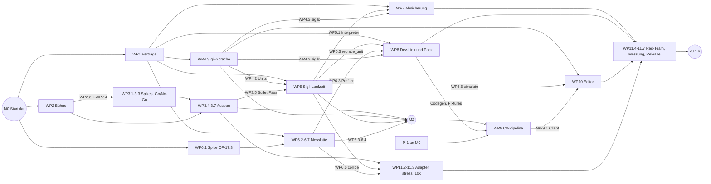

# Plan-0002: Phase P1 — Sichtbarer Kern (PBR-Renderer, 10k-Bullet-Stresstest, Sigil v1)

- **Status:** Entwurf
- **Datum:** 2026-09-14
- **Autor:** Lupus Malus Deviant (PO) / Claude (Ausarbeitung)
- **Basis-PRD:** [PRD-0002 Grimoire Engine](../prd/0002-grimoire-engine-architektur.md), [PRD-0003 Rendering & Art](../prd/0003-rendering-und-art.md), [PRD-0004 Sigil](../prd/0004-sigil-bullet-system.md), [PRD-0016 Tooling-Suite](../prd/0016-tooling-suite.md), [PRD-0017 Plattform & CI](../prd/0017-plattform-ci-distribution.md), [PRD-0018 Teststrategie](../prd/0018-teststrategie.md); Phasendefinition: [PRD-0000 §5](../prd/0000-index-fiends-n-patrons.md)
- **Verantwortlich:** Lupus Malus Deviant (PO + Entwickler, mit Coding-Agenten)
- **Umsetzungsstand:** WP1.0 (paralleler Scheduler) abgeschlossen am 2026-09-15, Engine `v0.1.1`, vom Spiel gepinnt (Nachweise bei WP1.0)
- **Entscheidungen:** Sammelsitzung A, Freigabe WP1.0 und Vertragsfreigabe WP1.2 am 2026-09-15 (vermerkt bei M0, „Offene PO-Entscheidungen“ und „Offene Punkte“; Einzelheiten im [Dossier](0002-sammelsitzung-a-dossier.md) und in der [Vertragsfreigabe](0002-vertragsfreigabe-wp1.2.md))

> **Zeitmodell-Hinweis:** Das Projekt plant in Phasen statt Kalenderdaten (Register E19).
> Schätzungen sind **fokussierte Arbeitstage** (nicht Kalendertage); Meilensteine sind
> Zustands-Gates ohne Datum. Das Entscheidungsregister ist bindend: Wo dieser Plan eine
> Registerentscheidung präzisiert, geschieht das über ein neues ADR (vorgeschlagen, vom PO abzunehmen).

## Kontext / Motivation

P0 legt das Fundament: Grimoire rendert instanzierte Sprites in einem Draw-Call über `Camera2D`,
besitzt ein deterministisches Archetyp-ECS, eine Fixed-Timestep-Simulation mit `SimRng`, `InputLog`,
Replay und goldenem Determinismus-Hash sowie die Fassade `grimoire` mit `App`, `GamePlugin`,
`InputMap` und Hauptschleife. Der goldene Hash **soll** auf Windows, Linux und macOS übereinstimmen —
der Nachweis ist Teil von M0, nicht vorausgesetzt. `grimoire_collide`, `grimoire_sigil`,
`grimoire_assets` und `grimoire_debug` sind Platzhalter; std-Transzendentalfunktionen weichen zwischen
den Plattformen ab, deshalb rechnet die Simulationsseite ausschließlich über `dmath` (Engine-ADR-0004).

Stand 2026-09-15 ist P0 abgeschlossen. Engine-`main` ist gepusht, der Engine-Tag `v0.1.0` existiert
remote (Commit `93bed40`), und Engine-ADR-0004 ist nach einem grünen 3-OS-Lauf akzeptiert. OF-2.2 ist
entschieden: Engine-ADR-0006 (akzeptiert) ersetzt das abgelehnte ADR-0003 durch einen parallelen
Scheduler, dessen Umsetzung als erster P1-Schritt WP1.0 ist. Das Spiel pinnte `v0.1.0` über einen
Git-Tag (ADR-0009) und pinnt seit dem Engine-Upgrade aus WP1.0 den Tag `v0.1.1`; der Spiel-CI-Lauf 34903989101 (Commit `00d6683`) ist auf Windows, Linux und macOS
grün — damals mit Engine-Zugriff über einen Read-only-Deploy-Key und mit identischem goldenem Endhash
des Spiels auf allen drei Plattformen. Von der Eintrittsbedingung M0 ist damit nur noch die
PO-Sammelsitzung A offen. Sammelsitzung A hat am 2026-09-15 stattgefunden; seitdem ist M0 bis auf die vertagte
Referenz-Hardware (P-4a) erreicht.

Seit dem 2026-09-15 sind beide Repos öffentlich (`LupusMalusDeviant/grimoire`,
`LupusMalusDeviant/fiends-n-patrons`). Die Spiel-CI holt die Engine anonym über HTTPS; Deploy-Key und
Secret `GRIMOIRE_DEPLOY_KEY` sind gelöscht. Gehostete Standard-Runner verbrauchen keine
Actions-Minuten mehr (OP-2 geschlossen, R21 entschärft).

Definition of Done aus PRD-0000 §5: *PBR-Renderer + Punktlichter + Kamera; 10k-Bullet-Stresstest
@60 FPS; Sigil v1 (Parser + Interpreter + Hot-Reload via Dev-Link).* Dazu kommen die P1-Abnahmen
der Sub-PRDs (Budgets und Stats-Overlay, Stilbibel, Referenz-Patterns, Asset-Compiler v1,
Live-Link-Basis, Sigil-Editor-MVP, Benchmark-Trend, Asset-Compiler-Gate, Sim-Harness v1, erste
Golden Master) und neun für P1 terminierte offene Fragen. Aufbaustrategie wie in P0: **„Sichtbares
zuerst“** — jeder Meilenstein liefert ein zeigbares Offscreen-Artefakt aus dem CI —, während die
unsichtbaren Garantien (Determinismus, Budgets, Verträge) ab dem ersten Commit als Test-Gates
mitlaufen und nicht am Ende nachgerüstet werden. Die stränge-übergreifenden Schnittstellen werden
zuerst als kompilierende Verträge mit Konformanztests geschnitten (Interface-First), die teuersten
Render-Unbekannten vor dem Ausbau per Spike mit Go/No-Go entschärft.

## Ziele

- **2.5D-Bühne mit realistischem 3D-Look:** gekippte Perspektivkamera (Neigung 60–75° konfigurierbar, Following eines Spieler-Proxys mit Look-Ahead, nur renderseitig), Mesh-Pass mit Tiefenpuffer, PBR-Shading (GGX, Metallic-Roughness) mit Schatten nach OF-3.2 und Kantenglättung für Glanzlichter (PRD-0003 FR-01/FR-03, [ADR-0014](../adr/0014-realistischer-3d-look-statt-toon.md)).
- **Licht und Bullet-Ebene:** Clustered Forward+ mit ≥ 256 aktiven Punktlichtern in Sicht; Telegraphie (Ebene 4) und Bullets (Ebene 6) strukturell nach dem (in P1 leeren) Post-FX-Resolve-Slot gezeichnet; Bullets per GPU-Instancing für 10.000+ Instanzen; Visuals ausschließlich aus Sigil-Metadaten (PRD-0003 FR-02/FR-05/FR-10, E18).
- **Sigil v1:** Parser mit präzisen Diagnosen, statische Validierung, plattformunabhängig byte-identisches Binärformat v1, deterministischer SoA-Interpreter mit allen 7 Bausteinen, stapelbaren Modifikatoren, Transformationen, Flags als Daten, Visual-Metadaten, typfilterbarem Bullet-Clear in ≤ 1 Tick und Hot-Swap (PRD-0004 FR-01–FR-06, FR-08, FR-09, FR-12; FR-10 minimal).
- **10k-Stresstest hält die Budgets** auf der Referenz-Hardware: Sim gesamt ≤ 4 ms (Bullets ≤ 1,0 ms, Kollision ≤ 1,5 ms bei 10k Bullets + 100 Gegnern), Render-Extraktion ≤ 0,5 ms, Render-CPU ≤ 3 ms, GPU-Frame ≤ 8 ms, stabile 60 FPS; sichtbar im Stats-Overlay, CPU-Anteile als CI-Trend (PRD-0002 NFR und P1-Abnahme, PRD-0004 NFR).
- **Hot-Reload über den Dev-Link** Ende-zu-Ende: Speichern einer `.sigil`-Datei ändert das Pattern in der laufenden Engine an einer Tick-Grenze — nachweisbar ohne C#-Suite (Rust-CLI `grimoire-link`) und mit ihr (Asset-Compiler-Watch, Sigil-Editor); Roundtrip gemessen.
- **Tooling-Basis nach PRD-0016 P1:** Asset-Compiler v1 (Sigil + Packs + Manifest) als CI-Gate, Live-Link-Basis (Stats, Hot-Swap) mit C#-Client aus generiertem Schema, Sigil-Editor-MVP mit Vorschau.
- **Qualitäts-Gates nach PRD-0017/0018 P1:** Benchmark-Jobs mit Trend und nachweislich scharfem > 10 %-Regressions-Gate, Sim-Harness v1 (Szenen) auf eigenem Spiel-Content, erste Golden Master mit Ein-Kommando-Erneuerung und Diff-Report, Render-Testszenen über den Software-Adapter.
- **Alle P1-terminierten offenen Fragen entschieden:** OF-3.2, OF-3.3, OF-3.5 (OF-3.1 entfällt mit [ADR-0014](../adr/0014-realistischer-3d-look-statt-toon.md)), OF-4.1, OF-4.2, OF-16.2, OF-17.3, OF-18.1, OF-18.2 — dazu die PO-Entscheidung OF-16.1 (an M0).
- **Release:** Engine-Abschlussversion als weitere Patch-Version `v0.1.x` getaggt (additive API-Erweiterung, CHANGELOG; P-7), das Spiel pinnt den Tag (ADR-0009); jeder CI-Lauf beider Repos bis zum Ende überwacht.

## Umfang und Nachverfolgung der P1-Anforderungen

Jede für P1 relevante Anforderung ist hier einem Schritt zugeordnet oder mit Begründung verschoben.
Verschieben heißt nach E20 „in eine spätere Phase“, nie „gestrichen“.

### In P1 umgesetzt

| Quelle | Anforderung | Umsetzung |
|--------|-------------|-----------|
| PRD-0000 §5 | PBR-Renderer + Punktlichter + Kamera | WP2, WP3 |
| PRD-0000 §5 | 10k-Bullet-Stresstest @60 FPS | WP11.2, WP11.3, WP11.5 |
| PRD-0000 §5 | Sigil v1: Parser + Interpreter + Hot-Reload via Dev-Link | WP4, WP5, WP8.4, WP8.5, WP11.4 |
| PRD-0002 FR-02 | Verträge als Traits, Konsumenten hängen nur an Traits | WP1.2 (Trait-Entscheid je neuem Subsystem: `CollisionQuery`, `AssetSource`, `DebugTransport`, Renderer-Erweiterung; begründete Abweichung für ECS-Ressourcen wie `BulletPool`), WP1.3 |
| PRD-0002 FR-03 | Layer-Regel vom Compiler erzwungen | WP1.3 (Engine-ADR „Crate-Map-Erweiterung P1“ mit allen neuen Kanten) |
| PRD-0002 FR-06 (Teil) | Snapshot-Fähigkeit bleibt mit Bullets erhalten | WP5.1 (Roundtrip-Test mit aktiven Bullets), WP5.5 (Restore über fremde Content-Epoche abgewiesen) |
| PRD-0002 FR-07 | Replays bit-identisch, Golden-Master-Basis | WP7.1 (Replay-Format v2), WP7.5 |
| PRD-0002 FR-09 | Kollision: Kreis/Kapsel, Spatial Grid, Layer-Masken, Graze-Ring-Query | WP6.5 (collide v0, PO-Entscheid P-3), Anbindung Bullets→Grid in WP11.2 |
| PRD-0002 FR-10 | Pack-Loader + Hot-Swap-Kanal | WP8.3, WP8.4 |
| PRD-0002 FR-11 (Teil) | Versioniertes IPC: Stats, Asset-/Sigil-Hot-Swap, Sigil-Live-Preview | WP8.1, WP8.2, WP8.4 |
| PRD-0002 FR-12 | Profiler je Subsystem, Stats-Overlay in jedem Build | WP6.3, WP6.4 |
| PRD-0002 FR-15 | Null-/Headless-Implementierungen für neue Verträge | WP1.3 (Null-Implementierung je Trait-Vertrag) |
| PRD-0002 NFR / P1-Abnahme | Budgets im Stresstest, Overlay-Werte, CI-Trend | WP6.2, WP6.7, WP11.3, WP11.5 |
| PRD-0002 Akzeptanz | Snapshot-Roundtrip bit-identisch; Beispiele je Subsystem | WP5.1; Beispiele (in CI nur gebaut): `pbr_stage` (WP2.8), `lights_stage` (WP3.7), `sigil_curtain` (WP5.7), `profiler_dump` (WP6.3, Konsole), `collide_query` (WP6.5, Konsole), `pack_inspect` (WP8.3, Konsole), `stress_10k` (WP11.3) |
| PRD-0003 FR-01/02/03 | PBR-Pass + Schatten, ≥ 256 Lichter, gekippte Kamera | WP2.3–WP2.6, WP3.4 |
| PRD-0003 FR-05 | GPU-Instancing 10k+ Bullets, Visuals aus Sigil-Metadaten (Form, Palette, Glow) | WP3.5, WP5.3, WP11.2 |
| PRD-0003 FR-10 | Lesbarkeits-Regeln 1, 3, 4 strukturell | Regel 1: WP3.5 (Telegraphie und Bullets nach Post-FX-Resolve, Strukturtest für Ebene 4 und 6); Regel 3: WP4.2 (Validator: Bullet-Typen einer Unit unterscheiden sich in der Silhouette); Regel 4: WP1.2 + WP3.5 (Palettenraum-ID in `BulletInstance`, Bullet-Pass weist fremde Palettenräume ab); Stilbibel WP2.7 |
| PRD-0003 FR-11 (Vorstufe) | Lichtbudget skalierbar (Low 32 / High 256) | WP3.4 |
| PRD-0003 FR-14 | Deterministische Render-Testszenen (Materialien, Schatten, Lichter, Bullets) | WP2.8, WP3.6 |
| PRD-0003 NFR | Stilbibel `docs/art/stilbibel.md` v0 | WP2.7 |
| PRD-0004 FR-01–06, 08, 09, 12 | Bausteine, Modifikatoren, Transformationen, Flags (als Daten), Visuals, SoA + 2.000 Spawns und Despawns/Tick, Validierung, Hot-Swap, Clear ≤ 1 Tick | WP4.1–WP4.3, WP5.1–WP5.5 |
| PRD-0004 FR-07 (Teil) | Bullets in der Broadphase, Graze-Ring-Query | WP6.5, WP11.2 |
| PRD-0004 FR-10 (Should, minimal) | `BulletBehavior`-Registry, namentlich referenzierbar, zustandslos | WP5.2 |
| PRD-0004 NFR | 1,0 ms Bullets, 0,5 ms Extraktion; Determinismus; `docs/formats/sigil.md` | WP5.4, WP5.3, WP5.1 + WP4.4, WP4.1 |
| PRD-0004 Akzeptanz | Benchmark „Vollvorhang“ mit Trend; Referenz-Patterns als Golden Master | WP6.2, WP6.6, WP4.5, WP5.7, WP7.5 |
| PRD-0016 FR-01/02 | Asset-Compiler v1 (Sigil + Packs), präzise Fehler, CI-Exit-Codes | WP9.2 |
| PRD-0016 FR-03 | Live-Link-Client-Bibliothek C# (typisiert, Reconnect) aus generiertem Schema | WP8.1, WP9.1 |
| PRD-0016 FR-04 (Teil) | Sigil-Editor: Text-Ansicht, Parameter-Panel, Vorschau, Validierung, Hot-Swap | WP10 |
| PRD-0016 FR-10 (Teil) | Formatdoku Sigil, Pack, Debug-Protokoll | WP4.1, WP8.3, WP8.2 |
| PRD-0016 NFR | Link-Abriss crasht nichts; Roundtrip und Pack-Rebuild gemessen; CLI-Äquivalent je Editor-Funktion; gepinnte .NET-Version | WP8.4, WP8.5, WP10.5, WP9.2, WP4.3 + WP5.6, WP9.1 |
| PRD-0017 FR-02 (Teil) | Asset-Compiler-Gate, Headless-Sim-Tests, Golden-Master-Vergleich in der Spiel-CI | WP9.3, WP7.4, WP7.5 |
| PRD-0017 FR-03 (Teil) | Benchmark-Jobs (Linux): Bullet-Stress, Kollision, Trend, Gate > 10 % | WP6.1, WP6.2, WP6.5, WP6.6 |
| PRD-0017 FR-04 | Engine-Release mit Changelog, Spiel pinnt Tag | WP11.1 (Patch-Tags `v0.1.x`), WP11.7 |
| PRD-0017 FR-07 (Teil) | Build-Metadaten (git-Hash, Engine-Pin) im Replay-Header | WP7.1 |
| PRD-0017 NFR | CI < 15 Min pro Plattform in beiden Repos, CI-Überwachung, gepinnte Toolchains | WP9.3 (Spiel-CI), WP11.1 (Engine-CI), Abschnitt Arbeitsorganisation |
| PRD-0018 FR-01 | Tests gegen Verträge, Mocks für alle neuen Subsysteme | WP1.3, in jedem WP |
| PRD-0018 FR-02 | Sim-Harness v1 (Szenen) | WP7.4 |
| PRD-0018 FR-03 (Teil) | Bot-Profile „Idle“ und „Zufalls-Dodger“ (über den Spieler-Proxy) | WP1.3, WP7.4 |
| PRD-0018 FR-04 a/b/c (Teil) | Doppellauf pro Push, 3-OS-Vergleich, Snapshot-Roundtrip mit Bullets | WP5.1, WP7.5 |
| PRD-0018 FR-05 | Golden-Master-Verwaltung mit Diff-Report | WP7.5 |
| PRD-0018 FR-09 | Determinismus-Lints auch für `sigil`, `collide` und den Compiler `sigilc` | WP1.3, WP5.1, WP6.5 |
| PRD-0018 FR-10 (Could, leicht) | Fuzz-/Property-Sweep über Sigil-Quellen, Packs, IPC-Frames | WP11.4 |
| PRD-0018 NFR | Headless-Suite < 5 Min; Diagnose erster Tick + Subsystem | WP7.4, WP7.2 |
| OF-3.2 / 3.3 / 3.5 | Schatten, Bullet-Darstellung, Glanzlicht-Kantenglättung (OF-3.1 entfällt, OF-3.4 Texturformat in P2; [ADR-0014](../adr/0014-realistischer-3d-look-statt-toon.md)) | WP2.6, WP3.2, WP2.5 |
| OF-4.1 / 4.2 | Sigil-Syntax, f32 vs. Fixed-Point | WP1.4 |
| OF-16.1 / 16.2 | Repo-Ort Suite (PO, an M0), Schema-Codegen | WP1.6, WP1.5 + WP8.1 |
| OF-17.3 | Benchmark-Stabilität | WP6.1 |
| OF-18.1 / 18.2 | Subsystem-Hash-Granularität, Snapshot-Referenzen je Treiberfamilie | WP7.2, WP2.1 + WP3.6 |

### Bewusst verschoben

| Quelle | Anforderung | Ziel-Phase | Begründung |
|--------|-------------|------------|------------|
| PRD-0002 FR-06 (Ringpuffer) | Rewind-Ringpuffer der letzten N Sekunden; Restore über Content-Epochen hinweg | P2 | Konsument (Rewind-Item) und Snapshot-Format-Spike OF-2.3 liegen in P2; P1 weist Restore mit fremder Content-Epoche ab (WP5.5) |
| PRD-0002 FR-11 (Rest) | Entity-Inspektion, Replay-Steuerung über IPC | P2/P3 | Konsumenten (Balancing-Dashboard P2, Replay-Viewer ab P3) fehlen; Nachrichten-IDs in Protokoll v1 reserviert |
| PRD-0002 FR-13 | Spiel-UI `grimoire_ui` | P2 | PRD-0000 §5; P1 braucht nur das Debug-Overlay |
| PRD-0002 FR-18 / PRD-0003 FR-11 (voll) | Live-Reconfigure, vollständige Grafik-Presets | P2/P3 | Presets skalieren Partikel und Post-FX, die in P1 nicht existieren; P1 liefert nur das Lichtbudget |
| PRD-0002 NFR Audio | Audio-Mix ≤ 1 ms | P2 | Audio-Subsystem ab P2 |
| PRD-0003 Ziel „Bullets als Lichtquellen“ | Glow-Vorhang: ausgewählte Bullet-Typen speisen Punktlichter ein | P2 (Game-Feel) | Kein P1-FR; belastet das ohnehin kritische GPU-Budget (R2); Glow als Instanz-Visual nach FR-05 bleibt P1 |
| PRD-0003 FR-04 | Kamera-Rail für Skript-Momente | P3 | Erster Konsument ist das Boss-Intro im Vertical Slice |
| PRD-0003 FR-06/07/08 | GPU-Partikel, Post-FX-Stack, Screen-Feedback | P2 (Game-Feel) ff. | PRD-0000 §5 ordnet Game-Feel P2 zu; Post-FX-Resolve-Slot existiert in P1 leer, damit FR-10 strukturell gilt |
| PRD-0003 FR-09 | Verwandlungs-Shader | P4 | Mutations-Events sind P4 |
| PRD-0003 FR-10 Regel 2 (Messung) | Kontrast ≥ 4,5:1 prüfbar | P3 | Kontrast-Checker und Lesbarkeits-Audit sind P3-Akzeptanz; strukturell sind Ebene 4 und 6 schon in P1 unberührt |
| PRD-0003 FR-12 | Fotosensitivitäts-Modus | P5 | A11y-Optionen sind P5; P1 enthält keine Blitzeffekte |
| PRD-0003 FR-13 | glTF-Modelle aus Blender, Mesh-Chunks im Pack | P3 | Blender-Pipeline P3 (OF-16.3 in P2); P1 nutzt prozedurale Testmeshes, Mesh-Chunk-Typ nur reserviert |
| PRD-0003 NFR (Vollszene) | 100k Partikel + Post-Stack im GPU-Budget | P2/P3 | Features fehlen; P1 misst 10k Bullets + 256 Lichter |
| PRD-0004 FR-04 (Wirkung) | Gameplay-Wirkung der Flags | P2 | Melee, Parade, Graze-Ökonomie sind P2; Flags werden in P1 geparst, gespeichert, gehasht |
| PRD-0004 FR-07 (Rest) | Melee-Parade-Bogen-Query | P2 | Semantik des Bogens hängt am Melee-Kit (PRD-0005, P2) |
| PRD-0004 FR-11 | Pattern-Metadaten für Director/Dashboard | P3 | Konsument Director light im Vertical Slice |
| PRD-0004 Zeitbasis Beats | Timings in Beats | P2 | Beat-Clock kommt mit Audio; Einheit im Format reserviert, Validator lehnt sie in v1 ab |
| PRD-0004 Akzeptanz (Rest) | Referenz-Patterns 13–20 | P2 | P1 liefert ≥ 12 mit voller Baustein-/Modifikator-/Transformations-Abdeckung (PO-Entscheid P-5) |
| PRD-0004/0016 Roundtrip < 1 s | Formales Gate | P2 | PRD-0004 terminiert das Gate auf P2; in P1 gemessen und protokolliert |
| PRD-0016 FR-04 (Rest) | Visuelles Komponieren (Knoten), tool-interne Canvas-Sim | P2 bzw. ersetzt | Knoten-Editor nach E20 in P2; Vorschau über den Rust-Interpreter statt eigener C#-Sim (ADR-0010, Abweichung per ADR) |
| PRD-0016 FR-01 (Rest) | Weitere Quelltypen (Templates, Tuning, Texte, Rezepte) | P2/P3 | Deren Formate entstehen erst mit ihren Features |
| PRD-0016 FR-11 | Launch-Profil „Engine mit einem Klick“ | P2 | Should; würde Fenster auf dem Entwicklungsrechner öffnen — erst mit geklärter Messsitzungs-Praxis |
| PRD-0017 FR-03 (Rest) | Boss-Worst-Case-Benchmark | P3 | Erster Boss im Vertical Slice |
| PRD-0017 FR-05/06/08/09 | Spiel-Releases, Nightly-Binaries, Crash-Handling, macOS-Signierung; Veröffentlichung von Werkzeug-Binaries am Engine-Release | P3 | PRD-0017 P3-Akzeptanz; der Engine-Release bleibt in P1 „nur Quelltext“ (PO-Entscheid P-14) |
| PRD-0018 FR-03 (Rest) | Bots „Radius-Grazer“, „Aggressiver Parierer“, „Pattern-Kenner“ | P2/P3 | Brauchen Graze/Parade (P2) bzw. OF-18.3 (P3) |
| PRD-0018 FR-04c (Suspend) | Suspend-Roundtrip | P3 | Saves sind P3 |
| PRD-0018 FR-06 (Gate) | Render-Snapshot-Suite als verbindliches Gate aller Plattformen, inklusive Metal-Nachweis auf macOS | P3 | PRD-0018 P3-Akzeptanz; P1 liefert Szenen, Referenzen und OF-18.2-Befund, blockierend nur wo belegt stabil (WP3.6) |
| PRD-0018 FR-07/08 | Crash-Injection, Balancing-Reports | P3/P5 | Persistenz P3, Balancing P5; Harness-JSON ist die Vorstufe |

## Arbeitspakete (Workstreams)

Elf Pakete liegen über dem Richtwert von 3–7. Das ist bewusst: P1 bündelt sechs Sub-PRDs, zwei Repos
und zwei Sprachen, und jedes Paket entspricht genau einem Agenten-Strang mit eigenem Worktree — der
Schnitt folgt den Strängen, nicht den Themen. Die Meilensteine M0–M4 halten die Pakete zusammen.

### WP1: Verträge & Weichenstellungen

**Zweck:** Der parallele Scheduler nach Engine-ADR-0006 ist gemergt und per Hash-Gate freigegeben, bevor Stränge Simulationssysteme schreiben; die stränge-übergreifenden Schnittstellen stehen als kompilierende Verträge mit Konformanztests, und die sprachprägenden Entscheidungen sind gefallen, bevor Sigil, Messung, Pipeline und Tooling parallel loslaufen.
**Rolle:** Architektur-Agent (Strang Verträge, Autor) + separater Review-Agent (adversarial) + PO (Freigabe der Kern-APIs und Entscheidungen)
**Schätzung:** L (16 Tage, davon 6 für WP1.0)

**Schritte:**

0. **WP1.0:** Paralleler Scheduler nach Engine-ADR-0006 als erster P1-Schritt, vor dem Start der Pakete mit Simulationssystemen (Timebox 6 Tage, Worktree `p1-scheduler`): Vertrags-PR für `crate-vertraege.md` §3/§7/§8 (Zugriffsdeklaration, Stufenbildung, Befehlspuffer pro System, `Executor`-Trait mit sequentieller Implementierung, datenparallele Queries in festen Blöcken, Zufallsströme je System und Block, Thread-Anzahl in der Fassade); rayon-Executor in eigener Crate außerhalb der Determinismus-Menge und CI-Prüfung, dass keine Determinismus-Crate von rayon abhängt; Debug-Prüfung der Deklarationen und Test-Executor mit permutierter Aufgabenreihenfolge; Hash-Gate mit 1, 2 und N Threads auf 3 OS über die Engine-Goldens und die Spiel-Harness, P0-Goldens unverändert; Benches mit 1 und N Threads; Release `v0.1.1` nach dem Release-Ablauf (WP11.1, P-7), das Spiel hebt den Pin. **Freigegeben (PO, 2026-09-15):** Merge nach grüner 3-OS-CI und Tag `v0.1.1`; Blockgröße 1024 vorläufig bis zum P1-Benchmark, Executor an der Welt, strenge Abhängigkeitsregel (auch keine Dev-Abhängigkeiten der Determinismus-Crates auf rayon oder `grimoire_exec`). WP1.1–WP1.7, WP2 und WP6.1 laufen parallel. **Erledigt (2026-09-15):** Engine-PR #1 als Merge-Commit `8eea39f` gemergt, nachdem der Pull-Request-CI-Lauf 34970030661 auf Windows, Linux und macOS grün war, einschließlich Thread-Hash-Gate (`grimoire_exec` `tests/hash_gate.rs` mit 1, 2 und N Threads) und der Prüfung, dass keine Determinismus-Crate von rayon abhängt; Push-CI auf `main` für den Merge: Lauf 34970424825, grün. Release-Commit `cee0308` „chore(release): v0.1.1“ (CI-Lauf 34975697800 grün), annotierter Tag `v0.1.1` auf `cee0308`, Release-Lauf 34976051627 grün, GitHub-Release [„Grimoire v0.1.1“](https://github.com/LupusMalusDeviant/grimoire/releases/tag/v0.1.1) veröffentlicht. Spiel: `3df1cb9` hebt den Pin auf `v0.1.1`, `95ba4b3` ergänzt den Harness-Test `golden_final_hash_for_seed_42_with_1_2_and_n_threads` (`grimoire_exec::gate_executors`: 1, 2 und 4 Threads; goldener Hash `0x5270_20ae_cf76_4ca7` unverändert, jeder Checkpoint gleich dem sequentiellen Lauf); Spiel-CI-Lauf 34976845473 auf allen drei OS grün, Engine anonym abgerufen. Damit ist Baustein 7 von Engine-ADR-0006 auf beiden Seiten erfüllt.
1. **WP1.1:** Eintritts-Check als Gate M0 dokumentieren (Bedingungen siehe M0); P0-Reste als P1-Backlog-Issues. Worktree-Konvention `<Arbeitsordner>\_wt\p1-<strang>`.
2. **WP1.2:** P1-Teil in `grimoire/docs/architektur/crate-vertraege.md` als Vertrags-PR:
   - **Trait-Entscheid je neuem Subsystem (PRD-0002 FR-02):** `CollisionQuery` (Grid als Implementierung, Null liefert leere Ergebnisse), `AssetSource` (`PackReader` und In-Memory-Quelle), `DebugTransport` (In-Process und TCP), Erweiterung des bestehenden Renderer-Traits um Mesh-, Licht- und Bullet-Kanäle. Begründete Abweichung: ECS-Ressourcen (`BulletPool`, `SpatialGrid`-Zustand) bleiben konkrete `Clone + StableHash`-Typen, weil Trait-Objekte weder hash- noch snapshotbar sind; Konsumenten greifen darauf nur über Systeme der Fassade zu.
   - **Sigil↔Render:** `BulletInstance` (Silhouette, Palette, **Palettenraum-ID**, Glow, Radius, interpolierbare Position) — **einziger Eigentümer ist dieser Vertrag**, WP2.2 konsumiert ihn nur; Anpassungen nach den Render-Spikes (WP3.2) ausschließlich per Vertrags-PR (WP1.7). Feste Ebenenreihenfolge nach WP3.5. Sigil liefert neutrale Visual-IDs, die Fassade bildet sie ab — `grimoire_render` kennt `grimoire_sigil` nicht.
   - **Sigil-Laufzeit:** `SigilUnit` (Binärformat v1 mit Magic, Version, Content-Hash), `BulletPool` als SoA-Ressource (`Clone + StableHash`, FIFO-Free-List wie der ECS-Allokator), Spawn-/Despawn-/Clear-API, `replace_unit`; `BulletBehavior`-Registry **außerhalb** der Welt, referenziert per stabiler ID. Behaviors sind **reine Funktionen** ohne eigenen Zustand; jeder Zustand liegt im Pool (Vertrag §8: simulationsrelevanter Zustand nur in der Welt); die Registry ist nach dem Start unveränderlich, ihre ID-Liste und Version fließen in den Content-Manifest-Hash.
   - **Hot-Swap-Semantik:** Anwendung nur an Tick-Grenzen, Content-Epoche fließt in den Zustands-Hash, Sessions mit Swap sind im Replay-Header als nicht golden markiert. Ein Snapshot mit anderer Content-Epoche als die geladene Unit wird beim Restore mit Fehler abgewiesen (kein stilles Weiterlaufen mit der neuen Unit).
   - **Replay-Format v2:** Header mit Engine-Version, Engine-Build-Hash (git), Content-Manifest-Hash, Swap-Markierung und einem Anwendungs-Metadatenblock, in den das Spiel Spielversion, Spiel-git-Hash und Engine-Pin schreibt (PRD-0017 FR-07); v1 bleibt lesbar.
   - **Pack-Format v1**, **Debug-Protokoll-v1**-Nachrichtenkatalog (Hello, Stats, SwapSigilUnit, SwapAck, SigilPreview, Error, Log; IDs für Entity-Inspektion und Replay-Steuerung reserviert).
   - **Profiler-Hook:** additiver Beobachter im `Schedule` (`SystemObserver`); Uhrzugriff, Anbindung an `grimoire_debug` und Overlay-Zeichnen über den Sprite-Pass liegen **in der Fassade**, damit `grimoire_debug` ohne Kanten zu `grimoire_ecs` und `grimoire_render` bleibt.
   - **Spieler-Proxy und Mauszielen (schließt OP-4):** minimaler, spielneutraler Spieler-Proxy in der Fassade hinter dem Cargo-Feature `fixtures` (nicht Default): Entity mit Position, deterministische Bewegung aus den Achsen 0/1 mit fester Geschwindigkeit, schreibt die Ziel-Ressource für `Aimed`, ist Folgeziel der Kamera und Zentrum des Graze-Rings. Die Zielrichtung wird einmal pro Frame relativ zur interpolierten Proxy-Position über `screen_to_ground` abgetastet und als `i16` in die `InputFrame`-Achsen 2/3 quantisiert; die Sim liest nie Kamerazustand. Das Spiel ersetzt den Proxy in P2 durch das Combat-Kit.
   - **Kollision v0** (Signaturen): Kreis/Kapsel, `SpatialGrid` mit deterministischer Ergebnisreihenfolge, `LayerMask`, `graze_ring`.
   - **Bench/Harness:** JSON-Ergebnisschema {Szenario, Metrik, Einheit, Median, Samples, Commit, Runner}; im Spiel-Repo Trait-Verträge `Scene`, `BotProfile`, `HarnessReport`; Golden-Master-Dateiformat mit Platz für Subsystem-Hashes.
3. **WP1.3:** Vertrags-Skelette als kompilierende Typen: für jeden Trait-Vertrag eine Null-Implementierung (kein `todo!()`) und ein Konformanztest, der gegen die Null-Implementierung grün ist und später gegen die echte laufen muss; für konkrete Typen (`BulletPool`, `PackReader`, Replay v2) Verhaltens-Vertragstests an der öffentlichen API. Einzige echte Implementierung in WP1 ist der **Spieler-Proxy** (klein, aber Voraussetzung für Kamera, `Aimed`, Graze und Bots). Engine-ADR „Crate-Map-Erweiterung P1“ mit allen neuen Kanten: `grimoire_sigil → grimoire_ecs` (Pool als Ressource); `grimoire_sigilc` (Compiler + CLI `sigilc`, nicht im Laufzeitpfad, → `grimoire_sigil`, `grimoire_core`) **in der Determinismus-Menge** mit identischer `clippy.toml` (dann sieben identische Dateien, Vertrag §3 anpassen), weil seine Ausgabe in Content-Hash, Golden Master und Replays eingeht; `grimoire_bench` (Nicht-Sim-Crate, weil die Uhr- und Thread-Sperren der Sim-Crates auch für `--all-targets` gelten); `grimoire_link` (CLI `grimoire-link`, → `grimoire_debug`, `grimoire_sigilc`). Hinweis: Docs-only-Commits lösen wegen `paths-ignore` keinen CI-Lauf aus — Vertragsdokument und Skelette landen im selben PR.
4. **WP1.4:** Spike OF-4.1 (Timebox 2 Tage): 5 Patterns in RON und eigener Grammatik, darunter zwei komplexe (Sub-Emitter-Kaskade, gespiegelte Spirale mit Tempokurve); Korpus aus 10 typischen Fehlern mit Meldungsvergleich (Datei, Zeile, Spalte, Ursache, Fix-Hinweis); Kriterien Editier-Ergonomie, Text↔Parameter-Roundtrip (inklusive gezieltem Setzen eines Werts an einem Knotenpfad ohne Kommentarverlust) und Generierbarkeit durch Agenten. → Engine-ADR „Sigil-Quelltextsyntax v1“ mit Versions-Header `sigil 1` und Migrationsregel; OF-4.2 dort per Verweis auf Engine-ADR-0004 geschlossen (f32 über `dmath`, `SimVec`-Fallback bleibt offen).
5. **WP1.5:** Projekt-ADR (voraussichtlich 0010, Vorschlag) „Sigil-Compiler-Hoheit“: Rust (`grimoire_sigilc`) ist die einzige Implementierung von Parser, Validator und Compiler; die Engine-Laufzeit lädt nur Binär-Units (ADR-0007-Grundsatz „Parser nicht im Laufzeitpfad“ bleibt gewahrt); der C#-Asset-Compiler orchestriert und ruft `sigilc` per CLI/JSON; die Editor-Vorschau nutzt `sigilc simulate` statt einer C#-Canvas-Sim (Abweichung vom Wortlaut PRD-0016 FR-04). Projekt-ADR (voraussichtlich 0011, Vorschlag) zu OF-16.2: Schema-Codegen aus einer Quelle für Rust und C# (Debug-Nachrichten, Pack-Manifest); Umsetzung in WP8.1. Nummern final beim Merge.
6. **WP1.6:** PO-Entscheidungen gebündelt statt einzeln einholen: **Sammelsitzung A an M0** (P-1, P-3 bis P-9, P-13, P-14) und **Sammelsitzung B am Ende von WP1** (P-2 mit ADR-0010-Entwurf, P-10 für Syntax- und Codegen-ADR); Ergebnisse im Abschnitt „Offene PO-Entscheidungen“. Pin-Politik für P1 (P-7, entschieden 2026-09-15): Patch-Versionen `v0.1.x` — `v0.1.1` für WP1.0, je Meilenstein eine weitere Patch-Version —, das Spiel pinnt diese Tags statt eines lokalen `[patch]` in parallelen Worktrees (`--locked`-Falle aus ADR-0009); Merge-Reihenfolge an der Fassade je Meilenstein festlegen.
7. **WP1.7:** Vertragsänderungs-Protokoll festschreiben: Änderungen an gemergten Verträgen nur per Vertrags-PR mit angepasstem Konformanztest und Hinweis an alle betroffenen Stränge. Gate: adversarialer Review des Vertrags-PR (sucht Mehrdeutigkeiten, Layer-Verstöße, Determinismus-Lücken, zustandsbehaftete Behaviors, Panics bei fehlerhaften Eingaben), PO-Freigabe, CI auf 3 OS grün und überwacht. **Vertragsfreigabe (PO, 2026-09-15):** V-1 bis V-20 wie empfohlen, die übrigen vorläufigen Entscheidungen im Ganzen übernommen (V-21); gemergt wird erst nach dem adversarialen Review und grüner, überwachter 3-OS-CI ([Vertragsfreigabe](0002-vertragsfreigabe-wp1.2.md)). **Erledigt (2026-09-15):** Engine-PR #2 als Merge-Commit `55b866f` gemergt. Vorher ist `main` in den Vertrags-Branch eingeflossen (Konflikte in der ADR-Übersicht und in §8 gelöst; die geprüfte Scheduler-Formulierung aus `main` bleibt, die V-4-Bitaufteilung aus dem Branch kommt dazu), und `ToonMaterial` ist nach [ADR-0014](../adr/0014-realistischer-3d-look-statt-toon.md) durch `PbrMaterial` ersetzt. Der adversariale Review (Codex, von Claude verifiziert) fand 6 Fehler bzw. Unklarheiten, alle bestätigt und eingearbeitet: `ErrorCode` als `u16`-Ausnahme, Panik-Semantik von `SpatialGrid`, Reihenfolge zusammengefasster Swaps, Lage der Sektionen hinter der Sektionstabelle, Signatur der Kollisions-Konformanzsuite, Überlauf in `slice_block_ranges`. Pull-Request-CI 34994750740 und 34996062003 sowie Push-CI auf `main` 34996545773 grün auf Windows, Linux und macOS. **Entschieden (PO, Sammelsitzung B, 2026-09-15, V-20):** Versionspflicht bei semantischen Änderungen an Behavior-Funktionen; die Regel wird in Engine-PR #3 in den Vertrag aufgenommen (Kommentar an PR #2).

**Ergebnis:** Gemergte P1-Verträge mit kompilierenden Skeletten, Konformanz- und Vertragstests; lauffähiger Spieler-Proxy; Engine-ADRs Sigil-Syntax und Crate-Map-Erweiterung; Projekt-ADRs Compiler-Hoheit und Schema-Codegen als Vorschläge; dokumentierte PO-Entscheidungen aus zwei Sammelsitzungen, Pin- und Merge-Politik.

### WP2: 2.5D-Bühne — Kamera, Mesh, PBR, Schatten

**Zweck:** Das erste Aha-Bild von P1: Die flache P0-Welt kippt in eine 2.5D-Bühne mit realistischem Licht und PBR-Materialien — noch bevor Sigil existiert.
**Rolle:** Render-Agent (Strang Render-A) + PO-Look-Review anhand der Offscreen-Bilder
**Schätzung:** M (10 Tage)

**Schritte:**

1. **WP2.1:** CI-Render-Ehrlichkeit (Vorstufe OF-18.2): Offscreen-Tests geben Adapter-Name, Backend und Gerätetyp je Runner sichtbar aus; die bestehende Pflicht (`GRIMOIRE_REQUIRE_GPU_ADAPTER=1` unter Windows/WARP und Linux/lavapipe) bleibt, Skips auf macOS werden gezählt und im Job-Summary gemeldet. Ergebnis: Adapter-Tabelle je Runner in PRD-0018 — sie entscheidet später, welche Snapshot-Szenen blockieren dürfen, und beantwortet OP-3 (Metal auf macOS-Runnern).
2. **WP2.2:** Render-Vertrag v1 additiv (vorhandene P0-Typen `Camera2D`, `SpriteInstance`, `RenderFrame` bleiben unverändert): `Camera25D` (Neigung, FOV, Ziel, Look-Ahead-Parameter, `screen_to_ground` als Strahl-Ebene-Schnitt), `MeshInstance`, `PbrMaterial` (Grundfarbe, Metall, Rauheit, Emission, optionale Texturverweise für Albedo, Normalen, Rauheit/Metall und AO; glTF-kompatibel, [ADR-0014](../adr/0014-realistischer-3d-look-statt-toon.md)), `PointLight`, gerichtetes Key-Light + Ambient, Bullet-Kanal für den in WP1.2 definierten `BulletInstance`-Typ (hier nicht neu definiert); erweiterter `NullRenderer`; wgpu-Typen bleiben unsichtbar (Engine-ADR-0002). Review im Rahmen von WP1.7. Der Vertragsentwurf aus WP1.2 (`crate-vertraege.md`) nennt noch `ToonMaterial` und wird bei seiner Aktualisierung auf `PbrMaterial` umgestellt.
3. **WP2.3:** Mesh-Pass mit Tiefenpuffer und statischen Mesh-Puffern; prozedural in Rust erzeugte Testmeshes (Boden, Säule, Kapsel-Akteur, Altarblock, Icosphäre) — keine Abhängigkeit zur Asset-Pipeline; der Sprite-Pass bleibt funktionsfähig.
4. **WP2.4:** Kamera: gekippte View-Projection, renderseitiges Following mit kritisch gedämpfter Feder und Look-Ahead (mit `alpha` interpoliert, nie in der Sim); Folgeziel ist bis zum Merge von WP1.3 ein skriptiertes Testziel, danach der Spieler-Proxy; Abtastung der Zielrichtung in die Achsen 2/3 nach WP1.2. Gates: Unit-Tests für Projektion und Strahl-Roundtrip; **Replay fester, aufgezeichneter `TickInput`s** mit unterschiedlichen Kameraparametern liefert identische Sim-Hashes; separater Test: gleiche Pixelposition und gleiche Kamera ergeben dieselben quantisierten Achsenwerte (Quantisierung deterministisch, Randfälle Horizont und Strahl parallel zur Ebene ohne NaN).
5. **WP2.5:** PBR-Shading (GGX mit höhenkorrelierter Smith-Sichtbarkeit, Metallic-Roughness, analytischer Umgebungsterm) nach [ADR-0014](../adr/0014-realistischer-3d-look-statt-toon.md); Ausgangspunkt ist der Look-Dev-Spike (`spikes/look-dev` auf dem Engine-Branch `p1/wp2-look-dev-spike`). Spike OF-3.5 TAA gegen Spekular-AA an einer Szene mit 500 Meshes + 10k Sprites (Korrektheit offscreen über den Software-Adapter, Kosten relativ; absolut erst in der Messsitzung); Kriterium zusätzlich: Ebenen 4 und 6 bleiben unberührt. → Engine-ADR Glanzlicht-Kantenglättung, Gewinner umsetzen.
6. **WP2.6:** OF-3.2 Schatten-Technik: Shadowmap für das Key-Light plus begrenzte Punktlicht-Schattenwerfer gegen Blob-Schatten anhand offscreen gerenderter Vergleichsbilder und relativer Kosten → PO-Entscheid, Eintrag in PRD-0003 und Stilbibel; Blob-Schatten als einfacher Decal-Pass auf Ebene 1 bleiben für das Preset „Low“.
7. **WP2.7:** `docs/art/stilbibel.md` v0 im Spiel-Repo, als „vorläufig“ markiert (3 Referenzpaletten, Materialwerte mit Albedo- und Helligkeitsgrenzen, Bullet-Licht-Obergrenze nach PRD-0003 Regel 5, Texturregeln mit CC0-Herkunftsnachweis, getrennte Palettenräume gegnerischer/eigener Projektile, Silhouette statt Farbe allein — die beiden letzten Regeln sind zusätzlich technisch erzwungen, siehe WP4.2 und WP3.5); Look-Dev-Timebox 1 Tag.
8. **WP2.8:** Render-Testszenen `pbr_materials`, `shadows`, `camera_tilt` mit `GRIMOIRE_GPU_ADAPTER=software`, Referenzen je Plattform mit Toleranzmetrik, Warnmodus. Schaufenster M1: Beispiel `pbr_stage` (in CI nur gebaut) plus CI-Job, der offscreen eine PNG-Sequenz rendert und als GIF-Artefakt ablegt.

**Ergebnis:** Gekippte 2.5D-Bühne mit PBR-Materialien, Schatten und Mauszielen über den Bodenstrahl; Adapter-Tabelle der Runner; Engine-ADR zu OF-3.5, Entscheid zu OF-3.2, Stilbibel v0; drei Render-Testszenen; M1-GIF als CI-Artefakt.

### WP3: Licht & Bullet-Ebene

**Zweck:** Viele Punktlichter tragen die Okkult-Atmosphäre, Telegraphie und Bullets bekommen ihre eigenen, nie verdeckten Ebenen — und beides wird vor dem Ausbau per Spike gegen das Budget geprüft.
**Rolle:** Render-Agent (Strang Render-B, startet nach WP2.2 + WP2.4 parallel zu WP2.5 ff.) + PO (Go/No-Go, Messsitzung)
**Schätzung:** M (10 Tage)

**Schritte:**

1. **WP3.1:** Downlevel-Prüfung vor jedem Shader: Storage-Buffer im Fragment-Stage und Compute auf DX12, Vulkan, Metal sowie WARP und lavapipe; Layout der Licht- und Cluster-Daten festlegen.
2. **WP3.2:** Spikes mit Stressmengen: OF-3.3 Billboard-Impostor gegen instanzierte Low-Poly-Meshes bei 10k/20k Instanzen unter gekippter Kamera; Licht-Culling CPU-Froxel-Zuordnung (z. B. 16×9×24) gegen Compute-Clustering bei 256 Lichtern. Gemessen headless auf dem Linux-Runner (Median aus 10 Wiederholungen, als „Runner-Wert“ gekennzeichnet): Extraktion, Upload, Clustering-CPU-Kosten; GPU-Zeit nur relativ per Software-Adapter. Keine CPU-Benches auf dem Entwicklungsrechner außerhalb einer Messsitzung. → Engine-ADRs Bullet-Darstellung und Licht-Culling (mit Migrationspfad); ein Änderungsbedarf an `BulletInstance` geht als Vertrags-PR (WP1.7) vor dem Start von WP5.3.
3. **WP3.3:** **Go/No-Go-Gate** (Teil von M1) auf Runner-Werten: Messwert ≤ 50 % des Budgetanteils (Extraktion ≤ 0,25 ms, Bullet-Upload + Clustering ≤ 1,5 ms Render-CPU) ⇒ Go; 50–100 % ⇒ Go mit Optimierungs-Issue; > 100 % ⇒ No-Go und Folge-ADR vor dem Ausbau. Die 50-%-Schwelle deckt die Annahme ab, dass der Runner-Kern nicht wesentlich langsamer ist als die Referenz-CPU. **WP3.4 startet auf Runner-Go und wartet nicht auf die Messsitzung.** **Messsitzung 1** (nur mit PO-Zustimmung, zweiter Monitor, ohne Fokus, `GRIMOIRE_EXAMPLE_MAX_FRAMES` begrenzt) folgt, sobald der PO sie terminiert: dieselben Bench-Binaries auf der Referenz-Hardware (dokumentierter Faktor Runner↔Referenz), Frühwarnung für das 8-ms-GPU-Budget und Prüfung, ob das Binden an `127.0.0.1` einen Firewall-Dialog auslöst (R8). Kippt der Faktor ein Go in ein No-Go, folgt ein Folge-ADR.
4. **WP3.4:** Clustered Forward+ nach ADR: Licht-Index-Storage-Buffer, der PBR-Pass verarbeitet Punktlichter, Lichtbudget in `RendererConfig` (Low 32 / High 256), Licht- und Cluster-Zähler in `RenderStats`.
5. **WP3.5:** Bullet-Pass Ebene 6 nach OF-3.3-ADR: SoA-Upload, Silhouette/Palette/Glow; Pass-Graph fest verdrahtet — Welt (Ebenen 1–3) → VFX-Slot (leer) → **Post-FX-Resolve-Slot (leer)** → Telegraphie-Slot (Ebene 4, reserviert) → Bullets (Ebene 6) → Spieler-Marker (Ebene 7) → Debug/UI. Damit kann kein Post-FX Telegraphie oder Bullets tönen oder blurren (PRD-0003 Regel 1); die Abweichung vom PRD-Ebenendiagramm (Post-FX dort nach Ebene 7) wird in WP11.6 im PRD nachgezogen. Der Bullet-Pass akzeptiert nur Instanzen im gegnerischen Palettenraum, andere werden gezählt und verworfen (`RenderStats`, Debug-Assertion) — PRD-0003 Regel 4. Ein Test prüft die Reihenfolge für Ebene 4 und 6 strukturell (PRD-0003 FR-10).
6. **WP3.6:** Testszenen `lights_256` und `bullets_on_top` (Bullet über hellem Lichtpixel bleibt unverdeckt); CPU-Kosten von Clustering und Bullet-Upload im Bench-Crate unter Regressions-Gate. OF-18.2 empirisch: Varianz WARP gegen lavapipe (und Metal, falls die Adapter-Tabelle Metal auf macOS-Runnern belegt) messen und in PRD-0018 dokumentieren; blockierend werden ab M2 nur Szenen auf Adaptern, die laut Adapter-Tabelle zuverlässig laufen und deren Varianz unter der Toleranz liegt, alle anderen bleiben im Warnmodus bis P3. Ohne Metal auf den Runnern gilt macOS in P1 als „baut, Szenen übersprungen und gezählt“; ein Metal-Nachweis gehört dann zum P3-Gate.
7. **WP3.7:** Beispiel `lights_stage` (nur gebaut) plus Offscreen-GIF-Artefakt.

**Ergebnis:** ≥ 256 Punktlichter über Clustered Forward+, strukturell erzwungene Telegraphie- und Bullet-Ebene hinter leerem Post-FX-Resolve-Slot mit Palettenraum-Prüfung, Engine-ADRs zu OF-3.3 und Licht-Culling, dokumentierter Go/No-Go-Entscheid auf Runner-Werten, Render-Testszenen mit begründeter Blockier-Regel, Befund zu OF-18.2.

### WP4: Sigil-Sprache & `sigilc`

**Zweck:** Patterns entstehen als `.sigil`-Daten, werden präzise diagnostiziert, statisch validiert und auf jedem Betriebssystem zu byte-identischen Binär-Units kompiliert — mit vollständiger CLI für Menschen, Asset-Compiler und Agenten.
**Rolle:** Sigil-Agent (Strang Sigil-Sprache) + PO-Review der Sprachoberfläche
**Schätzung:** L (12 Tage)

**Schritte:**

1. **WP4.1:** Lexer/Parser in `grimoire_sigilc` nach Syntax-ADR mit Spans und Versions-Header `sigil 1`; verlustfreier Syntaxbaum (Kommentare und Formatierung bleiben erhalten); Diagnoseformat (Datei, Zeile, Spalte, Knotenpfad, Ursache, Fix-Hinweis, Code) als Text und JSON; Formatdoku `grimoire/docs/formats/sigil.md` v1 (verlinkt aus dem Spiel-Repo). Gate: Roundtrip-Property-Tests parse→fmt→parse; **Konformitätskorpus** aus gültigen und ungültigen `.sigil`-Dateien mit erwarteten Diagnosen, der später auch im C#-Asset-Compiler-Test läuft.
2. **WP4.2:** Compiler: Namensauflösung, Importe/Komposition mit Parameter-Overrides, statische Validierung (unbekannte Referenzen, Parameterbereiche inklusive NaN-erzeugender Grenzwerte, Zyklen, maximale Kaskadentiefe, Einheit `beats` abgelehnt; **Lesbarkeit:** Bullet-Typen innerhalb einer Unit unterscheiden sich paarweise in der Silhouette — gleiche Silhouette mit nur anderer Farbe ist ein Fehler, PRD-0003 Regel 3; Sigil-Bullets referenzieren nur den gegnerischen Palettenraum, Regel 4); Binärformat v1. Richtungs- und Rotationskonstanten, die der Compiler vorberechnet, entstehen ausschließlich über `dmath` — `grimoire_sigilc` trägt die identische Determinismus-`clippy.toml` (WP1.3). Fehleingaben liefern Fehler, nie Panic (Proptest, auch für den Decoder in `grimoire_sigil`).
3. **WP4.3:** CLI `sigilc` mit `check`, `build`, `fmt`, `parse --json` und **`set <datei> <knotenpfad>=<wert>`** (gezieltes Rückschreiben eines Parameters für Editor und Agenten); Gate: `set` ist verlustfrei — Kommentare, Reihenfolge und Formatierung außerhalb des geänderten Werts bleiben byte-gleich (Property-Test über den Korpus). `simulate` folgt in WP5.6, weil es den Interpreter braucht. Bewertung von OP-5 (CI-Laufzeit der Werkzeug-Crates) nach dem ersten Lauf.
4. **WP4.4:** **Plattform-Identitäts-Gate der Units:** `sigilc build` über Korpus und Referenz-Patterns auf Windows, Linux und macOS; die Units werden als CI-Artefakte hochgeladen und in einem Vergleichsjob byte-weise verglichen (Muster wie der Float-Probe-Vergleich der Nightly). Abweichung bricht den Lauf.
5. **WP4.5:** ≥ 12 Referenz-Patterns als Engine-Fixtures (Quelltext), die jeden Baustein, jeden Modifikator und jede Transformation mindestens einmal abdecken (Doku, Testfall, Editor-Beispiel); sie kompilieren fehlerfrei und laufen durch WP4.4.

**Ergebnis:** `grimoire_sigilc` mit `sigilc` (check, build, fmt, parse, set); Formatdoku und Konformitätskorpus; Validator mit Lesbarkeitsregeln; ≥ 12 Referenz-Patterns als Quelltext; auf 3 OS byte-identische Units.

### WP5: Sigil-Laufzeit & Performance

**Zweck:** Der Content-Kern läuft: Binär-Units treiben deterministisch 10k Bullets im Budget, lassen sich an Tick-Grenzen tauschen und rendern — Determinismus-Gates ab dem ersten Interpreter-Commit.
**Rolle:** Sigil-Agent (Strang Sigil-Laufzeit; baut bis WP4.2 gegen handgebaute Test-Units aus dem Formatvertrag)
**Schätzung:** L (14 Tage)

**Schritte:**

1. **WP5.1:** Decoder und Interpreter in `grimoire_sigil` (Sim-Seite, Determinismus-Lints aktiv): SoA-`BulletPool` als ECS-Ressource mit FIFO-Free-List, Emitter, die 7 Bausteine (Ring, Spirale, Fächer, Aimed über die Ziel-Ressource des Spieler-Proxys, Welle, Linie, geseedete Streuung über `derive_rng`), stapelbare Modifikatoren (Tempo-Kurve, Rotation, Beschleunigung, Kurvenbahn, Sinus-Offset, Spiegelung). Konstanten kommen aus der Unit oder werden beim Spawn über `dmath` berechnet; der heiße Pfad nutzt nur Grundoperationen, `dmath`-Trigonometrie pro Bullet und Tick ist verboten (Mikro-Bench belegt es). Gate ab dem ersten Commit: snapshot→restore→N Ticks bit-identisch mit aktiven Bullets, Debug-Assertion gegen NaN im Pool, goldener Hash je Test-Unit in `cargo test` (pro Push auf 3 OS wie das P0-Gate).
2. **WP5.2:** Transformationen (Platzen nach Zeit/Distanz/Trigger in Sub-Bullets, Typwechsel, Richtungsumkehr, Sub-Emitter mit Kaskaden-Deckel); Flags `smashable`, `reflectable`, `env_active`, `grazeable` werden geparst, gespeichert und gehasht (Wirkung P2); Bullet-Clear mit Typfilter in ≤ 1 Tick samt Despawn-Event-Hook; minimale, zustandslose `BulletBehavior`-Registry nach WP1.2 (Test: zwei Welten mit derselben Registry und unterschiedlicher Aufrufreihenfolge liefern identische Hashes).
3. **WP5.3:** Render-Extraktion Pool → Visual-IDs → `BulletInstance` (inklusive Palettenraum) mit Interpolation (vorige/aktuelle Position) als Fassaden-Adapter Sigil→Render; Extraktions-Bench ≤ 0,5 ms bei 10k.
4. **WP5.4:** Performance: 10k aktive Bullets ≤ 1,0 ms Sim-Anteil; 2.000 Spawns **und** 2.000 Despawns in je einem Tick ohne Budgetbruch (PRD-0004 FR-06); Benches in `grimoire_bench` unter Regressions-Gate.
5. **WP5.5:** Laufzeitseitiger Hot-Swap `replace_unit` nach WP1.2-Semantik (Tick-Grenze, Neustart laufender Instanzen, Content-Epoche im Hash) mit In-Process-Test ohne IPC; Restore eines Snapshots mit fremder Content-Epoche liefert einen Fehler (Test).
6. **WP5.6:** `sigilc simulate --ticks N --json [--target x,y | --target-path <datei>]` über denselben Interpreter (feste oder geskriptete Zielposition für `Aimed`), deterministische JSON-Ausgabe als Vorschau-Quelle für Editor und Agenten.
7. **WP5.7:** Goldene Hashes der ≥ 12 Referenz-Patterns aus WP4.5 (kompiliert über `sigilc`) in `cargo test` pro Push auf 3 OS; Beispiel `sigil_curtain` (nur gebaut) mit Offscreen-GIF über den Bullet-Pass aus WP3.5 als M2-Schaufenster.

**Ergebnis:** `grimoire_sigil` v1 (Laufzeit) mit allen Bausteinen, Modifikatoren und Transformationen; `sigilc simulate`; Snapshot-Roundtrip mit Bullets; Budgetnachweise (Sim, Spawn/Despawn, Extraktion) im Bench-Gate; Hot-Swap-API bereit für den Live-Link; ≥ 12 Referenz-Patterns als goldene 3-OS-Tests.

### WP6: Messlatte — Benchmarks, Profiler, Overlay, Kollision v0

**Zweck:** Die Budgets von P1 werden messbar, sichtbar und gegen Regressionen verteidigt — ab dem ersten Bullet, nicht erst am Ende.
**Rolle:** Qualitäts-Agent (Strang Messung; WP6.1-Spike startet schon parallel zu WP1)
**Schätzung:** M (10 Tage)

**Schritte:**

1. **WP6.1:** Spike OF-17.3 (startet sofort, Wegwerf-Code; zunächst nur Linux fahren, Windows/macOS danach nur für den Wanduhr-Vergleich; gehostete Runner der öffentlichen Repos kosten keine Minuten und haben unter Linux und Windows 4 statt 2 vCPUs, siehe Vorbereitung OF-17.3 §1): identischer Bench je 10× auf den Runnern; Variationskoeffizient von Wanduhr-Medianen gegen Instruktionszählung (Linux, z. B. `iai-callgrind` mit Valgrind auf dem Runner — als `[workspace.dependencies]`-Eintrag nur für `grimoire_bench` mit Begründung im Commit, Vertrag §2 Regel 4). → ADR Benchmark-Strategie (Gate-Metrik, begründete 10 %-Schwelle, Warnmodus zum Start, Trend-Ablage, Umgang mit fremden Ursachen). Ein Self-Hosted-Runner auf dem Entwicklungsrechner scheidet aus. **Spike erledigt (2026-09-15):** Engine-Branch `p1/wp6.1-bench-spike` (`spikes/bench-noise`, eigener Workflow nur für diesen Branch), Läufe 34995502352 und 34997032190 grün. Ergebnis: Die Callgrind-Instruktionszählung (`Ir`) auf Linux hatte in zwei unabhängigen Läufen mit je 10 Jobs einen Variationskoeffizienten von 0,0 %; Wanduhr-Mediane auf Linux lagen bei 17–39 % Variationskoeffizient und einem Rauschband von 95–129 %, also weit über der 10-%-Schwelle. Unter Windows und macOS (je 3 Wiederholungen) war die Wanduhr ruhiger, aber nicht belastbar. Engine-ADR-0010 „Benchmark-Strategie“ (Status Akzeptiert 2026-09-15): scharfes Gate auf `Ir` für einfädige Linux-Benches, Wanduhr überall nur Trend, Millisekunden-Budgets nie ein hartes CI-Gate auf geteilten Runnern. Bekannte Lücke vor WP6.2, weiterhin offen: Die eingespeisten Regressionen sind nicht kalibriert (nominal +12 % ergab bei `sim_step_600` nur +8,2 % `Ir`); getrennte Messblöcke über zwei Tage stehen noch aus, ebenso der Vergleich von gungraun gegen die reine Callgrind-Zeile. **Entschieden (PO, Sammelsitzung B, 2026-09-15):** Engine-ADR-0010 angenommen — OF-17.3 ist damit entschieden. P-12 (Ablage der Trenddaten): eigener Datenzweig `bench-trends` im Engine-Repo, CI hängt nach Pushes auf `main` JSON an und bekommt nur für diesen Zweig Schreibzugriff. Self-hosted-Runner als Rückfall: der PC des PO, abweichend von der Empfehlung des Autors, noch nicht eingerichtet; feste Auflagen bei Einrichtung siehe P-12 unten. Die WP6.5-Formulierung wird entsprechend von „≤ 1,5 ms im Regressions-Gate“ auf Trend mit Budgetlinie und `Ir`-Gate umgestellt (siehe WP6.5).
2. **WP6.2:** `grimoire_bench` nach WP1.3 mit P0-Baselines (ECS-Query 10k, Sim-Step) und JSON-Ausgabe; CI-Benchmark-Job (Linux): ab M1 im Warnmodus auf den P0-Benches, scharf (> 10 % Regression der Gate-Metrik laut ADR bricht den Lauf) sobald die Referenzläufe laut ADR stabil sind, spätestens M2. **Negativnachweis:** Unit-Test des Vergleichers mit eingespeister +15-%-Regression erwartet Fehler, und ein eigener Selbsttest-Job (manuell und nightly) läuft mit `GRIMOIRE_BENCH_INJECT_REGRESSION=1` und prüft, dass das Gate rot meldet.
3. **WP6.3:** Profiler in `grimoire_debug`: Scope-API, Budgets je Subsystem (Sim, Sigil, Kollision, Render-Extraktion, Render-CPU, GPU über Timestamp-Queries, sonst gekennzeichneter Fallback statt Nullwert), erweiterte `FrameStats`, CSV/JSON-Export; Anbindung an den `SystemObserver` und Uhrzugriff in der Fassade. Beispiel `profiler_dump` (Konsole, nur gebaut).
4. **WP6.4:** Stats-Overlay per Taste in jedem Build: Budgetbalken und Ziffern aus einem prozedural erzeugten 5×7-Glyphenatlas (keine Schriftlizenz), von der Fassade über den Sprite-Pass auf der Debug-Ebene gezeichnet, rot bei Überschreitung; Testszene `overlay`.
5. **WP6.5:** `grimoire_collide` v0 (sofern PO-Entscheid P-3 = ja) hinter dem Trait `CollisionQuery`: Kreis/Kapsel, uniformes Spatial Grid mit deterministischer Ergebnisreihenfolge, Layer-Masken, `graze_ring`; Property-Tests gegen Brute-Force-Referenz; Determinismus-Lints und goldener Hash der Query-Ergebnisse; Headless-Bench 10k Bullets + 100 Dummy-Gegner mit Broadphase und Graze-Query pro Tick; ≤ 1,5 ms ist Ziel- und Trendwert mit Budgetlinie, das scharfe Regressions-Gate misst nach Engine-ADR-0010 `Ir` (Callgrind-Instruktionen), nicht Millisekunden; Beispiel `collide_query` (Konsole, nur gebaut). Gameplay-Anbindung erst P2.
6. **WP6.6:** Bench-Szenarien „Vollvorhang“ (10k Bullets, Mix aller Modifikator-Typen) für Sim, Extraktion, Kollision und Render-CPU (Offscreen, Software-Adapter) im Trend.
7. **WP6.7:** Budget-Abgleich: Trenddaten (Runner-Werte) mit dem Faktor aus Messsitzung 1 gegen die Budgets aus PRD-0002/0004 als Tabelle im Plan-Umsetzungsstand je Meilenstein; Budgetaussagen „auf Referenz-Hardware“ stützen sich nur auf Messsitzungen.

**Ergebnis:** Benchmark-Gate mit Trend, nachgewiesenem Regressions-Bruch und ADR zu OF-17.3; Profiler und Stats-Overlay; `grimoire_collide` v0 im Budget; Konsolen-Beispiele für Profiler und Kollision.

### WP7: Determinismus-Absicherung — Replay v2, Subsystem-Hashes, Spiel-Content, Sim-Harness, Golden Master

**Zweck:** Determinismus wird mit Bullets und echtem Spiel-Content bewiesen, und ein Bruch liefert eine präzise Diagnose statt einer Suche.
**Rolle:** Qualitäts-Agent (Strang Absicherung, Engine + Spiel-Repo)
**Schätzung:** M (9 Tage)

**Schritte:**

1. **WP7.1:** Replay-Format v2 nach WP1.2 (`GRIMREPL` Version 2: Engine-Version, Engine-Build-Hash, Content-Manifest-Hash, Swap-Markierung, Anwendungs-Metadatenblock mit Spiel-git-Hash und Engine-Pin); v1 bleibt lesbar; Fehleingaben liefern Fehler, nie Panic (Längenprüfung vor Allokation wie in v1).
2. **WP7.2:** Spike OF-18.1: Subsystem-Hash je System pro Tick gegen alle N Ticks, Kosten bei 10k Bullets gemessen; Umsetzung über den `SystemObserver`-Hook; Diagnose meldet ersten abweichenden Tick und erstes abweichendes Subsystem. → Vertragseintrag bzw. Engine-ADR.
3. **WP7.3:** **Spiel-Content v0:** ≥ 6 Spiel-Patterns unter `Prototype/content/sigil/`, abgeleitet aus den Referenz-Patterns (unterschiedliche Bausteine, mindestens eine Kaskade, ein `Aimed`-Pattern); Formatdoku-Verweis in `content/README.md`. Außerdem ein bewusst kaputtes Fixture unter `Prototype/tests/fixtures/sigil-broken/` (nicht in `content/`) für den Negativnachweis des Asset-Gates (WP9.3).
4. **WP7.4:** `fnp_sim_harness` v1 im Spiel-Repo (baut gegen den aktuellen Engine-Tag `v0.1.x`, kompiliert den Content über `grimoire_sigilc` als Bibliothek): Szene = Seed + Pattern-Set + Bot-Profil („Idle“, „Zufalls-Dodger“ = geseedete Bewegung des Spieler-Proxys über die Achsen 0/1), headless mit `NullRenderer`; Ausgabe `HarnessReport` als JSON (Metriken, Invarianten: kein NaN, Pool-Grenzen, Clear ≤ 1 Tick; Zustands-Hashes, Event-Log); CLI; Standard-Suite < 5 Min.
5. **WP7.5:** Golden-Master-Werkzeug: versioniertes Master-Verzeichnis, Erneuerung per Ein-Kommando **nur in eigenem Commit** mit geloggtem Grund und Diff-Report (erster Tick, Subsystem, Diff-Replay als Artefakt); erste Master für Engine-Referenz-Patterns und die Spiel-Szenen aus WP7.3; Spiel-CI pro Push (Linux), plattformübergreifender Hash-Vergleich nightly auf 3 OS.

**Ergebnis:** Replay v2 mit Content- und Build-Bezug, Subsystem-Hashes mit Diagnose (OF-18.1), erster Spiel-Content mit Negativ-Fixture, Sim-Harness v1 und erste Golden Master in beiden CIs.

### WP8: Dev-Link & Pack (Rust)

**Zweck:** Die Sekunden-Iterationsschleife auf Rust-Seite: generierte Schemata, versionierter Debug-Link, Pack-Loader und eine Rust-CLI, die den DoD-Nachweis „Hot-Reload via Dev-Link“ ohne C#-Suite trägt.
**Rolle:** Pipeline-Agent (Strang Pipeline-Rust)
**Schätzung:** L (13 Tage)

**Schritte:**

1. **WP8.1:** **Schema-Codegen nach ADR-0011:** Schema-Quelle (Format laut ADR) für Debug-Nachrichten und Pack-Manifest; Generator als Werkzeug im Engine-Repo mit Rust- und C#-Emitter (C#-Ausgabe ortsneutral, Zielpfad nach P-1); CI-Check „generierter Code aktuell“ (Generator läuft, `git diff --exit-code` über die generierten Dateien).
2. **WP8.2:** Engine-ADR „Debug-Link v1“: Transport TCP strikt an `127.0.0.1` (Adresse über `GRIMOIRE_DEBUG_ADDR`) gegen Named Pipe/Unix Domain Socket, Cargo-Feature `debug-link` (Release aus), Sitzungstoken, längenpräfixierte Frames, Handshake {Protokollversion, Engine-Version, Build-Hash} mit hartem Reject, Thread-Modell, Trait `DebugTransport`; Nachrichten v1 aus WP8.1 generiert; `grimoire/docs/formats/debug-protocol.md`; byteweise **Golden-Fixtures** der Nachrichten.
3. **WP8.3:** `grimoire_assets` Pack v1: Magic, Version, Inhaltsverzeichnis, Alignment, Manifest aus WP8.1 (AssetId = stabiler Pfad-Hash, SHA-256 je Eintrag, Compiler- und Formatversion), Eintragstyp Sigil (Mesh, Material, Audio, Template reserviert); `PackReader` hinter `AssetSource`, `AssetStore` mit typisierten Handles; Fehleingaben liefern Fehler, nie Panic (Property-Tests); Rust-Referenz-`PackWriter` für Tests; handgeprüfte Pack-Golden-Fixture; `grimoire/docs/formats/pack.md`; Beispiel `pack_inspect` (Konsole, nur gebaut).
4. **WP8.4:** Engine-Server in `grimoire_debug` + Fassade: IO-Thread außerhalb der Sim-Crates, Übergabe per Kanal; Nachrichten wirken an Frame- bzw. Tick-Grenzen; Stats-Streaming aus dem Profiler (WP6.3); Sigil-Swap über `replace_unit` (WP5.5), protokolliert und im Replay-Header markiert; Asset-Hot-Swap-Kanal. Tests: Handshake, Versionskonflikt, Abriss mitten in einer Nachricht, Müll und Überlänge (kein Crash auf beiden Seiten), Swap an der erwarteten Tick-Grenze, Content-Epoche im Hash — **lokal ausschließlich über den In-Process-Transport**; echte Socket-Tests stehen hinter `GRIMOIRE_SOCKET_TESTS=1`, das nur die CI setzt. Auf dem Entwicklungsrechner werden Socket-Tests erst freigegeben, wenn Messsitzung 1 gezeigt hat, dass das Binden an `127.0.0.1` keinen Dialog auslöst.
5. **WP8.5:** Rust-CLI `grimoire-link` (kein Fenster): verbinden, Stats lesen, `watch <datei.sigil>` = Speichern → über `grimoire_sigilc` kompilieren → `SwapSigilUnit`; Roundtrip-Zeit protokolliert. **Headless-E2E-Test** (Engine headless + `grimoire-link` + Dateiänderung → neuer Pattern-Zustand ab der erwarteten Tick-Grenze) — lokal über In-Process-Transport, in CI zusätzlich über den echten Socket; das ist der DoD-Nachweis „Hot-Reload via Dev-Link“, unabhängig von OF-16.1. Offscreen-Vorher/Nachher-GIF des Hot-Swaps als M3-Schaufenster im Engine-CI.

**Ergebnis:** Schema-Codegen mit Aktualitäts-Check, versioniertes Debug-Protokoll v1 mit Rust-Server und Rust-CLI, Pack-Loader v1, Headless-E2E-Hot-Swap-Test, Formatdoku Pack und Debug-Protokoll, M3-GIF.

### WP9: C#-Pipeline — Live-Link-Client, Asset-Compiler, Spiel-CI-Gate

**Zweck:** Die C#-Suite schließt an die Rust-Wahrheit an: typisierter Live-Link-Client, Asset-Compiler v1 und ein Gate, das kaputten Content im Spiel-CI rot macht.
**Rolle:** Pipeline-Agent (Strang Pipeline-C#; startet an M2, sofern P-1 an M0 einen Ort festgelegt hat — sonst nach M0-Beschluss in P2)
**Schätzung:** M (8 Tage)

**Schritte:**

1. **WP9.1:** C#-Solution am entschiedenen Ort (P-1: `grimoire/tools/`), ortsneutral angelegt (relative Pfade): .NET-SDK über `global.json` gepinnt, `Grimoire.Formats` (aus WP8.1 generiert), `Grimoire.LiveLink`-Client (Verbindung, Handshake, Reconnect, typisierte Nachrichten, Degradieren auf Dateiarbeit bei Abriss); Konformanztests gegen die Rust-Golden-Fixtures von Nachrichten und Pack; CI-Job `dotnet build/test` auf 3 OS mit Pfadfiltern und NuGet-Cache (Socket-Tests auch hier nur mit `GRIMOIRE_SOCKET_TESTS=1`).
2. **WP9.2:** Asset-Compiler v1 `grimoire-ac` (C#-CLI): Content-Discovery in `content/`, Aufruf `sigilc build --json` (ADR-0010) mit unverändert durchgereichten Diagnosen, Pack- und Manifest-Erzeugung, CI-taugliche Exit-Codes, Konformitätskorpus aus WP4.1 als Test; Modus `watch --push` (Einzel-Unit kompilieren → Swap über den Live-Link); Pack-Rebuild-Zeit gemessen (Ziel < 60 s).
3. **WP9.3:** Asset-Compiler-Gate im Spiel-CI: zweiter `actions/checkout` des Engine-Repos am gepinnten Tag (Tag aus `Cargo.lock` gelesen) ohne Zugangsdaten, weil das Engine-Repo öffentlich ist (ADR-0013); `cargo build --release -p grimoire_sigilc` und `dotnet build` von `grimoire-ac`; Cache-Schlüssel = Engine-Tag + Hash von `global.json` + `Cargo.lock`. `grimoire-ac build content/` pro Push auf Linux und nightly auf 3 OS; jede Diagnose bricht den Lauf; `packs/` bleibt Build-Artefakt. **Negativnachweis:** ein eigener Job kompiliert `tests/fixtures/sigil-broken/` und ist nur grün, wenn `grimoire-ac` mit Exit-Code ≠ 0 und der erwarteten Diagnose endet. Spiel-CI-Laufzeit ab dem ersten Gate-Lauf protokolliert (Ziel < 15 Min pro Plattform, R13).

**Ergebnis:** C#-Live-Link-Client aus generiertem Schema, Asset-Compiler v1 mit Watch/Push, aktives und nachweislich scharfes Asset-Compiler-Gate im Spiel-CI.

### WP10: Sigil-Editor-MVP

**Zweck:** Pattern-Iteration im Werkzeug statt im Texteditor — ohne eine zweite Sigil-Wahrheit in C#.
**Rolle:** Tooling-Agent (Strang Tooling) + PO-Review des Bedienkonzepts
**Schätzung:** M (9 Tage)

**Schritte:**

1. **WP10.1:** Minimale Avalonia-Shell (Projektkontext = Content-Ordner, Verbindungsstatus der Engine); Avalonia-Version gepinnt; UI-Tests ausschließlich über Avalonia.Headless, auf 3 OS in CI.
2. **WP10.2:** Texteditor mit Syntax-Highlighting, Live-Diagnosen aus `sigilc check --json`, Formatter über `sigilc fmt`.
3. **WP10.3:** Parameter-Panel: numerische Parameter aus dem AST (`sigilc parse --json`) als Regler, Rückschreiben über `sigilc set <datei> <knotenpfad>=<wert>` (WP4.3; verlustfreier Text-Roundtrip, kein C#-Parser). Zwischencheck des Umfangs (R14).
4. **WP10.4:** 2D-Vorschau-Canvas aus `sigilc simulate --ticks N --json --target …` (WP5.6, derselbe Rust-Interpreter) mit Scrubbing und verschiebbarer Zielposition für `Aimed`.
5. **WP10.5:** „Push to Engine“ über `Grimoire.LiveLink` (WP9.1): Speichern → Kompilieren → Swap; Stats-Anzeige; Roundtrip gemessen und protokolliert (Gate < 1 s formal P2). Jede Editor-Funktion hat ihr CLI-Äquivalent (`check`, `fmt`, `parse`, `set`, `simulate`, `grimoire-link watch`), dokumentiert im Editor-README.

**Ergebnis:** Sigil-Editor-MVP (Text, Parameter-Panel, Vorschau, Push, Stats), headless getestet auf 3 OS, mit CLI-Äquivalent je Funktion. Visuelles Knoten-Komponieren folgt in P2.

### WP11: Integration, Stresstest, Red-Team & Phasenabschluss

**Zweck:** Die Stränge zusammenführen, den Stresstest integriert aufbauen, die P1-Definition-of-Done messbar belegen und die Engine als Abschluss-Patch-Version `v0.1.x` an das Spiel übergeben.
**Rolle:** Integrations-Agent (ein Merge-Verantwortlicher) + separater Red-Team-Agent + PO (Messsitzung, Abnahme)
**Schätzung:** M (10 Tage)

**Schritte:**

1. **WP11.1:** Rollierende Integration je Meilenstein in fester Reihenfolge an der Fassade (M1: Verträge → Render-A; M2: Sigil-Laufzeit → Render-B → Profiler; M3: Kollision → Assets/Debug-Link; M4: Tooling), nach jedem Merge Konformanztests gegen die echten Implementierungen und überwachter CI-Lauf. **Release-Ablauf je Patch-Tag** nach `CONTRIBUTING.md`: `[workspace.package] version = "0.1.N"` heben, CHANGELOG-Abschnitt anlegen, Commit `chore(release): v0.1.N`, Push und CI überwachen, Tag setzen, Release-Lauf (`verify-version`) mit `gh run watch --exit-status` überwachen; das Spiel hebt den Pin bewusst. Engine-CI-Laufzeit je Plattform nach jedem Meilenstein im Umsetzungsstand protokollieren (Ziel < 15 Min, OP-5).
2. **WP11.2:** Fassaden-Adapter Sigil → Kollision: Bullets in der Broadphase, Graze-Ring-Query pro Tick um den Spieler-Proxy, Anbindung an die Extraktion aus WP5.3 und das Mauszielen über `Camera25D::screen_to_ground`; Adapter-Tests headless mit goldenem Hash.
3. **WP11.3:** Stresstest-Szene `stress_10k` (10k Sigil-Bullets aus Referenz-Patterns, 256 Lichter, 100 Gegner-Proxies mit PBR-Material, Spieler-Proxy, gekippte Kamera, Overlay): Headless-Variante in CI mit CPU-Budgets (Runner-Werte) und CSV-Export; Offscreen-GIF als M4-Schaufenster; Fenster-Variante als Beispiel (nur gebaut) für die Abschluss-Messsitzung.
4. **WP11.4:** Red-Team-Review vor M4: Determinismus-Jagd (Hot-Swap, Clear, Free-List-Wiederverwendung, Snapshot/Restore mitten im Pattern, **Restore mit fremder Content-Epoche**, versteckter Zustand in Behaviors), absichtlich eingebauter Determinismusbruch muss ersten abweichenden Tick und Subsystem liefern; Fuzz-/Property-Sweeps über Sigil-Quellen, Pack-Bytes und IPC-Frames; Audit der Ebenenregel (Ebene 4 und 6), der Palettenraum-Prüfung, der wgpu-Kapselung, der Loopback-Bindung, des Socket-Test-Schalters und des Standalone-Gates; Nachprüfung aller Budgetbehauptungen.
5. **WP11.5:** **Abschluss-Messsitzung** nur mit PO-Zustimmung zu einem vom PO freigegebenen Zeitpunkt: Release-Build `stress_10k` und Live-Hot-Swap-Demo mit `GRIMOIRE_WINDOW_MONITOR=secondary`, `GRIMOIRE_WINDOW_FOCUS=0`, begrenzter Frame-Zahl; Overlay-Werte, CPU- und GPU-Zeiten und 60-FPS-Nachweis in `grimoire/docs/messungen/p1-stresstest.md` (Engine-Repo, weil engine-versioniert; Verweis aus dem Umsetzungsstand von Plan-0002); bei Budgetbruch gezielte Nacharbeit und erneute Sitzung.
6. **WP11.6:** Dokumentation („PRDs leben“, PRD-0000 §6.3): DoD-Checkliste gegen PRD-0000 §5 und diese Nachverfolgungstabelle; **PRD-0000** §4 Crate-Map (`grimoire_sigilc`, `grimoire_link`, `grimoire_bench`, `tools/`), §8 OF-2 als entschieden, §9 nächste Schritte; **PRD-0002** OF-2.1 mit Verweis auf Engine-ADR-0004 geschlossen (OF-2.2 ist seit 2026-09-14 mit Engine-ADR-0006 geschlossen); **PRD-0003** Ebenendiagramm (Post-FX-Resolve vor Telegraphie und Bullets), OF-3.x; **PRD-0004** Pipeline-Text (Compiler = `grimoire_sigilc` nach ADR-0010), Budgetangabe vereinheitlicht (OP-1), OF-4.x; **PRD-0013** Achsenbelegung 2/3 und `i16`-Quantisierung der Zielrichtung; **PRD-0016** FR-04-Wortlaut an ADR-0010 angepasst, OF-16.1/16.2; **PRD-0017/0018** offene Fragen; Crate-Verträge P1 final, README-Status; Umsetzungsstand und Abweichungen in Plan-0002.
7. **WP11.7:** Release: Engine-CHANGELOG (git-cliff), Abschluss-Patch-Version `0.1.x` nach dem Release-Ablauf aus WP11.1 (P-7; `0.2.0` nur, falls P1 doch eine inkompatible Änderung enthält), Tag `v0.1.x` mit überwachtem Release-Lauf; der Engine-Release bleibt nach `release.yml` „nur Quelltext“ (P-14). Windows-Werkzeug-Binaries (`sigilc`, `grimoire-link`, `grimoire-ac`, Editor) werden nicht am Release veröffentlicht; signiert werden nach OP-7 nur Release-Builds. Spiel pinnt die Abschlussversion (ADR-0009), Spiel-CI auf 3 OS überwacht grün; P1-Abnahme mit dem PO.

**Ergebnis:** Integrierter sichtbarer Kern auf `main` beider Repos, Stresstest headless in CI und auf Referenz-Hardware gemessen, bestandenes Red-Team-Gate, aktualisierte PRDs, Engine-Abschlussversion `v0.1.x` getaggt und vom Spiel gepinnt — P1 Definition of Done.

## Abhängigkeiten

Abhängigkeiten sind auf Schrittebene modelliert, wo ein Paket nur einen Teil eines anderen braucht.

| Von | Nach | Typ |
|-----|------|-----|
| M0 (P0 gepusht, Tag `v0.1.0`, Pin, Engine-ADR-0004/0006 akzeptiert) | P1-Start aller Stränge | intern, blocking |
| WP1.0 Paralleler Scheduler (Hash-Gate grün, `v0.1.1`) | Pakete mit Simulationssystemen: WP1.3 (Spieler-Proxy), WP5, WP6.5, WP11.2 | intern, blocking; erfüllt 2026-09-15 (Merge `8eea39f`, Tag `v0.1.1`, Spiel-Gate grün) |
| PO-Sammelsitzung A an M0 (u. a. P-1 = OF-16.1, P-3, P-4) | WP9, WP10 (P-1); WP6.5, WP11.2 (P-3); WP3.3, WP11.5 (P-4) | extern (PO); entschieden 2026-09-15 bis auf P-4a (vertagt bis Messsitzung 1) |
| PO-Sammelsitzung B am Ende von WP1 (P-2 = ADR-0010, P-10) | WP4.1, WP4.3, WP9.2, WP10 | extern (PO), blocking |
| WP2.2 Render-Vertrag + WP1.7 Review | WP2.3 ff. | intern |
| WP2.2 + WP2.4 | WP3.1–WP3.3 (Spikes, Go/No-Go) | intern |
| WP2 fertig + WP3.3 Go (Runner-Werte) | WP3.4–WP3.7 | intern, risikobehaftet |
| WP1 fertig | WP4, WP5, WP6.2 ff., WP7, WP8 | intern |
| WP1.3 Spieler-Proxy | WP2.4 (Folgeziel, bis dahin skriptiert), WP5.1 (`Aimed`), WP6.5/WP11.2 (Graze-Zentrum), WP7.4 („Zufalls-Dodger“) | intern |
| WP6.1 (OF-17.3-ADR) | WP6.2 Gate scharf | intern |
| WP4.2 (Compiler, Binärformat) | WP4.4, WP5.7 | intern |
| WP4.3 (`sigilc` inkl. `set`) | WP7.3, WP8.5, WP9.2, WP10.2, WP10.3 | intern |
| WP5.1 (Interpreter) | WP5.6, WP6.6, WP7.2, WP7.4 | intern |
| WP5.6 (`sigilc simulate --target`) | WP10.4 | intern |
| WP3.5 (Bullet-Pass) | WP5.7 (Schaufenster), WP11.3 | intern |
| WP5.5 (`replace_unit`) + WP6.3 (Profiler) | WP8.4 (Swap- und Stats-Nachrichten) | intern |
| WP8.1 (Codegen) + WP8.2/WP8.3 (Golden-Fixtures) + M2 | WP9.1 | intern |
| WP7.3 (Spiel-Content, Negativ-Fixture) + WP9.2 | WP9.3 | intern |
| WP9.1 (C#-Client) | WP10.5 | intern |
| WP3.5 + WP5.3 + WP6.5 + WP1.3 | WP11.2 (Fassaden-Adapter) | intern |
| WP11.2 | WP11.3 (`stress_10k`) | intern |
| WP2–WP10 fertig (WP9/WP10 ggf. nach E20 verschoben) + WP11.3 | WP11.4–WP11.7 | intern |
| Gehostete Standard-Runner der öffentlichen Repos (Bench-Spike, Unit-Identitäts-Gate auf 3 OS, dotnet auf 3 OS, GIF-Jobs): keine Minutenkosten, aber begrenzte Zahl gleichzeitiger Jobs (R21) | WP6.1, WP4.4, WP9.1, Schaufenster-Jobs | extern |
| Anderer laufender Workflow im Engine-Repo | Merges in `grimoire` (Rebase, ADR-Nummern beim Merge) | extern |

**Kritischer Pfad** (unter der Strang-Obergrenze, siehe Aktivierungsreihenfolge im Abschnitt Arbeitsorganisation): M0 → WP1 (16, davon WP1.0: 6) → WP5 (14) → M2 → WP9 (8) → WP10.5 (≈ 1, WP10.1–10.4 laufen ab Ende WP4 vor) → WP11.4–WP11.7 (≈ 7) ≈ **46 fokussierte Tage Durchlauf** ohne Puffer; mit den Risikoreserven der Pfadpakete (WP1 +3, WP5 +3, WP9 +2, WP11 +3) ≈ 57 Tage plus anteiliger Puffer. Nahezu kritisch: M0 → WP1 → WP4 (12) → WP7 (Start wegen Strang-Obergrenze erst nach WP6, ≈ Tag 26) → WP11 (≈ 45 Tage).
**Parallelisierbar:** WP1 ∥ WP2 ∥ WP6.1 ab M0; WP3-Spikes ∥ WP2.5 ff.; WP4 ∥ WP5 ∥ WP6 nach WP1; WP7 ∥ WP8 ∥ WP9 ∥ WP10 ab M2 — jeweils innerhalb der Obergrenze von vier Strängen.
**Rückfall bei Engpass (E20):** OF-16.1 wird genau einmal entschieden, an M0: entweder ein Ort für die C#-Suite, oder ausdrücklich „C#-Seite (WP9, WP10) nach P2“ — dann tragen WP8 und `grimoire-link` den DoD-Nachweis allein. Hat der Tooling-Anteil (WP9–WP10) seine gemeinsame Schätzung inklusive Reserve (20 Tage) aufgebraucht, entscheidet der PO, ob der Sigil-Editor-MVP nach P2 wandert (P-6; Frühwarnung schon nach WP10.3); Asset-Compiler-Gate, Live-Link-Basis und `grimoire-link` bleiben P1.

## Arbeitsorganisation: Agenten-Stränge und Bildschirmregel

**Stränge.** Die Arbeit läuft in parallelen Coding-Agent-Strängen, jeder in einem eigenen Git-Worktree
unter `<Arbeitsordner>\_wt\p1-<strang>`:

| Strang | Paket | Voraussetzung | Aktivierung (höchstens vier gleichzeitig) |
|--------|-------|---------------|-------------------------------------------|
| Verträge | WP1 | M0 | Slot 1 ab M0 |
| Render-A | WP2 | M0 | Slot 2 ab M0 |
| Messung | WP6 | WP6.1 ab M0, WP6.2 ff. nach WP1 | Slot 3 ab M0 |
| Render-B | WP3 | WP2.2 + WP2.4 | Slot 4, sobald die Voraussetzung steht (≈ Tag 5) |
| Sigil-Sprache | WP4 | WP1 | übernimmt Slot 1 nach WP1 (≈ Tag 16) |
| Sigil-Laufzeit | WP5 | WP1 | übernimmt Slot 2 nach WP2, startet nach WP1 (≈ Tag 16) |
| Pipeline-Rust | WP8 | WP1 | übernimmt Slot 4 nach WP3 (≈ Tag 16) |
| Absicherung | WP7 | WP1, Harness nach WP5.1 | übernimmt Slot 3 nach WP6 (≈ Tag 26) |
| Tooling | WP10 | WP4.3, WP5.6; WP10.5 nach WP9.1 | übernimmt Slot 1 nach WP4 (≈ Tag 28) |
| Pipeline-C# | WP9 | M2 + P-1 entschieden | übernimmt Slot 2 nach WP5 = M2 (≈ Tag 30) |
| Integration | WP11 | rollierend je Meilenstein; WP11.2 ff. wie in Abhängigkeiten | WP11.1 durch den jeweils mergenden Strang; WP11.2 ff. im ersten freien Slot nach WP7/WP8 (≈ Tag 35), Abschluss zuletzt |

- **Höchstens vier Stränge gleichzeitig aktiv**, damit der PO als einziger menschlicher Reviewer nicht zum Engpass wird; fertige Arbeit wartet im Worktree statt auf Einzelfreigaben. Bei Slot-Konflikten (z. B. WP2 überzieht) gilt die Priorität Sigil-Laufzeit > Sigil-Sprache > Render-B > Messung > Pipeline-Rust > Absicherung > Pipeline-C# > Tooling.
- **Interface-First:** Stränge bauen nur gegen gemergte Verträge; eine Vertragsänderung ist ein eigener Vertrags-PR (WP1.7).
- **Adversariales Review:** Jeder Merge nach `main` wird zuerst von einem separaten Review-Agenten geprüft; der PO sieht Verträge, ADRs und Meilenstein-Artefakte (GIFs, Messprotokolle) — gebündelt in Sammelsitzungen.
- **Pins:** Das Spiel pinnt während P1 die Patch-Tags `v0.1.x` (P-7); der lokale `[patch]` in `<Arbeitsordner>\.cargo\config.toml` bleibt in Agentenläufen auskommentiert (ADR-0009).
- **CI:** Jeder Push wird mit `gh run watch --exit-status` bis zum Ende überwacht; ein roter Lauf wird vor jeder Weiterarbeit mit `gh run view --log-failed` analysiert und nach Code, Vorrichtung oder fremder Ursache benannt — bei fremder Ursache samt der Frage, ob der Test das aushalten muss. Der erste Push jedes neuen Branches wird auf Path-Filter-Lücken geprüft.
- **ADR-Nummern** werden erst beim Merge vergeben, weil parallel ein anderer Workflow das Engine-Repo bearbeitet.

**Bildschirm- und GPU-Regel.** Der Entwicklungsrechner ist zugleich Arbeitsplatz des PO; ohne Zustimmung des PO öffnet kein Agent ein Fenster auf dem Hauptbildschirm.

- Agenten starten **nie** etwas, das ein Fenster oder eine Konsole öffnet: kein `cargo run`, keine Beispiele, kein `dotnet run` des Editors, kein `wsl`, keine neuen Shell-Prozesse, kein Browser. Beispiele werden in CI nur gebaut.
- Lokale Tests laufen headless oder offscreen mit `GRIMOIRE_GPU_ADAPTER=software` (WARP); C#-UI-Tests nur über Avalonia.Headless; Debug-Link-Tests lokal **nur über den In-Process-Transport** — echte Socket-Tests laufen hinter `GRIMOIRE_SOCKET_TESTS=1` ausschließlich in CI, bis Messsitzung 1 belegt hat, dass das Binden an `127.0.0.1` keinen Dialog auslöst.
- Lokale CPU-Benchmarks nur in Messsitzungen; Budget- und Go/No-Go-Werte außerhalb davon stammen vom Linux-Runner.
- Schaufenster-Bilder entstehen als Offscreen-PNG/GIF im CI (lavapipe), nie auf dem Entwicklungsrechner.
- **Messsitzungen** (Hardware-GPU, Fenster, CPU-Benches auf Referenz-Hardware, erster echter Socket-Lauf) nur angekündigt und mit ausdrücklicher PO-Zustimmung zu einem vom PO freigegebenen Zeitpunkt, mit `GRIMOIRE_WINDOW_MONITOR=secondary`, `GRIMOIRE_WINDOW_FOCUS=0` und begrenzter Frame-Zahl. Geplant: Messsitzung 1 nach WP3.3 (Befund spätestens an M2), Abschluss-Messsitzung in WP11.5; eine optionale Zwischensitzung an M2.

## Risiken & Mitigationen

| # | Risiko | Wahrscheinlichkeit | Impact | Mitigation |
|---|--------|--------------------|--------|------------|
| R1 | WP9/WP10: OF-16.1 (Repo-Ort der C#-Suite) bleibt offen und blockiert C#-Client, Asset-Compiler-Gate und Editor | hoch | hoch | Einzige Entscheidungsstelle M0 (Sammelsitzung A): Ort oder ausdrücklich „C#-Seite nach P2“; Rust-Seite (Codegen, Protokoll, Pack, `sigilc`, `grimoire-link`) trägt den DoD-Nachweis; Solution ortsneutral angelegt; +2 Tage Reserve auf WP9 |
| R2 | WP3: 256 Clustered Lights + 10k Bullets sprengen das 8-ms-GPU-Budget oder Storage-Buffer-Limits auf Metal/WARP/lavapipe | mittel | hoch | Downlevel-Prüfung als WP3.1 vor jedem Shader; Spikes mit Stressmengen und Go/No-Go (WP3.3) vor dem Ausbau; Messsitzung 1 danach; Lichtbudget-Presets 32/256 als Rückfall; CPU-Clustering zuerst, Compute nur mit Messbeleg; Glow-Vorhang nach P2 verschoben; +2 Tage Reserve auf WP3 |
| R3 | WP4/WP5: Syntaxentscheid zieht sich, oder der Interpreter verfehlt 1,0 ms bei 10k Bullets (u. a. `dmath`-Trigonometrie pro Bullet ist langsamer als die Plattform-libm) | mittel | hoch | Spike-Timebox 2 Tage mit festem Fehlerkorpus; Konstanten beim Kompilieren (über `dmath`) oder beim Spawn berechnen, Mikro-Bench; SoA-Layout und Bench-Gate ab dem ersten Interpreter-Commit; +2 Tage Reserve auf WP5 |
| R4 | WP4/WP5/WP7: Plattformabhängige Abweichungen durch Bullets oder Compiler (NaN aus Grenzparametern, Free-List- und Kaskaden-Reihenfolge, Float→i16-Casts, vom Compiler mit std-Trigonometrie vorberechnete Konstanten → unterschiedliche Units, Content-Hashes und Golden Master je Build-Maschine) | mittel | hoch | `grimoire_sigilc` in der Determinismus-Menge mit identischer `clippy.toml` (WP1.3); byte-weiser 3-OS-Vergleich der Units (WP4.4); goldene Pattern-Hashes in `cargo test` pro Push auf 3 OS; Validator schließt NaN-erzeugende Parameter aus, Debug-Assertion im Pool; Subsystem-Hashes (WP7.2) für Diagnose bis auf den Tick; +1 Tag Reserve auf WP5 |
| R5 | WP1: Verträge werden zu früh oder falsch geschnitten; Korrekturen treffen mehrere laufende Stränge | mittel | hoch | Render-Vertrag additiv; `BulletInstance` mit genau einem Eigentümer (WP1.2); sprachprägender Spike (OF-4.1) vor dem Merge; Verträge als Code mit Konformanz- und Vertragstests statt Prosa; Vertragsänderungs-Protokoll (WP1.7); Render-Spikes (WP3.2) dürfen `BulletInstance` nur per Vertrags-PR vor WP5.3 anpassen; +1 Tag Reserve auf WP1 |
| R6 | WP2/WP3: Render-Testszenen flackern zwischen Software-Adaptern und Runnern und färben die CI rot; macOS-Runner ohne Metal beweisen nichts | hoch | mittel | Adapter-Tabelle zuerst (WP2.1); Toleranzmetrik je Plattform; Warnmodus bis M2; blockierend nur Szenen auf nachweislich stabilen Adaptern (WP3.6), Suite-Gate formal P3; Erfolgskriterium für macOS ehrlich als „baut, Skips gezählt“ formuliert; jeder rote Lauf sofort nach Code/Vorrichtung/extern analysiert; +1 Tag Reserve auf WP3 |
| R7 | WP8: Hot-Swap bricht die Replay-Reproduzierbarkeit, oder ein Link-Abriss crasht Engine bzw. Tool | mittel | hoch | Semantik vorab im Vertrag (Tick-Grenze, Content-Epoche, nicht-goldene Swap-Sessions, Restore mit fremder Epoche abgewiesen); Abriss-, Müll- und Überlängen-Tests mit In-Process-Transport und Rust-Client in WP8.4 vor der C#-Seite; Fuzz-Sweep über IPC-Frames im Red-Team (WP11.4); +1 Tag Reserve auf WP8 |
| R8 | WP8: Das Binden eines Sockets löst einen Windows-Firewall-Dialog aus — ein Fenster auf dem Primärmonitor verletzt die Bildschirmregel | mittel | mittel | Bindung ausschließlich an `127.0.0.1`, Feature `debug-link` nur im Dev-Build; lokale Tests nur über In-Process-Transport; echte Socket-Tests hinter `GRIMOIRE_SOCKET_TESTS=1`, nur in CI gesetzt; Dialog-Prüfung als fester Punkt von Messsitzung 1, erst danach lokale Socket-Läufe |
| R9 | WP11: Der 60-FPS- und GPU-Nachweis braucht Fensterläufe, der Entwicklungsrechner ist oft anderweitig belegt; oder ein Agent startet doch ein Fenster | hoch | mittel | CPU-Budgets headless in CI; GPU- und Referenz-CPU-Werte gebündelt in zwei Messsitzungen mit PO-Zustimmung (P-4); M1 wartet nicht auf die Sitzung; jeder Agenten-Auftrag verbietet Fenster, Beispiele, `wsl` und neue Shell-Prozesse ausdrücklich; +1 Tag Reserve auf WP11 |
| R10 | WP6: Benchmark-Rauschen auf geteilten GitHub-Runnern erzeugt Fehlalarme; das Gate wird ignoriert oder abgeschaltet | hoch | mittel | Spike OF-17.3 ab Tag 1; Gate-Metrik und Schwelle laut Benchmark-ADR (aus 10 Wiederholungen begründet), Wanduhr nur als Trend; Warnmodus bis zu stabilen Referenzläufen; Selbsttest-Job mit eingespeister Regression (WP6.2); findet der Spike keine rauscharme Metrik, greift P-12 an M2; +1 Tag Reserve auf WP6 |
| R11 | WP6: Kollisionsbudget ≤ 1,5 ms bei 10k Bullets + 100 Gegnern + Graze-Query nicht haltbar, obwohl der Scheduler parallel ist (Engine-ADR-0006) — schreibende Systeme laufen exklusiv, der Gewinn hängt an der Blockparallelität der Broadphase | niedrig | mittel | Headless-Bench in der ersten Strangwoche von WP6.5 mit 1 und N Threads; Zellgrößen-Tuning, SoA, Blockgröße; als dokumentierter Plan B eine Aufteilung der Welt per `unsafe`, nur über ein Folge-ADR mit Messbeleg (Engine-ADR-0006) |
| R12 | WP7: Golden-Master-Churn — jede bewusste Interpreter-Änderung erneuert viele Master, echte Regressionen gehen unter | mittel | mittel | Kleine Master je Referenz-Szene; Erneuerung nur per Ein-Kommando in eigenem Commit mit Diff-Report und geloggtem Grund; CI bricht bei unerklärter Abweichung |
| R13 | WP9: Zwei Toolchains im Spiel-CI (dotnet + `sigilc` aus dem Engine-Tag) sprengen das 15-Minuten-Ziel | mittel | mittel | Engine-Checkout und Builds nach Tag + `global.json` + `Cargo.lock` cachen; Asset-Gate pro Push nur Linux, 3 OS nightly; Pfadfilter und NuGet-Cache; Laufzeit ab erstem Lauf im Umsetzungsstand protokolliert |
| R14 | WP10: Scope-Creep im Editor (Knoten-Editor, C#-Vorschau-Nachbau, eigene Controls) | mittel | mittel | MVP-Umfang per P-6 fixiert; keine Interpreter- oder Parser-Logik in C# (ADR-0010); Zwischencheck nach WP10.3; E20-Rückfallregel |
| R15 | WP2: Look-Dev mit prozeduralen Primitiven überzeugt nicht, der realistische Look wirkt ohne Texturen wie Plastik und wird zum Zeitfresser; Sog in Mesh-Pack oder glTF-Import | mittel | mittel | Stilbibel v0 als „vorläufig“ vor der Shader-Arbeit, Timebox 1 Tag; PO-Look-Review nur anhand der Offscreen-Bilder; Mesh-Chunks und glTF ausdrücklich P3 |
| R16 | WP2: Mauszielen über die Kamera führt Nichtdeterminismus ein, wenn die Sim Kamerazustand liest | niedrig | hoch | Zielrichtung einmal pro Frame quantisiert (`i16`) in die Achsen 2/3; Replay fester `TickInput`s mit unterschiedlichen Kameraparametern und identischen Hashes sowie Quantisierungstest (WP2.4) |
| R17 | WP11/übergreifend: Parallele Stränge und der gleichzeitig laufende Engine-Workflow kollidieren an Fassade, `crate-vertraege.md`, Workspace-Manifest und ADR-Nummern | mittel | mittel | Feste Merge-Reihenfolge je Meilenstein; Rebase vor jedem Merge; Vertragsänderungen nur als Vertrags-PR; ADR-Nummern beim Merge; Patch-Tags `v0.1.x` statt `[patch]` |
| R18 | Übergreifend: P2-Themen (Kollisions-Gameplay, Parade, Beats, Post-FX, Partikel, Glow-Lichter) sickern in P1 ein | hoch | mittel | Nachverfolgungstabelle und P1-DoD als PR-Checkliste; collide v0 ohne Gameplay, `beats` vom Validator abgelehnt, Spieler-Proxy nur hinter Feature `fixtures`; alles Weitere als Issue ins P2-Backlog; +1 Tag Reserve auf WP11 |
| R19 | Organisatorisch: P1 ist mit ~168 fokussierten Tagen lang; der PO ist einziger Reviewer, die Motivation leidet im Hobby-Rhythmus | hoch | mittel | Jeder Meilenstein liefert ein Offscreen-GIF; höchstens vier aktive Stränge; PO prüft nur Verträge, ADRs und Artefakte in Sammelsitzungen; Umsetzungsstand-Tabelle nach jedem Gate; +1 Tag Reserve auf WP11 |
| R20 | WP1/WP4/WP9/WP10: Der PO lehnt ADR-0010 (Rust-Compiler-Hoheit, P-2) ab; dann bräuchte die C#-Seite eigenen Parser, Validator und Canvas-Sim (E07-Wortlaut, PRD-0016 FR-04) | mittel | hoch | Entscheidung in Sammelsitzung B vor dem Start von WP4 mit ausgearbeitetem Kostenvergleich; Rückfall: `sigilc` bleibt Referenz und Konformitätskorpus die gemeinsame Wahrheit, ein C#-Parser/-Validator und die C#-Vorschau werden als eigener Strang nach E20 in P2 verschoben (geschätzt +8–10 Tage, wenn in P1 erzwungen); DoD-Nachweis über `grimoire-link` bleibt unberührt; +1 Tag Reserve auf WP10 |
| R21 | Extern: Seit dem 2026-09-15 sind beide Repos öffentlich; gehostete Standard-Runner kosten keine Actions-Minuten mehr. Restrisiko: Die Grenze gleichzeitiger Jobs des Kontos (für macOS am knappsten) staut Bench-Spike, Unit-Identitäts-Gate, dotnet auf 3 OS und GIF-Jobs | niedrig | niedrig | Bench-Spike zuerst nur Linux; 3-OS-Jobs mit Pfadfiltern und `concurrency`-Gruppen; GIF- und Selbsttest-Jobs nur nightly bzw. an Meilensteinen; größere Runner sind kostenpflichtig und nur mit PO-Entscheidung (P-12); lange Warteschlangen dem PO melden |
| R22 | Organisatorisch: Stau offener PO-Entscheidungen (P-1 bis P-14) blockiert die Stränge am Ende von WP1 | hoch | mittel | Zwei gebündelte Sammelsitzungen (A an M0, B am Ende von WP1) mit vorbereiteten Empfehlungen statt Einzelanfragen; Stränge laufen bis dahin gegen die Empfehlung, ohne zu mergen; +1 Tag Reserve auf WP1. *Stand 2026-09-15:* Sammelsitzung A durchgeführt (P-1, P-3, P-4b, P-5 bis P-9, P-13, P-14 und OP-7 entschieden, P-4a bis Messsitzung 1 vertagt, OP-2 durch die Veröffentlichung geschlossen), WP1.0 und der WP1.2-Vertrag freigegeben; Sammelsitzung B durchgeführt (P-2, der Syntax- und Codegen-Teil von P-10 sowie P-12 entschieden); offen bleiben P-11 und die übrigen Spike-ADRs aus P-10 (M1) |
| R23 | WP1.0: Der parallele Scheduler (Engine-ADR-0006) überzieht und hält die Pakete mit Simulationssystemen auf, oder Ergebnisse hängen doch von Thread-Anzahl oder Fertigstellungsreihenfolge ab (falsche Zugriffsdeklaration, Stufenbildung, Blockgrenzen) | mittel | hoch | Timebox 6 Tage; Hash-Gate mit 1, 2 und N Threads auf 3 OS vor `v0.1.1`; Debug-Prüfung der Deklarationen und Test-Executor mit permutierter Aufgabenreihenfolge; bestehende Systeme laufen exklusiv weiter, die P0-Goldens bleiben der Maßstab; bei Überzug mergt WP1.0 zuerst Zugriffs-API und sequentiellen Executor, die Stränge bauen dagegen, der rayon-Executor folgt vor M1; +1 Tag Reserve auf WP1. *Stand 2026-09-15:* WP1.0 abgeschlossen, mit rayon-Executor (kein Rückfall auf den reinen sequentiellen Executor): Engine-PR #1 nach grüner 3-OS-CI mit Thread-Hash-Gate (Lauf 34970030661) als `8eea39f` gemergt, Tag und Release `v0.1.1` (Läufe 34975697800 und 34976051627 grün); das Spiel pinnt `v0.1.1` (`3df1cb9`) und prüft den goldenen Hash mit 1, 2 und 4 Threads (`95ba4b3`, Lauf 34976845473 grün auf 3 OS), P0-Golden unverändert. Das Risiko ist damit geschlossen, ohne eingetreten zu sein |

## Meilensteine

Zustands-Gates ohne Datum (E19):

- **M0 „Startklar“ (Eintritts-Gate, kein P1-Aufwand):**
  - Alle P0-Commits beider Repos gepusht, die zugehörigen CI-Läufe bis zum Ende überwacht und grün auf 3 OS.
  - Goldener Determinismus-Hash stimmt auf Windows, Linux und macOS überein; Engine-ADR-0004 daraufhin akzeptiert; OF-2.2 durch Engine-ADR-0006 entschieden (ersetzt das abgelehnte ADR-0003); P0-Review-Befunde gemergt.
  - Engine-Tag `v0.1.0` remote; Engine-Abhängigkeit im Spiel-Manifest gemergt und auf den Tag gepinnt (P0-WP6.3).
  - PO-Sammelsitzung A: OF-16.1 entschieden — Ort der C#-Suite oder ausdrücklich „C#-Seite nach P2“; Messsitzungs-Regeln und Referenz-Hardware (P-4) abgestimmt.
  - *Stand 2026-09-15:* Sammelsitzung A durchgeführt. P-1 entschieden (`grimoire/tools/`), P-4b entschieden (Messsitzung 1 nach WP3.3, Abschluss-Messsitzung in WP11.5), P-4a (Referenz-Hardware) bis Messsitzung 1 vertagt. Alle übrigen Bedingungen sind laut [M0-Eintritts-Check](0002-m0-eintritts-check.md) erfüllt; M0 gilt damit als erreicht, formal offen bleibt nur P-4a.
- **M1 „Die Welt kippt“ (WP1 + WP2 fertig; WP3.1–3.3 und WP6.1–6.2 fertig):**
  - Gekippte 2.5D-Bühne mit PBR-Materialien und Schatten, Spieler-Proxy und Mauszielen als Offscreen-GIF im CI.
  - Verträge mit Konformanztests gemergt; Sigil-Syntax-ADR, ADR-0010/0011 als Vorschläge; Sammelsitzung B erfolgt.
  - Sim-Hash unabhängig von der Kamera bewiesen (Replay fester `TickInput`s), P0-Golden-Hash unverändert.
  - Adapter-Tabelle dokumentiert; Benchmark-Job im Warnmodus auf den P0-Benches.
  - ADRs zu OF-3.1, OF-3.3, Licht-Culling und OF-17.3; Entscheid OF-3.2.
  - Go/No-Go auf Runner-Werten dokumentiert; Messsitzung 1 mit dem PO terminiert (durchgeführt spätestens an M2); nächste Patch-Version `v0.1.x` nach Release-Ablauf (`v0.1.1` ist der Scheduler aus WP1.0, veröffentlicht 2026-09-15 und vom Spiel gepinnt).
- **M2 „Der erste Vorhang“ (WP3 + WP4 + WP5 + WP6.3–6.4 fertig):**
  - In `.sigil` geschriebene Patterns treiben 10.000 Bullets auf eigener Ebene durch 256 Punktlichter; das Stats-Overlay zeigt die Budgets; `sigil_curtain`-GIF im CI.
  - Units auf 3 OS byte-identisch; goldene Pattern-Hashes pro Push auf 3 OS; Snapshot-Roundtrip mit Bullets.
  - Interpreter-, Extraktions- und Licht-Benches im scharfen Regressions-Gate laut OF-17.3-ADR, Selbsttest-Job belegt den Bruch; findet der Spike keine rauscharme Metrik, ist an M2 der P-12-Rückfall beschlossen und das Gate bleibt bis zu dessen Umsetzung begründet im Warnmodus.
  - Messsitzung 1 durchgeführt (Runner↔Referenz-Faktor, GPU-Frühwarnung, Socket-Dialog-Prüfung).
  - Render-Testszenen nach Blockier-Regel; Befund OF-18.2 in PRD-0018; nächste Patch-Version `v0.1.x`.
- **M3 „Live-Magie“ (WP6 + WP7 + WP8 fertig; WP9 fertig oder laut M0-Beschluss nach P2):**
  - Speichern einer `.sigil`-Datei ändert das Pattern in der laufenden Engine über `grimoire-link` (Headless-E2E-Test grün, in CI auch über den echten Socket) und — sofern die C#-Seite in P1 ist — über `grimoire-ac watch --push`; Hot-Swap-GIF im CI.
  - Link-Abriss-Tests grün; Asset-Compiler-Gate im Spiel-CI aktiv, Negativ-Job belegt den Bruch.
  - collide v0 im Budget; Spiel-Content v0, Sim-Harness v1 und erste Golden Master in beiden CIs, Nightly-Plattformvergleich.
  - ADR Debug-Link und OF-18.1-Eintrag; nächste Patch-Version `v0.1.x`.
- **M4 „Sichtbarer Kern“ (WP10 + WP11 fertig) = P1 Definition of Done:**
  - Sigil-Editor-MVP mit Vorschau und Push (oder nach E20 dokumentiert verschoben).
  - `stress_10k` integriert, headless in CI im CPU-Budget, Offscreen-GIF.
  - Red-Team-Gate ohne offene Blocker.
  - Abschluss-Messsitzung belegt 10k-Stresstest @60 FPS im Budget (Messprotokoll + CI-Trend).
  - Alle P1-Fragen entschieden, PRDs nach WP11.6 aktualisiert; Engine-Abschlussversion `v0.1.x` getaggt und vom Spiel gepinnt, alle CI-Läufe beider Repos überwacht grün.

## Erfolgskriterien

(aus den P1-Akzeptanzkriterien von PRD-0000 §5, 0002, 0003, 0004, 0016, 0017, 0018 übernommen; Abweichungen siehe Nachverfolgungstabelle)

- PBR-Pass mit Schatten und Glanzlicht-Kantenglättung, Kamera mit konfigurierbarer Neigung 60–75° und Look-Ahead-Following, ≥ 256 aktive Punktlichter und strukturell nach dem Post-FX-Resolve-Slot gezeichnete Telegraphie- und Bullet-Ebenen **bauen auf Windows, macOS und Linux und sind offscreen auf WARP (Windows) und lavapipe (Linux) verifiziert**; macOS-Skips sind gezählt und gemeldet, ein Metal-Nachweis liegt vor, falls die Adapter-Tabelle Metal auf den Runnern belegt (sonst P3-Gate); ein Test belegt die Ebenenreihenfolge für Ebene 4 und 6, ein weiterer die Palettenraum-Prüfung; Render-Testszenen existieren für Materialien, Schatten, Kamera, Lichter und Bullet-Ebene; auf Windows mit Hardware-GPU ist der Stand in den Messsitzungen belegt (PRD-0003 FR-01/02/03/05/10/14).
- Stresstest `stress_10k` hält auf der festgelegten Referenz-Hardware stabile 60 FPS und die Budgets Sim ≤ 4 ms (Bullets ≤ 1,0 ms, Kollision ≤ 1,5 ms), Render-Extraktion ≤ 0,5 ms, Render-CPU ≤ 3 ms, GPU ≤ 8 ms; die Werte stehen im Stats-Overlay und in `grimoire/docs/messungen/p1-stresstest.md` (PRD-0002 P1-Abnahme, PRD-0003/0004 Akzeptanz).
- 2.000 Bullet-Spawns und 2.000 Despawns in je einem Tick ohne Budgetbruch; Bullet-Clear mit Typfilter in ≤ 1 Tick (PRD-0004 FR-06/FR-12).
- Sigil v1 deckt alle 7 Bausteine, alle Modifikatoren und alle Transformationstypen ab; ≥ 12 Referenz-Patterns laufen als goldene Tests auf 3 OS grün, ihre Units sind auf 3 OS byte-identisch; Compiler-Diagnosen nennen Datei, Zeile, Spalte, Ursache und Fix-Hinweis; der Validator erzwingt Silhouetten-Unterscheidung und gegnerischen Palettenraum; `docs/formats/sigil.md`, `pack.md` und `debug-protocol.md` existieren (PRD-0004, PRD-0003 FR-10, PRD-0016 FR-02/FR-10).
- Jedes neue Subsystem hat seinen Trait-Vertrag mit Null-Implementierung oder eine dokumentierte Abweichung, die neuen Crate-Kanten stehen im Crate-Map-ADR, und jedes neue Subsystem hat ein in CI gebautes Beispiel (PRD-0002 FR-02/FR-03/FR-15, Akzeptanz).
- Determinismus verteidigt: P0-Golden-Hash unverändert; Zustands-Hashes bei 1, 2 und N Threads identisch (Engine-ADR-0006); snapshot→restore→N Ticks mit aktiven Bullets bit-identisch; Restore mit fremder Content-Epoche abgewiesen; Golden Master beider Repos grün und plattformübergreifend nightly verglichen; ein absichtlich eingebauter Bruch liefert ersten abweichenden Tick und Subsystem; Swap-Sessions sind als nicht golden markiert; Replay-Header tragen Build-Hash und Engine-Pin (PRD-0002, PRD-0017 FR-07, PRD-0018 FR-04/FR-05).
- Hot-Reload über den Dev-Link: Speichern einer `.sigil`-Datei (über `grimoire-link`, Asset-Compiler-Watch oder Sigil-Editor) ändert das Pattern in der laufenden Engine an einer Tick-Grenze; ein Link-Abriss crasht weder Engine noch Tool; die Roundtrip-Zeit ist gemessen (PRD-0000 §5, PRD-0004 FR-09, PRD-0016 NFR).
- Asset-Compiler v1 (Sigil + Packs + Manifest) ist aktives Gate im Spiel-CI über echten Spiel-Content — ein eigener Job mit einem kaputten `.sigil`-Fixture belegt, dass der Lauf rot wird; Live-Link-Basis (Stats, Hot-Swap) mit generiertem C#-Client, dessen Codegen-Aktualität in CI geprüft wird; Sigil-Editor-MVP mit Vorschau aus dem Rust-Interpreter und CLI-Äquivalent je Funktion (PRD-0016 P1 und NFR, PRD-0017 P1).
- Benchmark-Jobs laufen mit gespeichertem Trend; ein Selbsttest-Job mit eingespeister Regression > 10 % auf der Gate-Metrik belegt, dass das Gate den Lauf bricht (PRD-0017 FR-03).
- Sim-Harness v1 führt Szenen headless mit Seed, Pattern-Set und Bot-Profil aus und liefert JSON mit Metriken, Invarianten, Hashes und Event-Log; Standard-Suite < 5 Min; Golden-Master-Erneuerung ist ein geloggter Ein-Kommando-Akt mit Diff-Report (PRD-0018 FR-02/FR-05, P1).
- OF-3.2, OF-3.3, OF-3.5, OF-4.1, OF-4.2, OF-16.2, OF-17.3, OF-18.1 und OF-18.2 (OF-3.1 entfällt mit ADR-0014) sind per ADR, Vertragseintrag oder PRD-Aktualisierung entschieden; OF-16.1 ist vom PO an M0 entschieden; `docs/art/stilbibel.md` v0 existiert; die in WP11.6 genannten PRD-Stellen sind nachgezogen.
- Jeder Meilenstein M1–M4 hat ein Offscreen-Schaufenster-Artefakt im CI; kein Agentenlauf hat ein Fenster oder einen Firewall-Dialog auf dem Primärmonitor ausgelöst; Hardware-GPU-Messungen und lokale CPU-Benches fanden nur in Messsitzungen mit Zustimmung statt.
- Die Engine-Abschlussversion `v0.1.x` ist mit generiertem CHANGELOG getaggt (P-7; `0.2.0` nur bei einer inkompatiblen Änderung), jeder Patch-Tag in P1 ist über den Release-Ablauf entstanden, die P0-APIs sind unverändert (additive Erweiterung), `wgpu`-Typen erscheinen nicht in der Fassaden-API, das Standalone-Gate ist grün; das Spiel baut mit `--locked` gegen den Tag; jeder P1-Push wurde bis zum Ende überwacht, jeder rote Lauf hat eine benannte Ursache; die Standard-Push-CI beider Repos bleibt < 15 Min pro Plattform.

## Zeitschätzung (Gesamt)

- **Summe Arbeitspakete:** 121 fokussierte Arbeitstage (WP1: 16, WP2: 10, WP3: 10, WP4: 12, WP5: 14, WP6: 10, WP7: 9, WP8: 13, WP9: 8, WP10: 9, WP11: 10)
- **Puffer (25 %):** 30 Tage
- **Reserve für hohe Risiken:** 17 Tage. Einheitliche Regel: Jedes Risiko mit mindestens einer Bewertung „hoch“ und keiner Bewertung „niedrig“ bekommt Reserve auf sein Hauptpaket — +2 Tage bei hoch × hoch oder bei einem Budget-Risiko mit hohem Impact (R1, R2, R3), sonst +1 Tag. Verteilung: WP1 +3 (R5, R22, R23), WP3 +3 (R2, R6), WP5 +3 (R3, R4), WP6 +1 (R10), WP8 +1 (R7), WP9 +2 (R1), WP10 +1 (R20), WP11 +3 (R9, R18, R19). R16 (niedrig × hoch) und alle mittel × mittel-Risiken sind durch den Puffer gedeckt.
- **Gesamt:** ~168 fokussierte Arbeitstage — wegen der Parallelität der Stränge ist die Durchlaufzeit deutlich kürzer als die Summe (kritischer Pfad ≈ 46 Tage, mit Pfadreserven ≈ 57 Tage, plus anteiliger Puffer); im Hobby-Rhythmus bewusst ohne Kalender-Zusage (E19).
- **Gegenüber dem ersten Entwurf (122 Tage):** WP4 und WP7 wurden geteilt und neu geschätzt (Sigil 16 → 26 Tage, Pipeline 15 → 21 Tage inklusive Schema-Codegen, Identitäts-Gate, `sigilc set` und CI-Checkout), der Editor wurde auf 9 Tage angehoben, der Stresstest wanderte in die Integration, der Glow-Vorhang nach P2, und die Reserve-Regel gilt jetzt für alle Risiken gleich.
- **Nachtrag 2026-09-14 (Engine-ADR-0006):** WP1.0 paralleler Scheduler +6 Tage, R23 +1 Tag Reserve, Puffer +1 Tag; Strang-Aktivierung und kritischer Pfad sind entsprechend verschoben.
- **Sanity-Check „doppelte Dauer“:** Dauert P1 doppelt so lange, bleibt der Plan sinnvoll, weil jeder Meilenstein für sich verwertbaren Stand liefert (M1 Bühne, M2 Vorhang, M3 Live-Link) und E20 zwei vorbereitete Schnitte kennt: C#-Seite nach P2 (WP9 + WP10 ≈ 17 Tage plus Reserven) und Editor-MVP nach P2 (≈ 9 Tage). Die DoD aus PRD-0000 §5 hängt an keinem dieser beiden Pakete.

## Offene PO-Entscheidungen

Vor bzw. während P1 vom PO zu treffen; Empfehlungen in Klammern. Gebündelt in **Sammelsitzung A (M0)** und **Sammelsitzung B (Ende WP1)**.

**Stand 2026-09-15:** Sammelsitzung A und Sammelsitzung B sind durchgeführt. Entschiedene Punkte tragen den Vermerk „Entschieden 2026-09-15“ mit der gewählten Option; P-11 ist weiter offen (an M1), ebenso die übrigen Spike-ADRs aus P-10 (M1).

- **P-1 — OF-16.1, Repo-Ort der C#-Tooling-Suite** (Empfehlung `grimoire/tools/`, weil Protokoll und Formate engine-versioniert sind; Folge: .NET-Job in der Engine-CI mit Pfadfiltern). **Sammelsitzung A, M0 — einzige Entscheidungsstelle;** Alternative ist der ausdrückliche Beschluss „C#-Seite nach P2“. Blockiert WP9 und WP10. **Entschieden 2026-09-15:** `grimoire/tools/` (Empfehlung). Folge: C#-Ausgabe von WP8.1 und die Solution aus WP9.1 liegen im Engine-Repo; die Engine-CI bekommt einen .NET-Job mit Pfadfiltern, das Standalone-Gate wird auf `tools/` erweitert.
- **P-2 — Projekt-ADR-0010 „Sigil-Compiler-Hoheit“ bestätigen:** Rust (`grimoire_sigilc`/`sigilc`) als einzige Parser-/Compiler-Implementierung, die Laufzeit lädt nur Binär-Units, der C#-Asset-Compiler orchestriert per CLI/JSON, die Editor-Vorschau nutzt den Rust-Interpreter statt einer C#-Canvas-Sim. Präzisiert E07/ADR-0007 und weicht vom Wortlaut PRD-0016 FR-04 ab (Empfehlung: ja; Folgen einer Ablehnung siehe R20). **Sammelsitzung B.** **Entschieden 2026-09-15 (Sammelsitzung B):** Option 1 angenommen, [ADR-0010](../adr/0010-sigil-compiler-hoheit.md) akzeptiert (Empfehlung).
- **P-3 — `grimoire_collide` v0 in P1:** Grid, Kreis/Kapsel, Layer-Masken, Graze-Ring-Query als Budget-Nachweis, Gameplay-Anbindung in P2 (Empfehlung: ja, weil die P1-Abnahme in PRD-0002 das Kollisionsbudget verlangt). Bei Nein wird der Kollisionsanteil des Stresstests ausdrücklich nach P2 verschoben und die P1-Abnahme als Teilnachweis dokumentiert. **Sammelsitzung A.** **Entschieden 2026-09-15:** Ja, collide v0 ohne Gameplay, mit Worst-Case-Test: WP6.5 bekommt neben der repräsentativen Szene eine dichte Cluster-Szene (Empfehlung).
- **P-4 — Referenz-Hardware und Messsitzungen:** PRD nennt GTX 1060/M1 — eigener Rechner mit dokumentierter Einordnung oder ein Referenzgerät? Zustimmung zu Messsitzung 1 (nach WP3.3, spätestens an M2) und Abschluss-Messsitzung (WP11.5), optional an M2; Regeln: zweiter Monitor, ohne Fokus, nur zu vom PO freigegebenen Zeiten; Inhalte: GPU-Zeiten, CPU-Benches auf Referenz-Hardware, Socket-Dialog-Prüfung. **Sammelsitzung A.** **Entschieden 2026-09-15:** P-4a (Referenz-Hardware) bis Messsitzung 1 vertagt; M0 bleibt in diesem Punkt formal offen. P-4b wie empfohlen: Messsitzung 1 nach WP3.3 und Abschluss-Messsitzung in WP11.5, Regeln wie oben.
- **P-5 — Umfang der Referenz-Patterns:** ≥ 12 in P1 mit voller Abdeckung, Rest bis 20 in P2 (Empfehlung) oder alle 20 in P1. **Sammelsitzung A.** **Entschieden 2026-09-15:** 12 in P1, Patterns 13–20 in P2; WP4.5 liefert zusätzlich eine Abdeckungstabelle, WP11.4 prüft sie (Empfehlung).
- **P-6 — Umfang des Sigil-Editor-MVP und Überzugsregel:** Text + Parameter-Panel + Vorschau + Push in P1, Knoten-Komponieren nach E20 in P2; Rückfall: Editor-MVP nach P2, wenn der Tooling-Anteil deutlich überzieht, Asset-Compiler-Gate und Live-Link bleiben P1 (Empfehlung: ja). **Sammelsitzung A.** **Entschieden 2026-09-15:** Umfang wie geplant, mit Frühwarnung nach WP10.3 (Empfehlung): Sind mehr als 60 % der WP10-Schätzung inklusive Reserve verbraucht, wird der PO gefragt; über den Rückfall entscheidet der PO, sobald WP9 und WP10 ihre gemeinsame Schätzung inklusive Reserve (20 Tage) aufgebraucht haben.
- **P-7 — Pin- und Versionspolitik in P1:** Vorab-Tags `v0.2.0-alpha.N` für den Scheduler-Schritt WP1.0 und je Meilenstein über den Release-Ablauf (WP11.1), Spiel pinnt Alpha-Tags; `v0.2.0` als Abschluss mit rein additiver API (Empfehlung: ja). **Sammelsitzung A.** **Entschieden 2026-09-15:** Patch-Versionen `0.1.x` statt Vorab-Tags (abweichend von der Empfehlung). Replay v2 gilt als Ergänzung (neuer Typ neben `InputLog` v1, v1 bleibt lesbar), deshalb bleibt P1 bei `0.1.x`; erst eine echte inkompatible Änderung hebt auf `0.2.0`. Der Scheduler aus WP1.0 wird `v0.1.1`, Meilenstein- und Abschlussstände werden weitere Patch-Versionen; das Spiel pinnt diese Tags. Die SemVer-Politik im Engine-`CONTRIBUTING.md` nennt diese P1-Regel.
- **P-8 — Replay-Format v2** mit Engine-Version, Build-Hash, Content-Manifest-Hash und Anwendungs-Metadaten schon in P1 (Voraussetzung dafür, dass Golden Master Content-Änderungen erkennen; Empfehlung: ja). **Sammelsitzung A.** **Entschieden 2026-09-15:** Ja, Replay v2 in P1, v1 bleibt lesbar (Empfehlung); nach P-7 als Ergänzung eingestuft.
- **P-9 — Ablageort der Format-Dokumentation:** `grimoire/docs/formats/` (engine-versioniert) mit Verweis aus dem Spiel-Repo, abweichend vom Wortlaut „docs/formats/“ in PRD-0016 FR-10 (Empfehlung: ja). **Sammelsitzung A.** **Entschieden 2026-09-15:** Beim Eigentümer des Formats (Empfehlung): Engine-Formate in `grimoire/docs/formats/`, Spiel-Formate ab P2 in `docs/formats/` des Spiel-Repos; ein Index im Spiel verlinkt beide (WP11.6).
- **P-10 — Abnahme der Spike-ADRs:** Sigil-Syntax OF-4.1 und Schema-Codegen OF-16.2 (Sammelsitzung B), Glanzlicht-Kantenglättung OF-3.5 (Outline-Technik OF-3.1 entfällt mit [ADR-0014](../adr/0014-realistischer-3d-look-statt-toon.md)), Bullet-Darstellung OF-3.3, Licht-Culling und Go/No-Go (M1). **Entschieden 2026-09-15 (Sammelsitzung B):** Sigil-Syntax (Engine-ADR-0007, eigene Grammatik „sigil 1“) und Schema-Codegen ([ADR-0011](../adr/0011-schema-codegen-aus-einer-quelle.md), Option 2e) angenommen. *Offen bleiben* die übrigen Spike-ADRs (Glanzlicht-Kantenglättung OF-3.5, Bullet-Darstellung OF-3.3, Licht-Culling, Go/No-Go) an M1.
- **P-11 — OF-3.2 Schatten und Stilbibel v0:** Schatten-Technik (Key-Light-Shadowmap plus begrenzte Schattenwerfer, Blob-Schatten für „Low“) sowie Paletten, Materialwerte, Bullet-Licht-Obergrenze und Bullet-Palettenräume. **An M1.** *Offen (Stand 2026-09-15).* Der Look selbst ist vorgezogen entschieden: realistischer 3D-Look statt Toon, Texturen prozedural gebacken plus CC0 ([ADR-0014](../adr/0014-realistischer-3d-look-statt-toon.md), PO 2026-09-15). **3D-Assets zurückgestellt (PO, 2026-09-15):** Ein Test mit per Skript gebauten Prototyp-Modellen (Spielerfigur, zwei Gegner, Säulen, Altar) und den ersten prozeduralen Texturen überzeugte nicht; die Texturen waren auf den Figuren kaum sichtbar. P1 bleibt bei prozeduralen Testmeshes (WP2.3); die Asset-Pipeline bekommt einen eigenen Spike vor der Blender-Pipeline (OF-16.3, P2), der auch KI-gestützte Bild-zu-3D-Werkzeuge und CC0-Modelle prüft.
- **P-12 — Benchmark-Trendablage und Rückfall:** Datenzweig, Actions-Artefakte (in öffentlichen Repos höchstens 90 Tage) oder GitHub Pages im Engine-Repo, das seit dem 2026-09-15 öffentlich ist, sodass Trenddaten in jeder Variante öffentlich sind; falls der OF-17.3-Spike keine rauscharme Metrik auf gehosteten Runnern findet: eigener Server ohne GPU (nie der Entwicklungsrechner; an einem öffentlichen Repo nur für `push` auf `main` und `workflow_dispatch`, nie für Pull Requests) oder größerer kostenpflichtiger Runner. **Mit dem OF-17.3-ADR, spätestens M2.** **Entschieden 2026-09-15 (Sammelsitzung B, mit Engine-ADR-0010):** Datenzweig `bench-trends` im Engine-Repo; CI hängt nach Pushes auf `main` JSON an und bekommt nur für diesen Zweig Schreibzugriff. Self-hosted-Runner-Rückfall: der PC des PO, falls gehostete Runner je nicht ausreichen — abweichend von der Empfehlung des Autors, noch nicht eingerichtet. Bei Einrichtung gelten feste Auflagen: nie für `pull_request`- oder Fork-Events, nur `workflow_dispatch` oder Push auf `main`, ein eigenes Label, ein ephemerer bzw. just-in-time-Runner, nie während der PO spielt, und die Einrichtung selbst nur mit ausdrücklichem PO-Ja.
- **P-13 — .NET-SDK- und Avalonia-Version** (Vorschlag: aktuelle LTS), weil sie die CI-Matrix betrifft. **Mit P-1.** **Entschieden 2026-09-15:** .NET 10 LTS und Avalonia 12.1, exakt gepinnt (Empfehlung); die SDK-Patchnummer legt WP9.1 beim Anlegen fest.
- **P-14 — Werkzeug-Binaries am Engine-Release:** `release.yml` und `CONTRIBUTING.md` legen „nur Quelltext“ fest, das Zertifikat liegt nur im lokalen Speicher. (Empfehlung: in P1 bleibt der Release quelltext-only, Werkzeuge werden aus dem Tag gebaut; Veröffentlichung signierter Werkzeug-Binaries zusammen mit der Distribution in P3 — dann per Engine-ADR, das `release.yml` erweitert oder einen lokalen Build mit dem Signier-Skript des PO und `gh release upload` festschreibt.) **Sammelsitzung A.** **Entschieden 2026-09-15:** Nein, der Engine-Release bleibt in P1 quelltext-only (Empfehlung); signierte Werkzeug-Binaries kommen mit der Distribution in P3 per Engine-ADR.

## Offene Punkte

- **OP-1:** PRD-0004 nennt im Ziel ≤ 1,5 ms Sim-Budget-Anteil für 10k Bullets, im NFR ≤ 1,0 ms (Bewegung + Transformationen) plus Kollision ≤ 1,5 ms. Der Plan verwendet die strengere NFR-Zahl; das Ziel wird in WP11.6 angeglichen.
- **OP-2:** *Geschlossen 2026-09-15 (PO-Entscheid: beide Repos öffentlich):* Beide Repos sind öffentlich; gehostete Standard-Runner verbrauchen keine Actions-Minuten. Bench-Spike, Unit-Identitäts-Gate auf 3 OS, dotnet-Jobs auf 3 OS und Offscreen-GIF-Jobs brauchen kein Kontingent mehr; offen bleibt nur die Zahl gleichzeitiger Jobs (R21).
- **OP-3:** Verfügbarkeit von Metal auf macOS-Runnern und von GPU-Timestamp-Queries auf WARP/lavapipe ist ungeklärt; beantwortet durch die Adapter-Tabelle (WP2.1), beeinflusst OF-18.2, das macOS-Erfolgskriterium und die Profiler-GPU-Spalte (WP6.3).
- **OP-4:** *Geschlossen durch WP1.2:* Die Zielrichtung wird in der Fassade relativ zum Spieler-Proxy berechnet; offen bleibt nur, ob das Combat-Kit in P2 denselben Hook übernimmt.
- **OP-5:** Erhöhen die Werkzeug-Crates `grimoire_sigilc`, `grimoire_link` und `grimoire_bench` sowie Render-Szenen, GIF- und Identitäts-Jobs die Engine-CI-Laufzeit spürbar, und gehören sie in die Standard-Matrix oder in eigene Jobs? Nach dem ersten Lauf in WP4.3 bewerten, danach je Meilenstein in WP11.1 protokollieren.
- **OP-6:** *Durch die Veröffentlichung überholt (2026-09-15):* Das Engine-Repo ist öffentlich; `actions/checkout` holt es in WP9.3 am gepinnten Tag ohne Deploy-Key und ohne Secret. Offen bleibt nur, Cache-Schlüssel und Laufzeit in WP9.3 zu verifizieren.
- **OP-7:** Signierpflicht für Windows-Binaries. *Entschieden 2026-09-15 (PO, abweichend von der Empfehlung im Dossier):* Signiert werden **nur Release-Builds**. CI-, Nightly-, Test- und sonstige lokale Entwicklungs-Builds bleiben unsigniert. PRD-0000 §6.6 ist angeglichen; WP11.7 signiert nur beim Release.

## Referenzen

- [PRD-0000 Index, §2 Entscheidungsregister, §5 Phasenplan, §6 Leitfaden](../prd/0000-index-fiends-n-patrons.md) · [PRD-0001 Vision](../prd/0001-vision-und-scope.md) (Sichtbares zuerst, E19/E20)
- [PRD-0002 Engine](../prd/0002-grimoire-engine-architektur.md) · [PRD-0003 Rendering & Art](../prd/0003-rendering-und-art.md) · [PRD-0004 Sigil](../prd/0004-sigil-bullet-system.md) · [PRD-0013 Input](../prd/0013-input-system.md) · [PRD-0016 Tooling](../prd/0016-tooling-suite.md) · [PRD-0017 Plattform & CI](../prd/0017-plattform-ci-distribution.md) · [PRD-0018 Teststrategie](../prd/0018-teststrategie.md)
- Vorgänger: [Plan-0001 Phase P0](0001-phase-p0-fundament.md)
- Projekt-ADRs: [0001](../adr/0001-rust-kern-csharp-tooling.md), [0002](../adr/0002-engine-eigenes-repo.md), [0003](../adr/0003-wgpu-als-gpu-schicht.md), [0004](../adr/0004-eigenes-ecs.md), [0005](../adr/0005-voll-deterministische-simulation.md), [0006](../adr/0006-sigil-daten-dsl-statt-scripting.md), [0007](../adr/0007-offline-asset-kompilierung.md), [0008](../adr/0008-avalonia-fuer-tooling.md), [0009](../adr/0009-engine-pin-ueber-git-tag.md)
- Engine-Repo `grimoire`: `docs/architektur/crate-vertraege.md`, Engine-ADRs 0001–0005 unter `docs/adr/`, `CONTRIBUTING.md` (Release-Ablauf), `.github/workflows/ci.yml`, `nightly.yml`, `release.yml`
