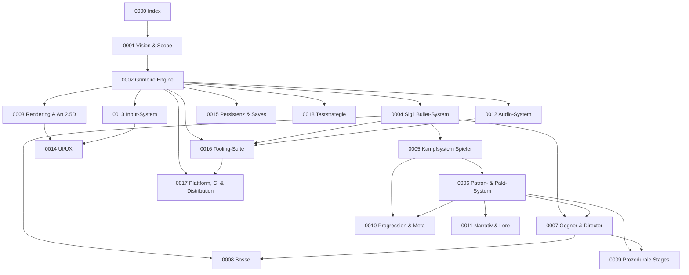
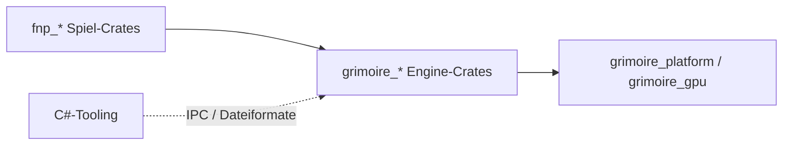

# PRD-0000: Index — Fiends n Patrons & Grimoire Engine

- **Status:** Entwurf
- **Datum:** 2026-09-14
- **Autor:** Lupus Malus Deviant (Product Owner) / Claude (Ausarbeitung)
- **Stakeholder:** Lupus Malus Deviant (PO, einziger Entwickler-Auftraggeber), Coding-Agenten (Umsetzung)
- **Dokumenttyp:** Index-PRD — Einstiegspunkt für Menschen UND Agenten

> **Agenten-Hinweis:** Dieses Dokument ist der Wurzelknoten. Lies es zuerst und vollständig.
> Jedes Sub-PRD ist eigenständig lesbar, verweist aber hierher zurück. Technische
> *Warum*-Entscheidungen stehen in `docs/adr/`. Bei Widerspruch gilt: ADR > Sub-PRD > Index.

---

## 1. Was gebaut wird (Elevator Pitch)

**Fiends n Patrons** ist ein 2D-Topdown-**Bullet-Hell-Roguelite** im **Dark-Fantasy/Okkult**-Setting
mit 2.5D-Optik (3D-Toon-Modelle, gekippte Topdown-Kamera). Der Spieler ist eine **verdammte Seele
im Aufstieg**, kämpft mit **Melee-Primärwaffe**, Magie-Skillshot und Graze-geladenem Ultimate durch
**prozedurale Runs** (2–3 Stages, ~20 Min) und schließt **Pakte mit einem von 5 Patronen** — auf
Kosten des **Zorns der übrigen vier**, der sich physisch in die Stages frisst.

Das Spiel läuft auf der **Grimoire Engine**: einer eigenständigen, from-scratch gebauten
Rust-Engine (eigenes Repo, eigenes Produkt, SemVer), begleitet von einer **C#/Avalonia-Tooling-Suite**.
Alle Assets (3D-Modelle, Audio, Texte, Patterns) werden generiert bzw. per Skript erzeugt.

## 2. Feste Rahmenentscheidungen (Kurzregister)

Vollständige Begründungen in den verlinkten ADRs. Dieses Register ist die "Single Source of Truth"
für Grundsatzfragen — Agenten dürfen diese Punkte **nicht** eigenmächtig umentscheiden.

| # | Entscheidung | Detail | Quelle |
|---|--------------|--------|--------|
| E01 | Sprache | Rust (Engine + Spiel), C# (Tooling) | [ADR-0001](../adr/0001-rust-kern-csharp-tooling.md) |
| E02 | Engine | From scratch, eigenes Repo `grimoire`, SemVer-Releases, standalone-fähig | [ADR-0002](../adr/0002-engine-eigenes-repo.md) |
| E03 | GPU-Schicht | wgpu (WGSL); Renderer-Logik komplett eigen | [ADR-0003](../adr/0003-wgpu-als-gpu-schicht.md) |
| E04 | Kern-Muster | Eigenes ECS, datenorientiert | [ADR-0004](../adr/0004-eigenes-ecs.md) |
| E05 | Simulation | Voll deterministisch, Fixed-Timestep, Seed-reproduzierbar | [ADR-0005](../adr/0005-voll-deterministische-simulation.md) |
| E06 | Content-Definition | Daten-DSLs (u.a. **Sigil** `.sigil` für Patterns), KEIN eingebettetes Scripting | [ADR-0006](../adr/0006-sigil-daten-dsl-statt-scripting.md) |
| E07 | Asset-Pipeline | Offline-Kompilierung (C#-Tooling) → binäre Packs | [ADR-0007](../adr/0007-offline-asset-kompilierung.md) |
| E08 | Tool-UI | Avalonia (Win/Mac/Linux), Live-Verbindung Tool↔Engine via IPC | [ADR-0008](../adr/0008-avalonia-fuer-tooling.md) |
| E09 | Plattformen | v1.0: Windows/macOS/Linux (Tastatur+Maus, Gamepad). Phase 2: iOS/Android (Touch, 2 Profile) | [PRD-0017](0017-plattform-ci-distribution.md) |
| E10 | Kollision | Eigene 2D-Kollision (Kreise/Kapseln + Spatial Grid), keine Physik-Lib | [PRD-0002](0002-grimoire-engine-architektur.md) |
| E11 | Bullet-Ziel | ~10.000 simultane Bullets bei 60 FPS (Desktop-Mittelklasse) | [PRD-0004](0004-sigil-bullet-system.md) |
| E12 | Namen | Engine **Grimoire**, Spiel **Fiends n Patrons**, DSL **Sigil** | dieses Dokument |
| E13 | Sprachen | Code EN / Docs+PRDs DE / Spieltexte DE+EN ab v1.0 | [PRD-0011](0011-narrativ-und-lore.md) |
| E14 | Schwierigkeit | Eine feste Basis-Schwierigkeit, keine Wahlstufen. A11y-Komfort separat | [PRD-0014](0014-ui-ux.md) |
| E15 | Tod | Permadeath; Voll-Snapshot-Saves erlauben Run-Suspend + Rewind-Item | [PRD-0015](0015-persistenz-und-saves.md) |
| E16 | Multiplayer | v1.0 solo. Lokaler Co-op später denkbar, Online-Co-op Fernziel (Lockstep-Tür offen halten) | [PRD-0001](0001-vision-und-scope.md) |
| E17 | Modding | Keine aktive Unterstützung, aber Datenformate offen dokumentiert | [PRD-0016](0016-tooling-suite.md) |
| E18 | Lesbarkeit | "Lesbarkeit ist heilig": Bullets auf eigener Render-Ebene, nie von VFX verdeckt | [PRD-0003](0003-rendering-und-art.md) |
| E19 | Zeitmodell | Hobby, offenes Ende → Planung in Phasen/Meilensteinen, nie in Kalenderdaten | [PRD-0001](0001-vision-und-scope.md) |
| E20 | Scope-Politik | Kein Feature des Registers ist "kürzbar" — bei Engpässen wird phasenverschoben, nicht gestrichen | [PRD-0001](0001-vision-und-scope.md) |

## 3. PRD-Landkarte

Jedes Sub-Topic hat ein eigenes PRD. Abhängigkeitsrichtung: Pfeil = "baut inhaltlich auf".



| PRD | Titel | Ein-Satz-Inhalt |
|-----|-------|-----------------|
| [0001](0001-vision-und-scope.md) | Vision & Scope | Spielidee, Zielgruppe, Run-Struktur, Phasenplan, Scope-Politik |
| [0002](0002-grimoire-engine-architektur.md) | Grimoire Engine | Standalone-Engine: Layer, Subsysteme, ECS, Determinismus, Crate-Map |
| [0003](0003-rendering-und-art.md) | Rendering & Art | Toon-2.5D, Clustered Lights, Kamera, VFX-Stack, Lesbarkeits-Regeln |
| [0004](0004-sigil-bullet-system.md) | Sigil Bullet-System | Pattern-DSL, 10k-Bullets, Verhaltens-Features, Kollision, Graze |
| [0005](0005-kampfsystem-spieler.md) | Kampfsystem | Bewegung, Melee, Skillshot, Ultimate, Defensive, Items, Charaktere |
| [0006](0006-patron-und-pakt-system.md) | Patron & Pakt | 5 Patrone, Pakt/Altäre, Zorn-System, Welt-Einfluss |
| [0007](0007-gegner-und-director.md) | Gegner & Director | 8–12 Archetypen, Elites/Minibosse, Wellen-Templates + Director |
| [0008](0008-bosse.md) | Bosse | 3 Bosse, HP-Phasen, Arena-Verwandlung, Patron-Varianten |
| [0009](0009-prozedurale-stages.md) | Prozedurale Stages | Raum-Ketten, 3 Biome + korrumpierte Zwillinge, Mutations-Events |
| [0010](0010-progression-und-meta.md) | Progression & Meta | Run-Upgrades, Shop, Synergien, Unlocks, Patron-Reputation |
| [0011](0011-narrativ-und-lore.md) | Narrativ & Lore | Fortlaufende Run-Story, Protagonisten, Patron-Stimmen, DE+EN |
| [0012](0012-audio-system.md) | Audio | Metal-Hybrid, vertikale Layer, Beat-Clock, beat-synchrone SFX, DSP-Generierung |
| [0013](0013-input-system.md) | Input | Abstraktion, KBM+Gamepad-Presets, Touch-Profile (Phase 2) |
| [0014](0014-ui-ux.md) | UI/UX | Spielernahes HUD, Ritual-Menüs, Todesscreen/Nachruf, Settings, A11y |
| [0015](0015-persistenz-und-saves.md) | Persistenz | Voll-Snapshots, Run-Suspend, Formate, Korruptionsschutz, Config |
| [0016](0016-tooling-suite.md) | Tooling-Suite | Avalonia-Tools: Sigil-Editor, Stage-Editor, Balancing, Audio-Werkstatt, Live-Link |
| [0017](0017-plattform-ci-distribution.md) | Plattform & CI | Build-Matrix, GitHub Actions, Signing, Releases, Performance-Budgets |
| [0018](0018-teststrategie.md) | Teststrategie | Unit, Headless-Sim, Golden-Master-Replays, Render-Snapshots |

## 4. Repo- & Codebase-Map (Soll-Zustand)

Zwei Repos. Das Spiel pinnt Engine-Versionen (SemVer-Tags).

```text
<Arbeitsordner>\
├── Prototype\                  ← DIESES Repo = Spiel "Fiends n Patrons"
│   ├── docs\
│   │   ├── prd\                ← diese PRD-Suite
│   │   ├── adr\                ← Architecture Decision Records
│   │   └── plans\              ← Implementation-Pläne
│   ├── crates\
│   │   ├── fnp_game\           ← Spiel-Bibliothek: Game-States, Run-Logik
│   │   ├── fnp_content\        ← Gameplay-Plugins: Waffen, Patrone, Items, Gegner
│   │   ├── fnp_app\            ← dünnes Binary: bootet Grimoire + fnp_game
│   │   └── fnp_sim_harness\    ← Headless-Bot-Runs, Balancing-Sims (Test/Tooling)
│   ├── content\                ← Quell-Assets (Sigil-Dateien, Wellen, Items, Texte, Audio-Rezepte)
│   ├── assets_src\             ← Blender-Skripte / Modell-Generatoren
│   └── packs\                  ← kompilierte Asset-Packs (Build-Artefakt, gitignored)
│
└── grimoire\                   ← Engine-Repo (eigenständiges Produkt)
    ├── docs\                   ← Engine-ADRs + Crate-Verträge (docs/architektur/crate-vertraege.md)
    └── crates\
        ├── grimoire_core\      ← Blatt-Crate: stabiles Hashing, deterministische Mathematik (Engine-ADR-0005)
        ├── grimoire_platform\  ← Traits + Impl: Fenster, Input-Rohdaten, FS, Zeit, Audio-Out
        ├── grimoire_gpu\       ← wgpu-Wrapper, Ressourcen, Frame-Graph
        ├── grimoire_render\    ← 2.5D-Renderer: Toon, Clustered Lights, Instancing, Post-FX
        ├── grimoire_ecs\       ← eigenes ECS (Welt, Archetypen, Scheduler)
        ├── grimoire_sim\       ← Fixed-Timestep, deterministisches RNG, Snapshots, Replay
        ├── grimoire_collide\   ← 2D-Kollision: Kreise/Kapseln, Spatial Grid, Graze-Queries
        ├── grimoire_audio\     ← Mixer, Voice-Limiting, Beat-Clock, Layer-System
        ├── grimoire_ui\        ← Engine-eigenes Spiel-UI (HUD, Menüs), skalierbar
        ├── grimoire_assets\    ← Pack-Loader, Formate, Hot-Reload-Kanal (Dev)
        ├── grimoire_sigil\     ← Sigil-DSL: Parser, Compiler, Laufzeit-Interpreter
        ├── grimoire_debug\     ← IPC-Protokoll für Tooling-Live-Link, Profiler, Stats-Overlay
        └── grimoire\           ← Fassade/Prelude: bindet alles, definiert App-Lifecycle

<Arbeitsordner>\grimoire-tools\   (Alternativ: Unterordner im Engine-Repo — offene Frage OF-2)
└── C#/Avalonia-Solution: Sigil-Editor, Stage-Editor, Balancing-Dashboard,
    Audio-Werkstatt, Replay-Viewer, Pack-Inspektor, Asset-Compiler (CLI)
```

**Layer-Regel (Compiler-erzwungen über Crate-Abhängigkeiten):**



Nie rückwärts. Die Engine kennt das Spiel nicht. Content-Crates registrieren sich über Plugin-Traits.

## 5. Phasenplan (Meilensteine statt Daten, E19)

| Phase | Name | Ergebnis (Definition of Done) |
|-------|------|-------------------------------|
| P0 | Fundament | Beide Repos + CI-Matrix grün; Grimoire öffnet Fenster, rendert instanzierte Sprites, fixed-timestep ECS-Loop mit Determinismus-Test |
| P1 | Sichtbarer Kern | Toon-Renderer + Punktlichter + Kamera; 10k-Bullet-Stresstest @60FPS; Sigil v1 (Parser + Interpreter + Hot-Reload via Dev-Link) |
| P2 | Kampf-Kern | Spieler-Kit komplett (Melee, Skillshot, Dash, Graze, Ulti, Items); 3 Gegner-Archetypen; Kollision + Game-Feel (Hitstop/Shake) |
| P3 | **Vertical Slice „Mini-Run"** | 1 komplette Stage: Raum-Kette, Wellen+Director light, Upgrades, Shop, 1 Altar, 1 Boss mit Phasen; Todesscreen mit Nachruf; Saves |
| P4 | Systemvollausbau | 5 Patrone + Zorn, 3 Biome + Zwillinge, Mutations-Events, 8–12 Archetypen, Elites/Minibosse, 3 Bosse, 2 Charaktere |
| P5 | Meta & Politur | Run-Story, Hub-Dialoge, Reputation, Unlocks, Audio-Vollausbau (Layer+Beat-SFX), A11y-Optionen, Balancing via Sim-Harness |
| P6 | v1.0 Desktop | Signierte Releases Win/Mac/Linux, Nightlies, Golden-Master-Suite grün, DE+EN vollständig |
| P7 | Phase 2 | Mobile-Port (Touch-Profile, Store-Prozesse), Steam-Integration, ggf. lokaler Co-op |

## 6. Leitfaden für Coding-Agenten

1. **Einstieg:** Dieses Index-PRD → relevantes Sub-PRD → verlinkte ADRs. Pläne entstehen in `docs/plans/`, nicht ad hoc.
2. **Entscheidungsregister (Abschnitt 2) ist bindend.** Abweichungswunsch ⇒ neues ADR vorschlagen, nie stillschweigend abweichen.
3. **PRDs leben:** Erkenntnisse beim Bauen ⇒ PRD aktualisieren + bei Richtungswechseln ADR ergänzen.
4. **Konventionen:** Code + Kommentare Englisch; Commits konventionell (`feat:`, `fix:` …); Docs Deutsch. Determinismus-Regeln aus PRD-0002 sind in jedem System-Code einzuhalten (kein `HashMap`-Iterationsleak in die Sim, kein Wallclock in Gameplay, RNG nur über `grimoire_sim`).
5. **Jeder Push mit CI wird überwacht** bis der Lauf durch ist (`gh run watch --exit-status`); rote Läufe werden sofort analysiert (Arbeitsregel des PO).
6. **Windows-Binaries:** Nur Release-Builds werden mit dem vorhandenen Zertifikat signiert (Signier-Skript des PO); CI-, Nightly-, Test- und sonstige Entwicklungs-Builds bleiben unsigniert (PO-Entscheid OP-7, 2026-09-15, [Plan-0002](../plans/0002-phase-p1-sichtbarer-kern.md)).
7. **Tests sind Teil jedes Features:** siehe PRD-0018; ein Feature ohne Headless-Testpfad gilt als unfertig.

## 7. Glossar

| Begriff | Bedeutung |
|---------|-----------|
| Patron | Eine von 5 okkulten Mächten; Pakt-Geber mit Build-Achse + Regeländerung |
| Pakt | Run-gebundene Bindung an genau einen Patron; an Altären aufgelevelt |
| Zorn | Reaktion der 4 nicht gewählten Patrone: Invasionen, Elite-Flüche, Boss-Färbung |
| Sigil | Daten-DSL (`.sigil`) für Bullet-Patterns |
| Graze | Knappes Streifen von Bullets (Radius) ODER Melee-Parade; lädt das Ultimate |
| Director | Spawn-Regisseur mit Intensitätsbudget; wählt/skaliert Wellen-Templates |
| Stage-Verwandlung | Live-Mutation einer laufenden Stage (Layout/Licht/Gegner-Set kippen) |
| Nachruf | Hämischer Todes-Text auf dem Run-Ende-Screen |
| Mini-Run | Vertical-Slice-Meilenstein: eine vollständige Stage inkl. Boss |
| Pack | Binäres, offline kompiliertes Asset-Archiv |

## 8. Offene Fragen (Index-Ebene)

- **OF-1:** Genaue Namen/Domänen der 5 Patrone (Vorschläge in [PRD-0006](0006-patron-und-pakt-system.md), gemeinsam iterieren).
- **OF-2:** Tooling-Suite als drittes Repo oder Ordner im Engine-Repo? (Empfehlung in [PRD-0016](0016-tooling-suite.md): Ordner im Engine-Repo, da versionsgekoppelt.)
- **OF-3:** Online-Co-op-Fernziel — wann wird die Lockstep-Machbarkeit erstmals real geprüft? (Vorschlag: Spike nach P4.)

## 9. Nächste Schritte

- Review dieses Indexes + Sub-PRDs durch PO.
- Implementation-Plan für Phase P0 aus PRD-0002 (Engine) + PRD-0017 (CI/Repos) ableiten.
- Repos initialisieren (git init, GitHub-Remotes, CI-Skeleton).
