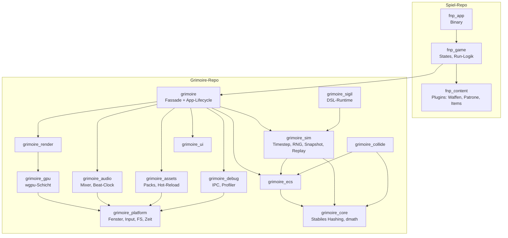
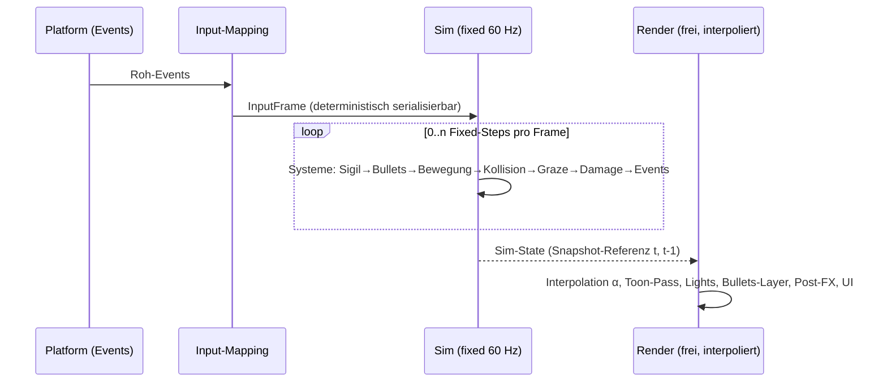

# PRD-0002: Grimoire Engine — Architektur & Subsysteme

- **Status:** Entwurf
- **Datum:** 2026-09-14
- **Autor:** Lupus Malus Deviant (PO) / Claude (Ausarbeitung)
- **Stakeholder:** Lupus Malus Deviant (PO), Coding-Agenten
- **Index:** [PRD-0000](0000-index-fiends-n-patrons.md) · ADRs: [0002](../adr/0002-engine-eigenes-repo.md), [0003](../adr/0003-wgpu-als-gpu-schicht.md), [0004](../adr/0004-eigenes-ecs.md), [0005](../adr/0005-voll-deterministische-simulation.md)

## Problem / Motivation

Fiends n Patrons braucht Fähigkeiten, die Fertig-Engines nur mit Kompromissen liefern
(10k deterministische Bullets, Voll-Snapshots für Rewind/Replay, Beat-Clock-Audio, Live-Tooling-Link) —
und der PO will die Engine als **eigenständiges Lernprodukt**. Ohne harte Architektur-Leitplanken
degeneriert "from scratch" zu einem verfilzten Monolithen, in dem Spiel und Engine untrennbar sind.
Dieses PRD definiert die Engine als Produkt: ihre Schichten, Verträge und Garantien.

## Ziele

- Grimoire ist ein **standalone Rust-Workspace** (eigenes Repo, SemVer-Releases), gegen den das Spiel als erster externer Konsument baut.
- **Interface-First:** Jedes Subsystem ist ausschließlich über Trait-Verträge konsumierbar; Plattform, Renderer, Audio-Backend sind austauschbare Implementierungen.
- **Deterministische Simulation** als Engine-Garantie: gleicher Seed + gleiche Inputs ⇒ bit-identischer Verlauf, plattformübergreifend (Ziel), mindestens pro Plattform (Minimum).
- **Snapshot-Fähigkeit** als Engine-Garantie: kompletter Sim-Zustand jederzeit serialisierbar/wiederherstellbar (Basis für Rewind-Item, Run-Suspend, Todesanalyse, Golden-Master).

## Non-Goals

- Keine General-Purpose-Engine: Grimoire optimiert für 2.5D-Topdown mit Massen-Projektilen; kein Anspruch auf 3D-First-Person, Terrain, Skeletal-Animation-Vollausbau etc.
- Kein eingebettetes Scripting (E06) — Verhalten kommt aus Rust-Plugins + Daten-DSLs.
- Kein In-Engine-Editor — Werkzeuge leben in der C#-Suite (PRD-0016), verbunden über `grimoire_debug`.
- Keine eigene GPU-API-Abstraktion unterhalb von wgpu (E03).

## Zielgruppen / Personas

### Persona A: Spiel-Entwickler (fnp_*-Crates)
- Konsumiert Grimoire über die `grimoire`-Fassade; will klare Lifecycle-Hooks, ECS-Ergonomie, stabile APIs pro SemVer-Minor.
- Pain Point: Engine-Breaking-Changes, die das Spiel unangekündigt brechen.

### Persona B: Engine-Entwickler (Lernender/Agent)
- Baut Subsysteme einzeln; braucht testbare Verträge, Mocks, Beispiele pro Crate.
- Pain Point: Subsysteme, die sich nur im Gesamtsystem testen lassen.

### Persona C: Tooling (C#-Suite)
- Spricht mit laufender Engine über das Debug-IPC-Protokoll; braucht stabile, versionierte Message-Schemata.

## Architektur-Übersicht



`grimoire_core` wurde beim Schnitt der P0-Verträge als abhängigkeitsfreie Blatt-Crate ergänzt
(Engine-ADR-0005). Die verbindlichen Crate-Schnittstellen stehen in
`grimoire/docs/architektur/crate-vertraege.md`, engine-interne Entscheidungen in `grimoire/docs/adr/`.

**Datenfluss pro Frame (fixed sim / entkoppeltes Rendering):**



## Funktionale Anforderungen

| ID | Anforderung | Priorität |
|----|-------------|-----------|
| FR-01 | Der Workspace `grimoire` baut und testet ohne jede Spiel-Abhängigkeit (Standalone-Garantie). | Must |
| FR-02 | Jedes Subsystem exponiert seinen Vertrag als Trait; Konsumenten hängen nur an Traits, nie an konkreten Typen anderer Subsysteme. | Must |
| FR-03 | Die Crate-Abhängigkeitsrichtung Game→Engine→Platform ist ausschließlich (Layer-Regel, vom Compiler erzwungen). | Must |
| FR-04 | `grimoire_sim` fährt einen Fixed-Timestep (60 Hz Sim-Rate) mit Akkumulator; Rendering interpoliert zwischen zwei Sim-Zuständen. | Must |
| FR-05 | Alle Zufallsentscheidungen der Sim laufen über ein seedbares, streambares RNG aus `grimoire_sim` (kein `rand::thread_rng` in Sim-Code). | Must |
| FR-06 | Der komplette Sim-Zustand ist als Snapshot serialisier- und wiederherstellbar; Ringpuffer der letzten N Sekunden (konfig., Default ≥ 5 s) für Rewind/Todesanalyse. | Must |
| FR-07 | Replays = Seed + InputFrame-Log; Abspielen reproduziert den Lauf bit-identisch (Golden-Master-Basis). | Must |
| FR-08 | Eigenes ECS: Archetyp-basierte Speicherung, Queries, System-Scheduler mit deterministischer Ausführungsreihenfolge. | Must |
| FR-09 | `grimoire_collide`: Kreis-/Kapsel-Shapes, Spatial-Grid-Broadphase, Layer-Masken, Graze-Ring-Queries; Budget siehe NFR. | Must |
| FR-10 | `grimoire_assets` lädt binäre Packs (E07); im Dev-Modus können einzelne Assets über den Debug-Link live ersetzt werden (Hot-Swap-Kanal). | Must |
| FR-11 | `grimoire_debug`: versioniertes IPC-Protokoll (lokaler Socket) für Tooling: Stats, Entity-Inspektion, Asset-Hot-Swap, Sigil-Live-Preview, Replay-Steuerung. | Must |
| FR-12 | Eingebauter Profiler: Frame-Budgets pro Subsystem messbar, Stats-Overlay in jedem Build aktivierbar. | Must |
| FR-13 | `grimoire_ui`: auflösungsunabhängiges Spiel-UI (Anker/Skalierung), von Sim getrennt, themebar (Ritual-Look des Spiels ist Spiel-Content). | Must |
| FR-14 | App-Lifecycle der Fassade: registrierbare Plugins (Trait `GamePlugin`) mit Phasen init/fixed_update/render_extract/shutdown. | Must |
| FR-15 | Alle Subsystem-Traits besitzen Mock-/Headless-Implementierungen (Null-Renderer, Null-Audio) für Tests und Sim-Harness. | Must |
| FR-16 | Zeit-, Datei- und Fenster-Zugriff ausschließlich über `grimoire_platform`-Traits (kein `std::time`/`std::fs` in höheren Schichten für Sim-relevante Pfade). | Should |
| FR-17 | Input-Slots sind mehrspielerfähig ausgelegt (Slot 0..n), auch wenn v1.0 nur Slot 0 nutzt (E16-Tür). | Should |
| FR-18 | Live-Übernahme von Grafik-/Audio-Settings ohne Neustart wird von jedem betroffenen Subsystem unterstützt (Reconfigure-Vertrag). | Should |

## Nicht-Funktionale Anforderungen

- **Performance-Budgets** (Frame @60 FPS, Desktop-Referenz GTX 1060/M1; harte Messlatte ab P1):
  Sim gesamt ≤ 4 ms (davon Kollision ≤ 1,5 ms bei 10k Bullets + 100 Gegnern), Render-CPU ≤ 3 ms, GPU-Frame ≤ 8 ms, Audio-Mix ≤ 1 ms. Stats-Overlay macht Budgets sichtbar (rot bei Überschreitung).
- **Determinismus-Disziplin:** keine Iteration über unsortierte HashMaps in Sim-Systemen; f32-Operationen nur in deterministisch definierten Reihenfolgen; kein Multithreading-Nondeterminismus in der Sim (parallele Systeme nur mit fester Reduktionsreihenfolge).
- **API-Stabilität:** Breaking Changes nur mit Major/Minor-Bump + CHANGELOG-Eintrag; das Spiel pinnt Tags (E02).
- **Portabilität:** Alle Crates kompilieren für Win/macOS/Linux ab P0; `grimoire_platform`+`grimoire_gpu` halten iOS/Android-Targets kompilierfähig ab P4 (Mobile-Ehrlichkeit, E09).

## User Stories

- **US-01:** Als Spiel-Entwickler möchte ich einen `GamePlugin` registrieren und ausschließlich über ECS + Fassaden-APIs arbeiten, damit Engine-Interna austauschbar bleiben.
- **US-02:** Als Engine-Entwickler möchte ich die Kollision headless mit synthetischen 10k-Bullet-Szenen benchen, damit Budget-Regressionen vor dem Merge auffallen.
- **US-03:** Als Tooling möchte ich mich zur laufenden Engine verbinden und ein geändertes `.sigil` live einspielen, damit Pattern-Iteration Sekunden statt Minuten dauert.
- **US-04:** Als Spiel möchte ich `sim.snapshot()`/`sim.restore(s)` aufrufen können, damit Rewind-Item und Run-Suspend triviale Konsumenten derselben Garantie sind.

```
Given eine laufende Sim mit Seed S und InputLog L
When ich die Sim headless mit S+L erneut ausführe
Then ist der finale Zustands-Hash identisch (Golden-Master)
```

## Akzeptanzkriterien / Success Metrics

- P0-Abnahme: Fenster + instanzierte Sprites + fixed-timestep ECS-Loop; Determinismus-Test (identischer Hash über 10.000 Sim-Ticks, 2 Läufe) grün auf allen 3 Desktop-Plattformen.
- P1-Abnahme: 10k-Bullet-Stresstest hält die Budgets (Messwerte im Stats-Overlay dokumentiert, CI-Benchmark als Trend).
- Snapshot-Roundtrip-Test: snapshot→restore→N Ticks ≡ ohne Roundtrip (bit-identisch).
- Engine-Beispiele (`examples/`) decken jedes Subsystem einzeln ab und dienen als lebende Doku.
- Cross-Plattform-Determinismus: identische Replay-Hashes Win/Mac/Linux; falls f32-bedingt unerreichbar ⇒ dokumentierte Entscheidung per ADR (Fallback: Determinismus pro Plattform garantiert).

## Offene Fragen

- **OF-2.1:** Cross-Plattform-Bit-Determinismus mit f32 realistisch, oder Fixed-Point für Sim-Positionen? Klärung: Spike in P0, Ergebnis als ADR.
- **OF-2.2:** ECS-Scheduler: Single-threaded deterministisch starten und später parallelisieren, oder von Beginn an paralleles Design mit fester Ordnung? Klärung: ADR in P0.
- **OF-2.3:** Snapshot-Format: eigenes Binärlayout vs. `serde`-basiert (Performance vs. Aufwand). Klärung: Spike P2 (Rewind-Item als Testfall).

## Referenzen

- [ADR-0002](../adr/0002-engine-eigenes-repo.md), [ADR-0003](../adr/0003-wgpu-als-gpu-schicht.md), [ADR-0004](../adr/0004-eigenes-ecs.md), [ADR-0005](../adr/0005-voll-deterministische-simulation.md)
- Abhängige PRDs: [0003 Rendering](0003-rendering-und-art.md), [0004 Sigil](0004-sigil-bullet-system.md), [0012 Audio](0012-audio-system.md), [0015 Persistenz](0015-persistenz-und-saves.md), [0016 Tooling](0016-tooling-suite.md), [0018 Tests](0018-teststrategie.md)
