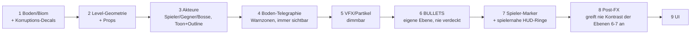

# PRD-0003: Rendering & Art-Direction — 2.5D-Toon

- **Status:** Entwurf
- **Datum:** 2026-09-14
- **Autor:** Lupus Malus Deviant (PO) / Claude (Ausarbeitung)
- **Stakeholder:** Lupus Malus Deviant (PO), Coding-Agenten
- **Index:** [PRD-0000](0000-index-fiends-n-patrons.md) · Engine: [PRD-0002](0002-grimoire-engine-architektur.md)

## Problem / Motivation

Das Spiel will zwei schwer vereinbare Dinge gleichzeitig: **Dark-Fantasy-Atmosphäre** (viele
dynamische Lichter, dichte VFX, Toon-Dramatik) und **kompromisslose Bullet-Lesbarkeit** bei bis zu
10.000 Projektilen. Ohne explizite Render-Regeln gewinnt immer das Spektakel — und der Spieler
stirbt an Treffern, die er nicht sehen konnte. Dieses PRD legt Look UND Lesbarkeits-Hierarchie fest.

## Ziele

- Ein wiedererkennbarer **Toon-2.5D-Look**: 3D-Modelle mit Cel-Shading + Outlines, gekippte Topdown-Kamera (60–75°), Gameplay auf einer 2D-Ebene.
- **Dynamische Beleuchtung** mit vielen Punktlichtern (Bullets, Rituale, Flüche als Lichtquellen) via Clustered/Forward+-Verfahren.
- **Lesbarkeit ist heilig (E18):** Gefahr ist zu jedem Zeitpunkt eindeutig erkennbar — messbar über die unten definierten Regeln.
- Voller Game-Feel-Stack: GPU-Partikel, Post-Processing, Screen-Feedback, Verwandlungs-Shader.

## Non-Goals

- Kein PBR/Realismus, keine gebackenen Lightmaps, keine Schatten-Kaskaden-Orgien — stilisiert schlägt korrekt.
- Kein frei rotierbarer Kamera-Modus; Kamera-Verhalten ist choreografiert (Basis-Neigung + Skript-Momente).
- Keine 2D-Sprite-Pipeline für Charaktere/Gegner (alles 3D-Modelle); Sprites nur für Partikel/UI/Bullets-Impostor, wo sinnvoll.

## Render-Ebenen (Lesbarkeits-Hierarchie, von hinten nach vorn)

**Harte Regeln (Render-Vertrag):**
1. Ebene 6 (Bullets) und 4 (Telegraphie) werden von keinem Effekt überdeckt, getönt oder geblurrt.
2. Bloom/Grading werden vor Ebene 6 aufgelöst oder maskiert — Bullets behalten garantierte Mindest-Kontrastwerte (Kontrastverhältnis ≥ 4,5:1 gegen jeden möglichen Hintergrund; im Tooling prüfbar).
3. Bullet-Typen unterscheiden sich durch **Silhouette + Farbe**, nie nur Farbe (A11y, PRD-0014).
4. Gegnerische Projektile und Spieler-Projektile sind über getrennte Palettenräume unverwechselbar.

## Funktionale Anforderungen

| ID | Anforderung | Priorität |
|----|-------------|-----------|
| FR-01 | Toon-Shading-Pass: quantisierte Beleuchtungsstufen (2–4 Bänder, materialgesteuert) + Screen-Space- oder Geometrie-Outlines. | Must |
| FR-02 | Clustered-/Forward+-Lighting: ≥ 256 aktive Punktlichter in Sicht ohne Budgetbruch (Desktop-Referenz). | Must |
| FR-03 | Kamera: gekippte Topdown-Perspektive, Neigung konfigurierbar 60–75°, sanftes Spieler-Following mit Look-Ahead. | Must |
| FR-04 | Kamera-Momente: skriptbare Übergänge (Boss-Intro, Verwandlungs-Event) über ein Kamera-Rail-Interface. | Should |
| FR-05 | Bullet-Rendering: GPU-Instancing für 10k+ Bullets; Bullet-Visuals aus Sigil-Metadaten (Form, Palette, Glow). | Must |
| FR-06 | GPU-Partikelsystem: ≥ 100k Partikel, Emitter-Definitionen als Daten, an Beat-Clock koppelbar (PRD-0012). | Must |
| FR-07 | Post-Processing-Stack: Bloom, Vignette, Farb-Grading (per Biom/Korruptionsgrad blendbar), Chromatic Aberration — jeweils einzeln schaltbar. | Must |
| FR-08 | Screen-Feedback: Hitstop, Screenshake, kurze Zeitlupen — zentral parametriert, in Intensität regelbar (A11y). | Must |
| FR-09 | Verwandlungs-Shader: Welt-Morphing (Dissolve, Risse, Korruptions-Ausbreitung) als kombinierbare Materialeffekte für Stage-Mutationen. | Must |
| FR-10 | Lesbarkeits-Regeln 1–4 (oben) sind im Renderer strukturell erzwungen, nicht nur Konvention (z.B. fester Bullet-Pass nach Post-FX-Resolve). | Must |
| FR-11 | Grafik-Presets (Low→Ultra) skalieren: Lichtanzahl, Partikelbudget, Post-FX, Auflösungsskala — live umschaltbar (E-Settings, PRD-0015). | Must |
| FR-12 | Fotosensitivitäts-Modus: reduziert Blitzfrequenz/Intensität global (Design vermeidet Stroboskop-Effekte von Grund auf). | Must |
| FR-13 | Asset-Kontrakt: Modelle als glTF aus der Blender-Skript-Pipeline (PRD-0016), Toon-Material-Parameter im Pack. | Must |
| FR-14 | Render-Snapshot-Testpunkte: deterministische Testszenen pro Feature (Toon, Lights, Post-FX) für Screenshot-Vergleiche (PRD-0018). | Should |

## Nicht-Funktionale Anforderungen

- **Budgets:** GPU-Frame ≤ 8 ms auf Referenz-Hardware bei Vollszene (10k Bullets, 256 Lichter, 100k Partikel, Post-Stack an). Mobile-Ziel (Phase 2): gleiche Szene mit Preset "Low" ≤ 16 ms auf Mittelklasse-SoC.
- **Skalierbarkeit nach unten:** Preset "Low" verzichtet auf Post-FX (außer Grading) und begrenzt Lichter (~32) — ohne Gameplay-Informationsverlust (Telegraphie/Bullets identisch).
- **Konsistenz:** Ein Stil-Dokument (`docs/art/stilbibel.md`, entsteht in P1) definiert Paletten pro Biom/Patron, Outline-Stärken, Bänder — alle generierten Assets folgen ihm.

## User Stories

- **US-01:** Als Spieler möchte ich in dichtestem Getümmel jede Bullet klar erkennen, damit jeder Tod mein Fehler ist — nicht der des Renderers.
- **US-02:** Als Erbauer möchte ich, dass ein Ritual-Raum von 50 Kerzen-Punktlichtern lebt, damit das Okkult-Setting durch Licht erzählt wird.
- **US-03:** Als Coding-Agent möchte ich Bullet-Visuals rein aus Sigil-Daten erzeugen, damit neue Patterns ohne Renderer-Änderung auskommen.
- **US-04:** Als Spieler mit Fotosensitivität möchte ich den Schutzmodus aktivieren, damit ich ohne Risiko spielen kann.

## Akzeptanzkriterien / Success Metrics

- Stresstest-Szene (P1) hält alle Budgets; Messwerte via Stats-Overlay + CI-Benchmark-Trend dokumentiert.
- Lesbarkeits-Audit (ab P3, dann je Release): Screenshot-Serie aus 20 zufälligen Kampfmomenten; in 100% der Bilder sind alle aktiven Bullets vom Tooling-Kontrast-Checker als regelkonform bestätigt.
- Blindtest (P3): Tester benennt nach 5 Minuten Spiel alle Bullet-Typen und ihre Gefahrbedeutung korrekt.
- Verwandlungs-Event läuft ohne Frame-Drop unter 60 FPS (P4).

## Offene Fragen

- **OF-3.1:** Outline-Technik: Inverted-Hull vs. Screen-Space-Kanten (Qualität vs. Kosten bei Massen-Szenen)? Spike in P1, Ergebnis als Engine-ADR.
- **OF-3.2:** Schatten: ganz verzichten (Blob-Shadows) oder eine Low-Cost-Variante für Akteure? Entscheidung nach erstem Look-Dev in P1.
- **OF-3.3:** Bullets als 3D-Instanzen oder Billboard-Impostor mit Toon-Material — was hält 10k besser? Benchmark-Spike P1.

## Referenzen

- [PRD-0002 Engine](0002-grimoire-engine-architektur.md) (Budgets, Subsystem-Verträge) · [PRD-0004 Sigil](0004-sigil-bullet-system.md) (Bullet-Metadaten) · [PRD-0012 Audio](0012-audio-system.md) (Beat-Clock) · [PRD-0014 UI/UX](0014-ui-ux.md) (A11y) · [PRD-0016 Tooling](0016-tooling-suite.md) (Blender-Pipeline, Kontrast-Checker)
