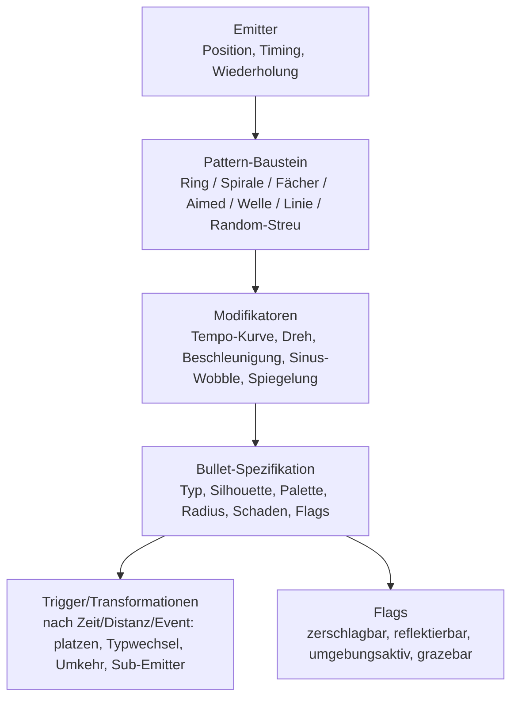

# PRD-0004: Sigil — Bullet-System & Pattern-DSL

- **Status:** Entwurf
- **Datum:** 2026-09-14
- **Autor:** Lupus Malus Deviant (PO) / Claude (Ausarbeitung)
- **Stakeholder:** Lupus Malus Deviant (PO), Coding-Agenten
- **Index:** [PRD-0000](0000-index-fiends-n-patrons.md) · ADR: [0006 Sigil-DSL statt Scripting](../adr/0006-sigil-daten-dsl-statt-scripting.md)

## Problem / Motivation

Bullet-Patterns sind der Content-Kern eines Bullet-Hells: Es werden hunderte gebraucht (Gegner,
Elites, Minibosse, Boss-Phasen, Patron-Varianten). Hardcodierte Patterns machen Iteration und
KI-gestützte Generierung unmöglich; freie Skripte sind schwer zu validieren und zu toolen.
**Sigil** (`.sigil`) ist die deklarative Daten-DSL, die Patterns komponierbar, validierbar,
hot-swappbar und von der C#-Suite visuell editierbar macht — bei deterministischer Ausführung
für bis zu 10.000 simultane Bullets.

## Ziele

- Eine Pattern-Definitionssprache, in der **90%+ aller Patterns ohne Rust-Änderung** entstehen (Kompositions-Bausteine statt Code).
- Laufzeit-Interpreter, der 10k Bullets in ≤ 1,5 ms Sim-Budget-Anteil treibt (SoA-Datenlayout).
- Sekunden-Iteration: Änderung im Sigil-Editor → Live-Preview in laufender Engine (< 1 s Roundtrip).
- Deterministische, seedbare Ausführung (E05) — Patterns sind Replay- und Golden-Master-fähig.

## Non-Goals

- Keine Turing-vollständige Skriptsprache; wer Logik braucht, die Sigil nicht ausdrückt, schreibt ein Rust-`BulletBehavior`-Plugin (dokumentierter Escape-Hatch, sparsam einzusetzen).
- Kein Bullet-übergreifendes Schwarm-Verhalten (Boids etc.) in v1 der DSL.
- Keine Spieler-Projektile über Sigil in v1 (Spieler-Skillshots sind Rust-Content; Vereinheitlichung später prüfbar).

## Konzeptmodell



- **Komposition:** Sigil-Dateien können Bausteine anderer Sigil-Dateien referenzieren und parametrisieren (Vererbung über Parameter-Overrides, keine Logik).
- **Zeitbasis:** Alle Timings in Sim-Ticks oder Beats (Beat-Clock-Referenz, PRD-0012) — nie Wallclock.
- **Pipeline:** `.sigil` (Quelltext, menschenlesbar) → Compiler (C#-Tooling oder `grimoire_sigil`) → kompaktes Binärformat im Pack → Interpreter in `grimoire_sigil`.

## Funktionale Anforderungen

| ID | Anforderung | Priorität |
|----|-------------|-----------|
| FR-01 | Sigil v1 bietet die Kern-Bausteine: Ring, Spirale, Fächer, Aimed (auf Spieler), Welle, Linie, Zufalls-Streuung (seeded). | Must |
| FR-02 | Modifikatoren sind stapelbar: Geschwindigkeitskurven, Winkelrotation, Beschleunigung, Kurvenbahnen, Sinus-Offset, Spiegelung/Symmetrie. | Must |
| FR-03 | Transformationen: Bullets können nach Zeit/Distanz/Trigger platzen (Sub-Bullets), Typ wechseln, Richtung umkehren, Sub-Emitter werden. | Must |
| FR-04 | Bullet-Flags: `smashable` (per Melee zerstörbar), `reflectable` (per Parade zurücklenkbar), `env_active` (interagiert mit Level: abprallen, entzünden, Zonen hinterlassen), `grazeable`. | Must |
| FR-05 | Jede Bullet-Spezifikation bindet Visual-Metadaten (Silhouette, Palette, Glow), die der Renderer direkt konsumiert (PRD-0003 FR-05). | Must |
| FR-06 | Der Interpreter verwaltet Bullets in SoA-Puffern mit Free-List; Spawn/Despawn von 2.000 Bullets in einem Tick ohne Budgetbruch. | Must |
| FR-07 | Kollision: Bullets nehmen an Spatial-Grid-Broadphase teil; Graze-Ring-Query (Radius um Spieler) + Melee-Parade-Query (Bogen vor Spieler) sind Erstklass-Abfragen. | Must |
| FR-08 | Sigil-Compiler validiert statisch: unbekannte Referenzen, Parameterbereiche, Rekursionstiefe von Sub-Emittern (Bomben-Schutz: max. Kaskadentiefe). | Must |
| FR-09 | Hot-Swap: kompilierte Sigil-Einheiten sind zur Laufzeit über den Debug-Link austauschbar; laufende Instanzen starten das Pattern neu. | Must |
| FR-10 | Escape-Hatch: Rust-Trait `BulletBehavior` für Spezialfälle; Sigil kann registrierte Behaviors namentlich referenzieren. | Should |
| FR-11 | Pattern-Metadaten: Schwierigkeits-Tags, Dichte-Schätzung, Patron-Zugehörigkeit — vom Director (PRD-0007) und Balancing-Dashboard (PRD-0016) auswertbar. | Should |
| FR-12 | Bullet-Clear-Ereignisse (Bombe, Phasenwechsel): typfilterbare Massen-Löschung mit Despawn-VFX-Hook, in ≤ 1 Tick. | Must |

## Nicht-Funktionale Anforderungen

- **Performance:** 10.000 aktive Bullets: Sim-Anteil (Bewegung+Transformationen) ≤ 1,0 ms, Kollision ≤ 1,5 ms (in PRD-0002-Budget enthalten), Render-Extraktion ≤ 0,5 ms — Desktop-Referenz.
- **Determinismus:** identisches Sigil + Seed + Spielerposition-Log ⇒ bit-identische Bullet-Zustände (Golden-Master-fähig).
- **Format-Offenheit:** `.sigil`-Syntax + Binärformat sind in `docs/formats/sigil.md` dokumentiert (E17 Modding-by-documentation); Fehlermeldungen des Compilers sind menschen- und agentenlesbar.

## User Stories

- **US-01:** Als Pattern-Designer möchte ich einen 5-armigen Spiral-Vorhang aus einem Ring-Baustein + Rotations-Modifikator komponieren, damit ich in Minuten von Idee zu Preview komme.
- **US-02:** Als Coding-Agent möchte ich hunderte Pattern-Varianten programmatisch als `.sigil`-Dateien generieren und statisch validieren lassen, damit Content-Masse ohne Engine-Builds entsteht.
- **US-03:** Als Spieler möchte ich bestimmte (markierte) Bullets zerschlagen oder parieren können, damit meine Melee-Waffe auch defensiv Bedeutung hat.
- **US-04:** Als Boss-Designer möchte ich, dass eine Phase ihre Bullets beim Übergang in Seelen-Partikel auflöst, damit Phasenwechsel lesbar und fair sind.

```
Given ein Pattern mit 3.000 aktiven Bullets und Flag smashable auf 20% davon
When der Spieler einen Melee-Schwung durch den Parade-Bogen führt
Then werden genau die im Bogen liegenden smashable-Bullets zerstört,
     erzeugen Graze-Ladung und der Rest fliegt unverändert weiter
```

## Akzeptanzkriterien / Success Metrics

- Benchmark-Szene "Vollvorhang" (10k Bullets, Mix aller Modifikator-Typen) hält die Budgets; als CI-Benchmark mit Trendüberwachung.
- 20 Referenz-Patterns (P1/P2) decken jeden Baustein + jede Transformation ab und dienen als Doku, Testfälle und Editor-Beispiele.
- Roundtrip-Messung: Speichern im Sigil-Editor → sichtbare Änderung in laufender Engine < 1 s (P2, mit Tooling-Live-Link).
- Determinismus-Test: Referenz-Patterns als Golden-Master-Replays in CI (PRD-0018).
- Der komplette Mini-Run (P3) verwendet ausschließlich Sigil-definierte Gegner-/Boss-Patterns (0 hardcodierte Patterns).

## Offene Fragen

- **OF-4.1:** Konkrete Quelltext-Syntax: RON-basiert vs. eigene Grammatik? Entscheidung per ADR beim Sigil-v1-Spike (P1) — Kriterium: beste Fehlermeldungen + Editier-Ergonomie im Tooling.
- **OF-4.2:** Bewegen sich Bullets in f32 oder Fixed-Point (koppelt an OF-2.1 Determinismus-Spike)?
- **OF-4.3:** Sollen Boss-Signature-Patterns Beat-quantisiert spawnen (Kopplung an PRD-0012)? Design-Experiment in P4.

## Referenzen

- [ADR-0006](../adr/0006-sigil-daten-dsl-statt-scripting.md) · [PRD-0002 Engine](0002-grimoire-engine-architektur.md) · [PRD-0003 Rendering](0003-rendering-und-art.md) · [PRD-0005 Kampfsystem](0005-kampfsystem-spieler.md) (Graze/Parade) · [PRD-0007 Director](0007-gegner-und-director.md) · [PRD-0016 Tooling](0016-tooling-suite.md) (Sigil-Editor)
