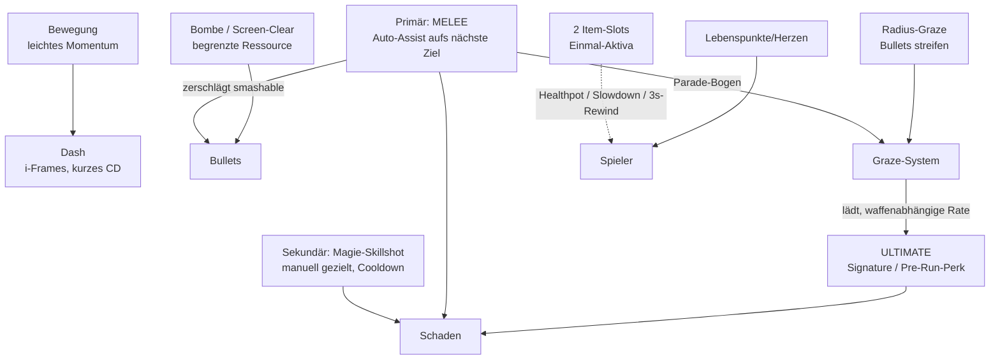

# PRD-0005: Kampfsystem — Spieler-Kit & Charaktere

- **Status:** Entwurf
- **Datum:** 2026-09-14
- **Autor:** Lupus Malus Deviant (PO) / Claude (Ausarbeitung)
- **Stakeholder:** Lupus Malus Deviant (PO), Coding-Agenten
- **Index:** [PRD-0000](0000-index-fiends-n-patrons.md)

## Problem / Motivation

Der Genre-Standard ist Distanz: schießen, ausweichen, nie berühren. Fiends n Patrons dreht das um —
**Melee als Primärwaffe** in einem Bullet-Hell erzwingt Nähe zur Gefahr und macht Graze/Parade zum
Herzschlag des Spiels. Dieses unkonventionelle Kit braucht präzise Definitionen (Reichweiten,
Fenster, Lade-Ökonomie), sonst wird es entweder trivial (Melee räumt alles) oder unspielbar
(Nähe = Tod). Es gibt keinen Trainingsmodus (E14) — das Kit muss sich selbst erklären.

## Ziele

- Ein Kampf-Kit, das **aggressives Spiel belohnt**: Nähe erzeugt Graze, Graze lädt das Ultimate, Melee kann Bullets zerschlagen/parieren.
- Zwei gleichwertige Lade-Spielstile: vorsichtiges Radius-Grazen UND offensives Parieren führen beide zum Ultimate (E-Antwort „Radius + Melee kombiniert").
- Bewegung mit Charakter: leichtes Momentum + Dash mit i-Frames — fühlbar, aber fair bei modellgroßer Hitbox.
- 2 spielbare Charaktere (v1.0) als kontrastierende Presets über demselben System-Kern.

## Non-Goals

- Kein Loadout-Grinding: Charakter-Presets sind kuratiert, kein freies Item-Slotting vor dem Run (Ultimate-Perk-Wahl ist die einzige Pre-Run-Entscheidung neben dem Charakter).
- Keine winzige Danmaku-Hitbox: Hitbox entspricht dem Modell (E-Antwort); Fairness kommt aus Pattern-Design + Telegraphie, nicht aus Hitbox-Tricks.
- Kein manuelles Zielen der Primärwaffe (Auto-Aim + Skill-Shots, E-Antwort); kein Twin-Stick.

## Das Kit im Überblick



## Funktionale Anforderungen

### Bewegung & Defensive

| ID | Anforderung | Priorität |
|----|-------------|-----------|
| FR-01 | Bewegung mit leichtem Momentum: kurze Beschleunigungs-/Abbremsrampen (Ziel: Reaktion < 3 Sim-Ticks bis 90% Zielgeschwindigkeit — fühlbar, nie schwammig). | Must |
| FR-02 | Dash: gerichteter Schub mit i-Frames über die Kernstrecke, Cooldown; Dash durch Bullets erzeugt Radius-Graze. | Must |
| FR-03 | Spieler-Hitbox: Kapsel in Modellgröße; nach erlittenem Treffer kurze i-Frame-Phase + klare Treffer-Rückmeldung (Hitstop, Blink, Sound). | Must |
| FR-04 | Lebenspunkte/Herzen (Startwert pro Charakter, Basis 3–6); Heilung nur über Drops/Items/Upgrades. | Must |
| FR-05 | Bombe/Screen-Clear: begrenzte Ladungen; löscht lösch-erlaubte Bullets (Sigil-Flag) + Schadensimpuls + kurze i-Frames. | Must |
| FR-06 | 2 Item-Slots für aktivierbare Einmal-Items; v1.0-Item-Pool: Healthpot, Slowdown (Sim-Zeitfaktor kurzzeitig), 3s-Rewind (Snapshot-Restore), + 3–5 weitere aus PRD-0010. | Must |
| FR-07 | 3s-Rewind: stellt den Sim-Zustand von vor 3 s wieder her (Engine-Snapshot-Ringpuffer, PRD-0002 FR-06); Item-Verbrauch und Rewind-Nutzung überleben den Rewind selbst. | Must |

### Offensive

| ID | Anforderung | Priorität |
|----|-------------|-----------|
| FR-08 | Melee-Primärangriff: Schwungbögen mit Auto-Assist (magnetisiert zum nächsten validen Ziel in Blick-/Bewegungsrichtung); Kombo-Kette (2–3 Stufen) mit Timing-Fenster. | Must |
| FR-09 | Melee zerstört `smashable`-Bullets im Schwungbogen und erzeugt dabei Melee-Graze-Ladung. | Must |
| FR-10 | Parade: korrekt getimter Melee-Einsatz gegen `reflectable`-Bullets lenkt sie als Spieler-Projektile zurück (Schaden skaliert mit Upgrade-System). | Must |
| FR-11 | Sekundär-Skillshot: manuell gerichtete Magie-Fähigkeit mit Cooldown; genau 1 Skillshot gleichzeitig geführt (E-Antwort), pro Charakter/Upgrades variiert. | Must |
| FR-12 | Ultimate: vor dem Run als Perk gewählt (Signature-Ultimate pro Charakter + freigeschaltete Cross-Charakter-Ultis, PRD-0010); lädt ausschließlich über Graze (Radius + Parade), Laderate waffenabhängig. | Must |
| FR-13 | Graze-Ökonomie: Radius-Graze (Ring um Hitbox, pro Bullet einmalig) und Parade-/Smash-Graze speisen dieselbe Ultimate-Leiste; Anti-Exploit: Diminishing bei stationärem Dauer-Grazen an langsamen Vorhängen. | Must |
| FR-14 | Alle Kit-Parameter (Reichweiten, Fenster, Cooldowns, Laderaten) liegen als Daten im Content-Pack (balancierbar via Dashboard, PRD-0016), nicht als Konstanten im Code. | Must |

### Charaktere

| ID | Anforderung | Priorität |
|----|-------------|-----------|
| FR-15 | Charakter = Preset aus: Melee-Waffe (Bögen/Tempo/Smash-Breite), Skillshot, Signature-Ultimate, Basis-Statistik, Silhouette/Modell. | Must |
| FR-16 | v1.0 enthält 2 kontrastierende Charaktere (OF-1.2: z.B. schwere Klinge/langsam/tanky vs. schnelle Sichel/fragil/mobil). | Must |
| FR-17 | Signature-Ultimates werden nach definierten Erfolgen für andere Charaktere freigeschaltet (Unlock-Regeln in PRD-0010). | Must |

## Nicht-Funktionale Anforderungen

- **Input-Latenz:** Eingabe → sichtbare Reaktion ≤ 2 Frames bei 60 FPS (inkl. Sim-Tick-Grenze); Dash und Parade sind latenzkritischste Pfade.
- **Fairness-Messlatte:** Parade-Fenster ≥ 8 Sim-Ticks (~133 ms) in der Basisversion; jedes Timing-Fenster ist ein Balancing-Datum, kein Hardcode.
- **Selbsterklärung:** Da kein Tutorial existiert, müssen die ersten Räume des ersten Runs das Kit beibringen können (Level-Design-Auftrag an PRD-0009: „smashable-Vorhang vor erster Welle" u.ä.).

## User Stories

- **US-01:** Als Spieler möchte ich durch einen Bullet-Vorhang dashen, an fünf Kugeln vorbeischrammen und mit voller Ulti-Leiste im Gegner stehen, damit sich Risiko wie Macht anfühlt.
- **US-02:** Als aggressiver Spieler möchte ich Vorhänge zerschlagen und Rückläufer parieren, damit Melee sich nach Kontrolle statt Verzweiflung anfühlt.
- **US-03:** Als Spieler möchte ich mein 3s-Rewind-Item im Todesmoment zünden, damit ein Patzer im 18-Minuten-Run nicht alles beendet — einmal.
- **US-04:** Als Balancing-Agent möchte ich Parade-Fenster und Graze-Raten als Daten patchen und 1.000 Bot-Runs simulieren, damit Tuning evidenzbasiert ist.

```
Given eine reflectable-Bullet fliegt auf den Spieler, Parade-Fenster 8 Ticks
When der Spieler den Melee-Angriff innerhalb des Fensters im Parade-Bogen auslöst
Then wird die Bullet zum Spieler-Projektil (Ziel: Verursacher-Richtung),
     Graze-Ladung steigt um den Parade-Wert und ein Parade-Feedback (Hitstop+Sound) spielt
```

## Akzeptanzkriterien / Success Metrics

- P2-Abnahme: komplettes Kit gegen 3 Gegner-Archetypen spielbar; alle FR-Must implementiert; Kit-Parameter im Pack, live tunebar.
- Rewind-Beweis: Golden-Master-Test „Tick 1000: Rewind auf Tick 820, weiterspielen bis 1200" ist deterministisch reproduzierbar.
- Spielgefühl-Gate (subjektiv, PO): Movement/Dash/Parade fühlen sich vor P3-Beginn „richtig" an — dokumentiert als abgehakte Feel-Checkliste (Latenz gemessen, Momentum-Rampen final).
- Beide Lade-Stile sind viabel: Bot-Simulationen zeigen, dass reine Radius-Grazer und reine Parierer das Ultimate in vergleichbarer Zeit laden (±25%).

## Offene Fragen

- **OF-5.1:** Genaue Identität der 2 Charaktere (Namen, Waffen, Signature-Ultis) — Design-Session vor P4 (siehe OF-1.1).
- **OF-5.2:** Slowdown-Item: globaler Sim-Zeitfaktor oder nur Bullet-Zeitfaktor? (Determinismus beachten.) Entscheidung beim Item-System-Bau (P2).
- **OF-5.3:** Ultimate-Perk-Wahl vor dem Run: freie Wahl aus Freigeschaltetem oder an Patron-Reputation gekoppelt? Klärung mit PRD-0010 (P4).

## Referenzen

- [PRD-0004 Sigil](0004-sigil-bullet-system.md) (Flags, Graze-Queries) · [PRD-0002 Engine](0002-grimoire-engine-architektur.md) (Snapshots) · [PRD-0010 Progression](0010-progression-und-meta.md) (Upgrades, Unlocks) · [PRD-0006 Patron](0006-patron-und-pakt-system.md) (Build-Achsen) · [PRD-0013 Input](0013-input-system.md)
