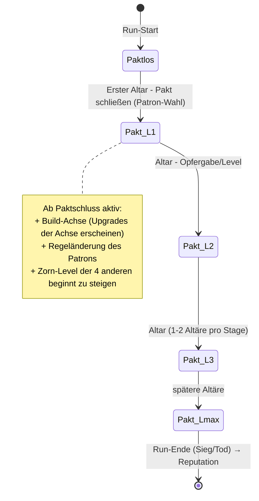
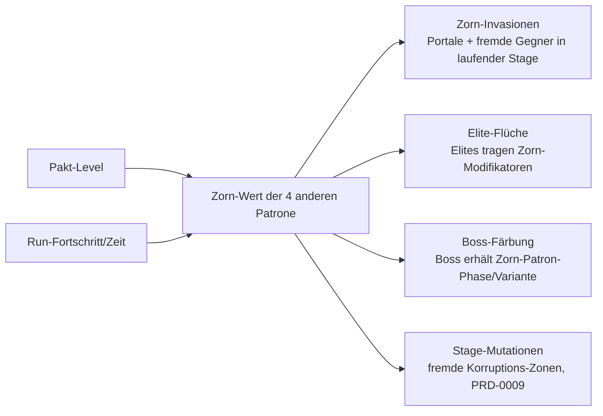

# PRD-0006: Patron- & Pakt-System

- **Status:** Entwurf
- **Datum:** 2026-09-14
- **Autor:** Lupus Malus Deviant (PO) / Claude (Ausarbeitung)
- **Stakeholder:** Lupus Malus Deviant (PO), Coding-Agenten
- **Index:** [PRD-0000](0000-index-fiends-n-patrons.md)

## Problem / Motivation

Roguelites leben von der Frage „Warum ist dieser Run anders?". Die Antwort von Fiends n Patrons
ist das Patron-System: **5 okkulte Mächte**, von denen der Spieler pro Run genau eine wählt — und
damit vier gegen sich aufbringt. Der Pakt ist Build-Achse, Regeländerung und Erzählmotor in einem.
Ohne dieses System ist das Spiel ein kompetenter Genre-Vertreter; mit ihm hat es eine Identität.
Es ist das inhaltlich komplexeste Einzelsystem und braucht das präziseste PRD.

## Ziele

- 5 Patrone, jeder mit **Build-Achse + Regeländerung** (E-Antwort „Beides"), die einen Run spürbar umformen.
- Der **Zorn** der vier übrigen Patrone ist eine erlebbare Gegenkraft (Invasionen, Flüche, Boss-Färbung) — Macht hat sichtbaren Preis.
- Patrone wirken in die Welt: **Gegner-Reaktionen, Level-Mutationen, Boss-Varianten** (E-Antwort: alle drei).
- Jeder Patron ist als Charakter präsent: Stimme im Run, visuelle Manifestation, Hub-Dialoge (PRD-0011).

## Non-Goals

- Kein Multi-Pakt: genau ein Patron pro Run, unumkehrbar (Wechsel = Non-Goal, auch als Spätfeature erst nach v1.0 diskutierbar).
- Kein „No-Pakt-Run" als gleichwertiger Pfad in v1.0: Paktlos spielen ist möglich, aber bewusst unattraktiv (kein Zorn, aber auch keine Achse — Balancing-Aussage, kein eigener Modus).
- Keine Patron-Skill-Trees über Runs hinweg: Meta-Wachstum läuft über Reputation/Unlocks (PRD-0010), nie über permanente Stat-Steigerung des Pakts.

## Systemmodell



**Zorn-Mechanik (Kopplung an Director, PRD-0007):**



## Die 5 Patrone (Arbeitsstand — Namen/Details = OF-1, gemeinsam zu iterieren)

| # | Arbeitsname | Domäne | Build-Achse (Beispiel) | Regeländerung (Beispiel) |
|---|-------------|--------|------------------------|--------------------------|
| 1 | Der Blutgraf | Blut, Preis, Gier | Lifesteal, Schaden skaliert mit fehlender HP | Heilung halbiert, Gegner droppen Blutzoll-Währung |
| 2 | Die Leere | Nichts, Sog, Stille | Zonen/Debuffs, Bullets verlangsamen nahe dem Spieler | Bomben werden zu Implosionen, weniger Item-Drops, mehr Altäre |
| 3 | Die Pestmutter | Fäulnis, Schwarm, Geduld | DoT, Sporenwolken, Beschwörungs-Ableger | Gegner hinterlassen Miasma; eigene HP-Regeneration über Zeit |
| 4 | Der Kettenschmied | Ordnung, Ketten, Strafe | Parade-/Melee-Verstärkung, Ketten-Procs zwischen Zielen | Parade-Fenster größer, Dash-Ladungen begrenzt |
| 5 | Die Aschekönigin | Feuer, Asche, Wiedergeburt | Brand-Flächen, Explosions-Synergien | Tödlicher Treffer einmalig überlebt (Asche-Form), dafür permanenter Brand-Selbstschaden-Risiko |

> Diese Tabelle ist Design-Rohmaterial mit Platzhalter-Charakter — sie zeigt die geforderte Struktur
> (Domäne + Achse + Regel) und wird in einer Design-Session mit dem PO finalisiert (OF-1).

## Funktionale Anforderungen

| ID | Anforderung | Priorität |
|----|-------------|-----------|
| FR-01 | Pro Run kann an einem Altar genau ein Pakt geschlossen werden; die Wahl ist für den Run unveränderlich. | Must |
| FR-02 | Jeder Patron definiert: Build-Achse (eigener Upgrade-Pool, der in Drops/Shop/Altäre einfließt) UND eine globale Regeländerung ab Paktschluss. | Must |
| FR-03 | 1–2 Altäre pro Stage; an Altären wird der Pakt gelevelt (Opfergabe/Interaktion), jedes Level vertieft Achse und Regelwirkung. | Must |
| FR-04 | Zorn-System: numerischer Zorn-Wert der 4 Nicht-Gewählten, steigend mit Pakt-Level und Run-Fortschritt; speist Director-Events (Invasionen, Elite-Flüche), Stage-Mutationen und Boss-Färbung. | Must |
| FR-05 | Zorn-Invasionen: Portal-Events in laufenden Stages, die Gegner-/Hazard-Sets des zürnenden Patrons einspeisen — klar telegraphiert. | Must |
| FR-06 | Gegner-Reaktionen: definierte Gegner-Tags reagieren auf den aktiven Patron (Furcht/Feindschaft/Verstärkung) gemäß Reaktionsmatrix (Daten). | Must |
| FR-07 | Boss-Varianten: jeder der 3 Bosse besitzt pro Patron mindestens eine Färbung (Zusatz-Phase, Pattern-Austausch oder Arena-Modifikator) — gesteuert über Pakt UND Zorn. | Must |
| FR-08 | Patron-Präsenz: Text-Einblendungen mit Charakterstimme bei Paktschluss, Altar, Zorn-Event, Tod/Sieg (Content aus PRD-0011). | Must |
| FR-09 | Patrone sind als Content-Plugins implementiert (Trait `PatronPlugin`): Achse, Regel, Zorn-Verhalten, Reaktions-Tags — kein Patron-Sonderfall im Kernsystem. | Must |
| FR-10 | Patron-Reputation: Runs erzeugen Reputationsfortschritt beim gewählten Patron (und ggf. Malus-Spuren bei zornigen) — Schnittstelle zu PRD-0010/0011. | Must |
| FR-11 | Paktlos-Zustand ist vollständig spielbar (kein Softlock ohne Pakt), aber ohne Achsen-Upgrades. | Must |
| FR-12 | Balancing-Sichtbarkeit: Zorn-Kurven, Achsen-Werte, Regelparameter liegen als Daten vor und sind im Balancing-Dashboard visualisier- und simulierbar. | Should |

## Nicht-Funktionale Anforderungen

- **Lesbarkeit der Kausalität:** Jedes Zorn-Event benennt seinen Urheber (Patron-Symbol + Einzeiler) — der Spieler muss Ursache→Wirkung immer zuordnen können.
- **Balance-Rahmen:** Jeder Patron muss jeden Boss besiegen können (keine Hard-Counter-Sackgassen); Bot-Simulationen pro Patron-Achse als Standard-Prüfung (PRD-0018).
- **Erweiterbarkeit:** Ein 6. Patron muss ohne Änderung am Kernsystem hinzufügbar sein (Plugin-Beweis; Test in P4 als „Dummy-Patron").

## User Stories

- **US-01:** Als Spieler möchte ich am Altar spüren, dass ich etwas Gefährliches tue — Pakt-Level 3 macht mich mächtig UND die Welt sichtbar feindseliger.
- **US-02:** Als Spieler möchte ich im dritten Run mit der Pestmutter anders bauen, kämpfen und sterben als mit dem Blutgrafen, damit Runs sich nach Weltanschauung anfühlen, nicht nach Zahlen.
- **US-03:** Als Coding-Agent möchte ich einen neuen Patron als Plugin + Datensatz anlegen, damit Content-Wachstum den Kern nie anfasst.
- **US-04:** Als Erzähler (PRD-0011) möchte ich an Pakt-, Altar-, Zorn- und Tod-Hooks Texte binden, damit Patrone als Charaktere sprechen.

```
Given Pakt mit Patron 3 (Pestmutter) auf Level 2, Zorn-Schwelle des Blutgrafen erreicht
When die nächste Raum-Welle startet
Then kündigt ein Blutgraf-Portal-Telegraph die Invasion an (Symbol + Spruch)
     und die Welle enthält zusätzlich Blutgraf-Gegner mit Zorn-Modifikator
```

## Akzeptanzkriterien / Success Metrics

- P3 (Slice): 1 Patron komplett erlebbar (Pakt, 1 Altar-Level, Achse in Upgrades, 1 Zorn-Invasionstyp, Boss-Färbung light).
- P4: alle 5 Patrone spielbar; Reaktionsmatrix, Zorn-Kurven, Boss-Varianten vollständig; Dummy-Patron-Plugin-Test bestanden.
- Wahrnehmungstest (P5): Tester können nach 3 Runs jeden erlebten Zorn-Effekt dem richtigen Patron zuordnen (≥ 80% Trefferquote).
- Balance: pro Patron ≥ 55% Boss-Kill-Rate im Standard-Bot-Profil, kein Patron > 1,5× Win-Rate eines anderen (Sim-Harness, P5).

## Offene Fragen

- **OF-6.1 (= OF-1):** Finale Namen, Domänen, Achsen, Regeln der 5 Patrone — gemeinsame Design-Session, iterativ (PRD-0011-Stimmen gleich mit).
- **OF-6.2:** Was ist die Opfergabe am Altar mechanisch (Währung, HP, Item-Slot, Wahl)? Vorschlag: patron-spezifisch (Teil der Identität). Entscheidung P3.
- **OF-6.3:** Sichtbarkeit der Zorn-Werte: exakte Leisten vs. stufige Omen (Empfehlung: Omen — Zahlen ins Statistik-Panel). Entscheidung mit PRD-0014.

## Referenzen

- [PRD-0007 Director](0007-gegner-und-director.md) (Zorn-Ausspielung) · [PRD-0008 Bosse](0008-bosse.md) (Varianten) · [PRD-0009 Stages](0009-prozedurale-stages.md) (Mutationen) · [PRD-0010 Progression](0010-progression-und-meta.md) (Reputation) · [PRD-0011 Narrativ](0011-narrativ-und-lore.md) (Stimmen)
