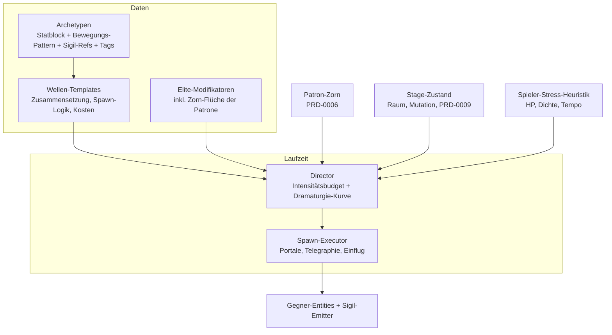

# PRD-0007: Gegner, KI & Director

- **Status:** Entwurf
- **Datum:** 2026-09-14
- **Autor:** Lupus Malus Deviant (PO) / Claude (Ausarbeitung)
- **Stakeholder:** Lupus Malus Deviant (PO), Coding-Agenten
- **Index:** [PRD-0000](0000-index-fiends-n-patrons.md)

## Problem / Motivation

Zwischen Spieler-Kit und Bossen liegt die Masse des Spiels: Wellen aus Gegnern, die Bullet-Patterns
in die Arena tragen. Zu dumm/gleichförmig ⇒ Fließband; zu chaotisch ⇒ unlesbar und unfair
(tödlich bei modellgroßer Hitbox). Gebraucht wird ein kuratierbares Vokabular (Archetypen,
Wellen-Templates) plus eine dramaturgische Instanz (Director), die daraus Spannung baut — und die
den Patron-Zorn als Werkzeug spielt.

## Ziele

- **8–12 Gegner-Archetypen** mit je klarer Rolle, Silhouette und Pattern-Sprache — vollständig pattern-basiert (deterministisch, lesbar).
- **Wellen-Templates + Director**: kuratierte Wellen als Vokabular; ein Intensitätsbudget-Director wählt, skaliert und sequenziert sie.
- **Eskalationsleiter**: Normal → Elite (Modifikator) → Miniboss (kleine Danmaku-Phasen) → Stage-Boss (PRD-0008).
- Telegraphie-Grammatik: jede Gefahr kündigt sich einheitlich an (Fairness-Fundament, koppelt an PRD-0003/0014).

## Non-Goals

- Keine Behavior-Trees/Utility-KI: Gegner entscheiden nicht, sie folgen Mustern (E-Antwort „Pattern-basiert"). Leichte Reaktivität nur als klar definierte Pattern-Zweige (z.B. „bei Melee-Nähe: Rückstoß-Pattern"), keine freie Entscheidungslogik.
- Kein Gegner-Spawning außerhalb des Directors (keine hartverdrahteten Raum-Spawns; Raum-Templates liefern nur Spawn-Punkte + Constraints).
- Keine Pathfinding-Vollausbaustufe (Navmesh): Arena-Räume + Steering-Patterns genügen.

## Systemmodell

**Director-Regelkreis:** Budget wächst mit Stage-Fortschritt und Pakt-Level; Dramaturgie-Kurve
wechselt zwischen Druckphasen und Atempausen; Zorn-Schwellen injizieren Invasions-Events als
Budget-Sonderposten.

## Gegner-Rollenraster (v1.0-Zielbild, Namen = Platzhalter)

| Rolle | Anz. | Kern-Verhalten (Beispiele) |
|-------|------|---------------------------|
| Schwärmer | 2 | billig, schnell, Melee-Futter; sterben in Masse, erzeugen Dichte |
| Schütze | 2–3 | stationär/kreisend, gerichtete Sigil-Patterns (Aimed/Fächer) |
| Vorhang-Träger | 1–2 | langsam, projiziert Flächen-Patterns (Ringe/Wellen) — die „Danmaku-Quelle" |
| Tank/Brecher | 1 | rückt vor, zwingt Positionswechsel, Smash-resistente Bullets |
| Beschwörer | 1 | spawnt Schwärmer/Zonen, Prioritätsziel |
| Störer | 1 | jagt den Spieler, unterbricht Graze-Camping (Anti-Stillstand) |
| Unterstützer | 1 | bufft/schirmt andere (Schild-Aura) — schafft Zielprioritäten |

## Funktionale Anforderungen

| ID | Anforderung | Priorität |
|----|-------------|-----------|
| FR-01 | Archetypen sind reine Daten + Sigil-Referenzen (Statblock, Bewegungs-Pattern, Phasen, Tags); neue Archetypen ohne Engine-/Kern-Codeänderung. | Must |
| FR-02 | v1.0 liefert 8–12 Archetypen, die das Rollenraster abdecken (jede Rolle ≥ 1). | Must |
| FR-03 | Bewegungs-Patterns: deklarative Bausteine (Kreisen, Zickzack, Annähern-bis-Distanz, Orbit, Fluchtpunkt) mit deterministischer Ausführung. | Must |
| FR-04 | Definierte Reaktivitäts-Zweige pro Archetyp erlaubt (z.B. `on_melee_proximity`, `on_patron_tag`), als Daten-Zweige, nicht als freie Logik. | Should |
| FR-05 | Elite-System: Modifikatoren (mehr HP, Zusatz-Pattern, Aura, Zorn-Fluch) stapeln auf Archetypen; visuell klar markiert (Silhouetten-Aufsatz + Farbe). | Must |
| FR-06 | Minibosse: eigene Entities mit 1–2 Danmaku-Phasen und Telegraphie-Intro; 2–3 Stück in v1.0, vom Director an Dramaturgie-Höhepunkten platziert. | Must |
| FR-07 | Wellen-Templates: deklarieren Zusammensetzung (Archetyp-Slots + Kostenwert), Spawn-Choreografie (Portale/Ränder/Timing) und Constraints (Raumgröße, Biom). | Must |
| FR-08 | Director: verwaltet Intensitätsbudget, Dramaturgie-Kurve (Druck/Pause), wählt Templates budget- und constraints-konform, skaliert Elite-Anteile. | Must |
| FR-09 | Director spielt Patron-Zorn aus: Zorn-Schwellen ⇒ Invasions-Events (PRD-0006 FR-05) mit eigenem Budget-Topf und Vorwarnung. | Must |
| FR-10 | Spieler-Stress-Heuristik als Director-Input (HP, Bullet-Dichte am Spieler, Zeit seit letztem Schaden) — dämpfend oder eskalierend, deterministisch aus Sim-Zustand berechnet. | Should |
| FR-11 | Telegraphie-Grammatik: jeder Spawn und jeder Angriff hat Vorlauf (Bodenmarker/Aufladeanimation/Sound-Cue) mit einheitlichen Zeitklassen (kurz/mittel/lang). | Must |
| FR-12 | Gegner-Tags für Patron-Reaktionen (PRD-0006 FR-06): Furcht (fliehen/zögern), Feindschaft (fokussieren), Verstärkung (Zorn-Buff). | Must |
| FR-13 | Alle Director-Parameter (Budgets, Kurven, Schwellen) sind Pack-Daten, im Balancing-Dashboard einseh- und simulierbar. | Must |

## Nicht-Funktionale Anforderungen

- **Performance:** 100 aktive Gegner + deren Emitter innerhalb des Sim-Budgets (PRD-0002); Gegner-Systeme sind ECS-Batch-Systeme, keine Pro-Entity-Einzellogik.
- **Lesbarkeit:** Silhouetten-Regel (PRD-0003): jede Rolle auf Anhieb unterscheidbar; Elite-Markierung nie nur Farbe.
- **Determinismus:** Director-Entscheidungen sind reine Funktionen aus (Seed, Sim-Zustand) — Replays enthalten identische Spawns.

## User Stories

- **US-01:** Als Spieler möchte ich nach Sekunden erkennen, welche Rolle ein neuer Gegner spielt, damit ich Prioritäten setzen kann statt Überraschungen zu sterben.
- **US-02:** Als Spieler möchte ich nach einer brutalen Druckphase eine hörbare/sichtbare Atempause bekommen, damit Spannung eine Kurve hat statt Dauerrauschen.
- **US-03:** Als Designer möchte ich eine neue Welle als Template aus vorhandenen Archetypen komponieren und dem Director Kosten nennen, damit sie automatisch dramaturgisch korrekt eingesetzt wird.
- **US-04:** Als Patron-System möchte ich dem Director Zorn-Events übergeben, damit Strafe des Pakts als inszenierte Invasion erlebbar wird.

## Akzeptanzkriterien / Success Metrics

- P2: 3 Archetypen (Schwärmer, Schütze, Vorhang-Träger) kämpfen im Testraum; Telegraphie-Grammatik v1 steht.
- P3 (Slice): Director light sequenziert Templates über eine Raum-Kette inkl. 1 Miniboss und 1 Zorn-Invasionstyp.
- P4: Rollenraster voll besetzt (8–12), Elites + 2–3 Minibosse, Reaktions-Tags aktiv.
- Determinismus: identische Seeds erzeugen identische Spawn-Sequenzen (Golden-Master).
- Dramaturgie-Messung (P5): Intensitäts-Verlaufskurven aus Bot-Runs zeigen erkennbare Wechsel von Druck- und Ruhephasen (kein Plateau-Dauerdruck > 90 s).

## Offene Fragen

- **OF-7.1:** Stress-Heuristik v1: welche Signale genau, und dämpft sie nur oder eskaliert sie auch? Design-Experiment in P3.
- **OF-7.2:** Fliegende/Geister-Gegner (ignorieren Level-Kollision)? Beeinflusst Raum-Generator (PRD-0009). Entscheidung P4.
- **OF-7.3:** Benennungs- und Lore-Schema der Archetypen (mit PRD-0011 abstimmen).

## Referenzen

- [PRD-0004 Sigil](0004-sigil-bullet-system.md) · [PRD-0006 Patron](0006-patron-und-pakt-system.md) · [PRD-0008 Bosse](0008-bosse.md) · [PRD-0009 Stages](0009-prozedurale-stages.md) · [PRD-0016 Tooling](0016-tooling-suite.md) (Stage-/Wellen-Editor)
