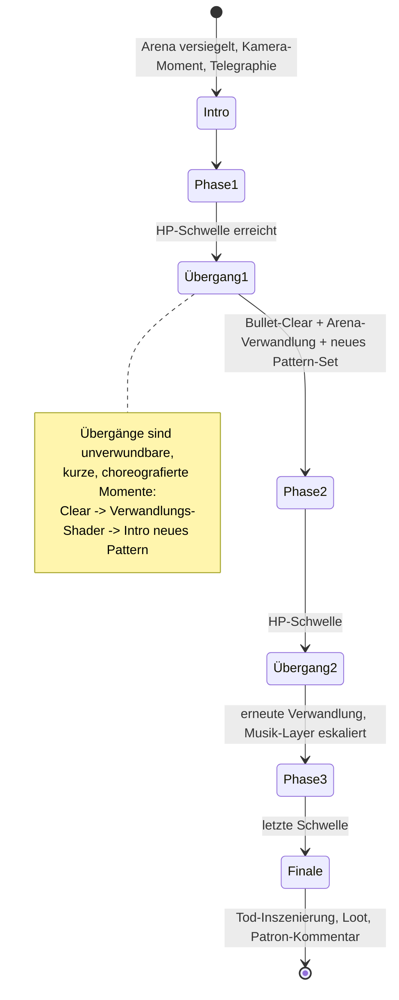

# PRD-0008: Bosse

- **Status:** Entwurf
- **Datum:** 2026-09-14
- **Autor:** Lupus Malus Deviant (PO) / Claude (Ausarbeitung)
- **Stakeholder:** Lupus Malus Deviant (PO), Coding-Agenten
- **Index:** [PRD-0000](0000-index-fiends-n-patrons.md)

## Problem / Motivation

Bosse sind der Danmaku-Anteil des Hybrids: choreografierte Bullet-Vorhänge als Höhepunkt jeder
Stage. Sie sind gleichzeitig der teuerste Content (Modell, Phasen, Patterns, Arena-Verwandlung,
5 Patron-Färbungen × 3 Bosse) — deshalb setzt v1.0 auf **3 handpolierte Bosse** statt eines Pools.
Ohne präzise Phasen-/Fairness-Regeln entsteht entweder Bullet-Chaos oder HP-Schwamm-Langeweile.

## Ziele

- 3 Bosse (einer pro Stage-Slot), jeder ein einprägsames Set-Piece mit eigener Identität, Arena und Musik-Layer-Eskalation.
- **Feste HP-Phasen** (2–4 pro Boss) mit klaren Übergängen: Bullet-Clear, Telegraphie, Arena-Verwandlung pro Phase.
- **Patron-Färbungen:** jeder Boss reagiert auf Pakt und Zorn mit mindestens einer Variante pro Patron (PRD-0006 FR-07).
- Melee-Viabilität: jeder Boss ist mit dem Nahkampf-Kit besiegbar designt (Angriffsfenster, Parade-Momente).

## Non-Goals

- Kein Boss-Pool, keine Zufalls-Bosse in v1.0 (3 feste Bosse; Pool ist Post-v1.0-Option).
- Keine adaptiven Phasen (E-Antwort: feste HP-Schwellen) — Reaktivität kommt aus Patron-Färbung, nicht aus Verhaltens-KI.
- Kein separater Boss-Rush-/Practice-Modus (E14: kein Trainingsmodus).
- Keine Spellcard-Bonusökonomie (Touhou-Stil) in v1.0 — Phasen sind Phasen.

## Boss-Anatomie



**Bausteine pro Phase:** 2–3 Sigil-Pattern-Sets (rotierend), 1 Bewegungs-Choreografie,
1 Arena-Zustand (Hazards, Geometrie), definierte Angriffsfenster (Melee-Punish-Momente),
optional Add-Spawns (Director-Sonderbudget).

## Funktionale Anforderungen

| ID | Anforderung | Priorität |
|----|-------------|-----------|
| FR-01 | Boss-Definitionen sind Daten + Sigil-Referenzen (Phasen, Schwellen, Patterns, Arena-Zustände, Färbungen); Kern-Code kennt nur das Boss-Schema. | Must |
| FR-02 | v1.0 enthält 3 Bosse mit je 2–4 HP-Phasen und eindeutiger Identität (Modell, Arena, Musik-Eskalation). | Must |
| FR-03 | Phasenübergang: Boss unverwundbar, aktives Bullet-Clear (Sigil FR-12), Verwandlungs-VFX, Telegraphie des neuen Pattern-Sets — Gesamtdauer 2–5 s. | Must |
| FR-04 | Arena-Verwandlung pro Phase: Geometrie-/Hazard-/Licht-Zustandswechsel über das Mutations-System (PRD-0009), choreografiert statt prozedural. | Must |
| FR-05 | Patron-Färbung: pro Boss und Patron mindestens EINE Variante — Zusatz-/Ersatz-Pattern, Arena-Modifikator oder Zwischenphase; Auswahl folgt Pakt + höchstem Zorn. | Must |
| FR-06 | Melee-Fairness: jede Phase enthält definierte Angriffsfenster (Boss verwundbar in Reichweite) und mindestens ein `reflectable`-Pattern als Parade-Chance. | Must |
| FR-07 | Boss-HP-Leiste mit Phasen-Segmenten im HUD (PRD-0014); Phasenwechsel-Schwellen sichtbar. | Must |
| FR-08 | Tod-Inszenierung: skriptbarer Ablauf (Zeitlupe, Zerfall-Shader, Loot-Ausschüttung, Patron-Kommentar-Hook). | Must |
| FR-09 | Boss-Kämpfe laufen versiegelt (kein Verlassen der Arena); Items/Bomben bleiben nutzbar. | Must |
| FR-10 | Jeder Boss-Kampf ist headless per Bot simulierbar (Balance-Messung: Time-to-Kill, Trefferquote pro Phase). | Should |

## Nicht-Funktionale Anforderungen

- **Performance:** Boss-Phasen sind die dichtesten Szenen des Spiels (Vorhang + Adds + Verwandlung) — sie definieren den Worst-Case des 10k-/Budget-Ziels und sind Pflicht-Benchmark-Szenen.
- **Fairness:** Kein Instant-Kill ohne lange Telegraphie; nach Phasenwechsel ≥ 1 s Orientierungszeit ohne tödliche Projektile im Spieler-Nahbereich.
- **Wiedererkennbarkeit:** Feste Phasen + Determinismus ⇒ Pattern-Lernen wird belohnt; Patron-Färbung variiert, ohne das Grundskelett unkenntlich zu machen.

## User Stories

- **US-01:** Als Spieler möchte ich beim dritten Versuch die Phase-2-Patterns „lesen" können, damit Lernen — nicht Glück — den Sieg bringt.
- **US-02:** Als Spieler mit Blutgraf-Pakt möchte ich denselben Boss anders erleben als mit der Leere, damit Boss-Wiederholung über Runs frisch bleibt.
- **US-03:** Als Designer möchte ich eine Boss-Phase komplett in Daten (Sigil + Schema) definieren und im Stage-Editor probespielen, damit Boss-Iteration nicht am Compiler hängt.
- **US-04:** Als Melee-Spieler möchte ich klare Punish-Fenster erkennen, damit Aggression eine Strategie ist und kein Selbstmord.

```
Given Boss 1 in Phase 2, Spieler-Pakt: Aschekönigin, Zorn-Führer: Kettenschmied
When die HP-Schwelle zu Phase 3 unterschritten wird
Then Clear + Verwandlung laufen, und Phase 3 lädt die Kettenschmied-Zorn-Variante
     (Ketten-Hazards in der Arena) zusätzlich zum Basis-Pattern-Set
```

## Akzeptanzkriterien / Success Metrics

- P3 (Slice): Boss 1 vollständig (3 Phasen, Arena-Verwandlung, 1 Patron-Färbung, Tod-Inszenierung, HUD-Leiste).
- P4: alle 3 Bosse, alle 5 Färbungen pro Boss vorhanden (min. 1 Variante je Kombination).
- Benchmark: dichteste Boss-Phase hält alle Budgets (CI-Benchmark-Szene).
- Balance (P5, Bot-Simulationen): mittlere Time-to-Kill pro Boss 2–4 Min; erste-Begegnung-Sterberate hoch, aber Lernkurve messbar (Bot-Profile mit Pattern-Wissen gewinnen signifikant öfter).
- Feel-Gate (PO): jeder Boss hat einen „Signature-Moment", der im GIF beeindruckt (Phasen-Verwandlung zählt).

## Offene Fragen

- **OF-8.1:** Identität der 3 Bosse (Wesen, Arena, Bezug zur Aufstiegs-Story) — Design-Session mit PRD-0011 vor P4.
- **OF-8.2:** Skaliert Boss-HP mit Pakt-Level (Zorn als Endpreis) oder bleibt sie fix? Balancing-Frage, Entscheidung nach ersten Sim-Daten (P4).
- **OF-8.3:** Färbungs-Matrix voll (3×5 einzigartig) oder geteilte Zorn-Bausteine pro Patron über Bosse hinweg? Aufwandsentscheidung P4.

## Referenzen

- [PRD-0004 Sigil](0004-sigil-bullet-system.md) · [PRD-0006 Patron](0006-patron-und-pakt-system.md) · [PRD-0009 Stages](0009-prozedurale-stages.md) (Verwandlung) · [PRD-0012 Audio](0012-audio-system.md) (Layer-Eskalation) · [PRD-0018 Tests](0018-teststrategie.md) (Bot-Simulation)
