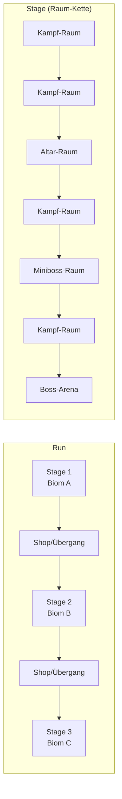
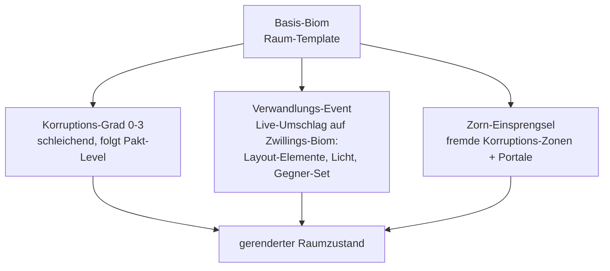

# PRD-0009: Prozedurale Stages & Level-Mutation

- **Status:** Entwurf
- **Datum:** 2026-09-14
- **Autor:** Lupus Malus Deviant (PO) / Claude (Ausarbeitung)
- **Stakeholder:** Lupus Malus Deviant (PO), Coding-Agenten
- **Index:** [PRD-0000](0000-index-fiends-n-patrons.md)

## Problem / Motivation

Runs sollen sich über dutzende Wiederholungen frisch anfühlen, ohne dass handgebaute Level-Massen
entstehen. Gleichzeitig ist das Signature-Feature des Spiels die **Verwandlung der Welt im
laufenden Run** (Stage-Events, wachsende Patron-Korruption, Zorn-Invasionen) — ein Generator, der
nur statische Layouts baut, greift zu kurz. Der Fokus liegt auf Kampf-Flow: **Raum-Ketten ohne
Erkundungs-Layer** (E-Antworten), jede Minute gehört dem Gefecht.

## Ziele

- Prozeduraler Generator für **lineare Raum-Ketten**: 2–3 Stages pro Run, klarer Flow Raum → Clear → Tür → Raum → … → Boss.
- **3 Biome mit je einer korrumpierten Zwillingsversion** — die Verwandlungs-Events blenden live zwischen Basis und Zwilling.
- Drei Mutations-Mechaniken erlebbar: **Stage-Verwandlungs-Events** (schlagartig), **Patron-Korruption** (schleichend, pakt-levelgetrieben), **Zorn-Invasionen** (punktuell, PRD-0006/0007).
- Seed-Reproduzierbarkeit: gleicher Seed ⇒ identische Kette, Räume, Platzierungen (E05).

## Non-Goals

- Keine Erkundung: keine Geheimräume, optionalen Abzweige oder Sammel-Nischen (E-Antwort „reiner Kampf-Flow"). Die Kette ist linear; Abwechslung kommt aus Raum-Innenleben, nicht Topologie.
- Keine offene Fläche, keine Weltkarte, kein Backtracking.
- Kein Terrain-/Höhensystem: Gameplay-Ebene bleibt 2D; Vertikalität ist rein visuell (PRD-0003).
- Keine destruktive Physik — zerstörbare Props sind skriptierte Zustandswechsel.

## Strukturmodell

**Raum-Typen v1.0:** Kampf-Raum (Varianten S/M/L), Altar-Raum (1–2 pro Stage, PRD-0006),
Shop-Raum (zwischen Stages, PRD-0010), Miniboss-Raum, Boss-Arena, Auftakt-Raum (Stage-Intro, sicher).

**Mutations-Schichten:**

## Funktionale Anforderungen

| ID | Anforderung | Priorität |
|----|-------------|-----------|
| FR-01 | Stage-Generator erzeugt aus Seed + Stage-Parametern eine lineare Raum-Kette (v1.0: 5–8 Räume) aus Raum-Templates mit Varianten-Slots. | Must |
| FR-02 | Raum-Templates sind Daten (Geometrie-Bausteine, Spawn-Punkte, Hazard-Slots, Altar-/Shop-Anker, Constraints für Director). | Must |
| FR-03 | Raum-Ablauf: betreten → versiegeln → Wellen (Director) → Clear → Belohnung → Tür öffnet; kein Zurück. | Must |
| FR-04 | 3 Biome, jedes mit korrumpierter Zwillingsversion (eigene Paletten, Props, Licht-Stimmung, Hazard-Set) — Zwilling teilt Geometrie-Grundriss (Verwandlung ohne Layout-Bruch). | Must |
| FR-05 | Verwandlungs-Event: skript-/triggerbar (Story-Beat, Boss-Phase, Altar-Ritual); Umschlag Basis→Zwilling live im betretenen Raum (Verwandlungs-Shader PRD-0003 FR-09, Gegner-Set-Wechsel via Director). | Must |
| FR-06 | Patron-Korruption: pro Pakt-Level steigender Korruptions-Grad (0–3) färbt Folgeräume zunehmend (Decals, Licht, patroneigene Hazards) — schleichend, nicht schlagartig. | Must |
| FR-07 | Zorn-Einsprengsel: Zorn-Events dürfen Räume nachträglich modifizieren (Portal-Anker, fremde Hazard-Zonen) — über dieselbe Mutations-Schnittstelle wie FR-05/06. | Must |
| FR-08 | Hazard-System: Flächen-/Objekt-Gefahren (Feuer, Miasma, Ketten, Dornen) als wiederverwendbare Bausteine, biom- und patronzuordenbar; interagiert mit `env_active`-Bullets (PRD-0004 FR-04). | Must |
| FR-09 | Kit-Lehrpfad: die ersten Räume von Stage 1 erzwingen per Constraint Lehr-Situationen (smashable-Vorhang, Parade-Gegner, Graze-Gasse) — Ersatz für den nicht existierenden Trainingsmodus (PRD-0005 NFR). | Must |
| FR-10 | Boss-Arenen sind handgebaute Templates mit Phasen-Zuständen (PRD-0008 FR-04), vom Generator nur ausgewählt, nie generiert. | Must |
| FR-11 | Generator-Validierung: jede generierte Kette ist beweisbar abschließbar (Pfad existiert, Pflicht-Räume vorhanden, Budget-Grenzen eingehalten) — Validator läuft im Sim-Harness über Seed-Batches. | Must |
| FR-12 | Stage-Übergang: kurze inszenierte Abstiegs-/Aufstiegssequenz (Story-Hook, PRD-0011) + Shop-Raum. | Should |

## Nicht-Funktionale Anforderungen

- **Generierungszeit:** komplette Stage < 100 ms auf Referenz-Hardware (Ladebildschirm-frei zwischen Räumen; Stage-Wechsel darf kurz blenden).
- **Determinismus:** Generator ist reine Funktion (Seed, Parameter) → Kette; Mutationen sind Event-Log-basiert und damit replay-fähig.
- **Varianz-Messlatte:** 100 Seeds derselben Stage-Position ergeben ≥ 20 strukturell unterscheidbare Ketten (Raum-Typ-Sequenz + Template-Wahl), gemessen im Sim-Harness.
- **Speicher:** Raumwechsel streamt Assets aus dem Pack ohne Spike > Frame-Budget (Preload des Folgeraums während des Kampfes).

## User Stories

- **US-01:** Als Spieler möchte ich mitten im Kampf erleben, wie der Ritualsaal in seinen korrumpierten Zwilling kippt, damit „starke Leveländerung im Run" ein Gänsehaut-Moment ist.
- **US-02:** Als Spieler mit hohem Pakt möchte ich sehen, wie MEINE Macht die Welt zeichnet (Korruption wächst), damit der Pakt räumlich erzählt wird.
- **US-03:** Als Designer möchte ich ein neues Raum-Template mit Spawn-Punkten und Constraints im Stage-Editor anlegen, damit der Generator es sofort verwenden kann.
- **US-04:** Als QA-Agent möchte ich 10.000 Seeds automatisch validieren, damit kein Spieler je in einer unabschließbaren Kette landet.

## Akzeptanzkriterien / Success Metrics

- P3 (Slice): 1 Biom + Zwilling, 5-Raum-Kette, 1 Verwandlungs-Event, Altar- und Shop-Raum, Boss-Arena; Kit-Lehrpfad in Raum 1–2 wirksam (Tester lernt Parade ohne Erklärung).
- P4: 3 Biome + Zwillinge, Korruptions-Grade, Zorn-Einsprengsel, alle Raum-Typen.
- Validator: 10.000 Seeds ohne Abschließbarkeits-Fehler (CI-Gate).
- Varianz-Messung bestanden (siehe NFR); PO-Stichprobe: 10 zufällige Seeds fühlen sich „nicht wie Wiederholung" an.
- Verwandlungs-Event ohne Frame-Drop (gemeinsames Kriterium mit PRD-0003).

## Offene Fragen

- **OF-9.1:** Biom-Identitäten (3 Basis + 3 Zwillinge) — thematische Festlegung mit PRD-0011 (Aufstiegs-Logik: Tiefe → Oberfläche?) vor P4.
- **OF-9.2:** Raumgeometrie: reine Template-Instanzen oder Template + prozedurale Innen-Variation (Props/Hazard-Streuung)? Empfehlung: Template + Streuung. Spike P3.
- **OF-9.3:** Werden Verwandlungs-Events vom Run-Skript (Story-Beats) oder vom Director getriggert — oder beides mit Prioritätsregel? Design-Entscheidung P4.

## Referenzen

- [PRD-0006 Patron](0006-patron-und-pakt-system.md) · [PRD-0007 Director](0007-gegner-und-director.md) · [PRD-0008 Bosse](0008-bosse.md) · [PRD-0003 Rendering](0003-rendering-und-art.md) (Verwandlungs-Shader, Paletten) · [PRD-0016 Tooling](0016-tooling-suite.md) (Stage-Editor)
