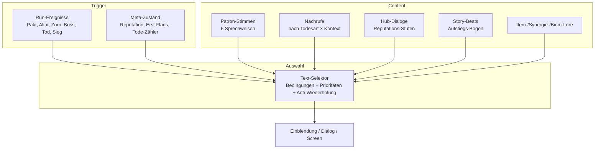

# PRD-0011: Narrativ, Lore & Texte

- **Status:** Entwurf
- **Datum:** 2026-09-14
- **Autor:** Lupus Malus Deviant (PO) / Claude (Ausarbeitung)
- **Stakeholder:** Lupus Malus Deviant (PO, kreative Endinstanz), Claude (Erstfassungen), Coding-Agenten
- **Index:** [PRD-0000](0000-index-fiends-n-patrons.md)

## Problem / Motivation

Permadeath braucht Sinn: Im Hades-Modell wird das Scheitern selbst zum Erzählvehikel — jeder Tod
treibt Beziehungen und Geschichte weiter. Fiends n Patrons hat dafür ideales Personal: 5 Patrone
mit Agenda, eine verdammte Seele im Aufstieg, und einen Todesscreen, der **hämische Nachrufe**
verdient. Ohne System dahinter bleibt es bei drei Zufallssprüchen, die sich nach Run 10 wiederholen.
Texte entstehen **gemeinsam iterativ** (Claude generiert, PO redigiert) in **DE + EN ab v1.0**.

## Ziele

- **Fortlaufende Run-Story:** Story-Beats und Patron-Beziehungen entwickeln sich über viele Runs (getrieben durch Reputation, Erst-Ereignisse, Boss-Kills, Tode).
- Die 5 Patrone sind unterscheidbare Stimmen mit Agenda — präsent im Run (Einblendungen), visuell (Manifestationen) und im Hub (Dialoge).
- **Nachruf-System:** todesursachen- und kontextabhängige, hämische Nachrufe mit hoher Varianz.
- Vollständige Lokalisierungs-Architektur: Keys statt Strings, DE+EN gleichwertig gepflegt.

## Non-Goals

- Keine Cutscenes, kein Voice-Acting in v1.0 (Text + Inszenierung in-engine; Voice ist Post-v1.0-Option).
- Keine sammelbaren Lore-Fragmente (E-Antwort: kein Erkundungs-Layer) — Lore fließt über Dialoge, Item-/Synergie-Beschreibungen, Biome.
- Kein verzweigender Story-Baum mit Enden-Matrix in v1.0: EIN Aufstiegs-Bogen, der sich über Wiederholung entfaltet; Patron-Perspektiven färben ihn.
- Keine prozedural generierten Texte zur Laufzeit — alle Texte sind kuratierter, redigierter Content (Auswahl ist prozedural, Inhalt nicht).

## Erzähl-Architektur



**Text-Content ist Daten:** Einträge mit Bedingungen (`patron=3, pakt_level>=2, erstes_mal=false`),
Priorität, Cooldown/Anti-Wiederholung, Lokalisierungs-Key. Der Selektor ist deterministisch
(Seed-RNG bei Gleichstand).

## Funktionale Anforderungen

| ID | Anforderung | Priorität |
|----|-------------|-----------|
| FR-01 | Lokalisierungssystem: alle Spielertexte über Keys + Sprachdateien (DE, EN); Fallback-Regel EN→DE-Key-Anzeige; Umschaltung zur Laufzeit. | Must |
| FR-02 | Text-Selektor-System: bedingungsbasierte Auswahl mit Prioritäten, Erst-Ereignis-Flags, Anti-Wiederholungs-Historie (persistiert im Profil). | Must |
| FR-03 | Patron-Stimmen: pro Patron definierte Sprechweise (Stilblatt) + Textpools für: Paktschluss, Altar-Level, Zorn-Event (eigener & fremder), Boss-Färbung, Tod, Sieg. | Must |
| FR-04 | Nachruf-System: Todesscreen zeigt hämischen Nachruf, selektiert nach Todesursache (Gegnertyp/Boss/Hazard), Kontext (Stage, Pakt, Fast-Sieg) und Patron-Beziehung; v1.0-Pool ≥ 100 Nachrufe. | Must |
| FR-05 | Fortlaufende Story: Aufstiegs-Bogen in Story-Beats (Stage-Übergänge, Erst-Kills, Reputations-Schwellen); Beats sind einmalige, persistierte Ereignisse. | Must |
| FR-06 | Hub-Dialoge: Patrone im Menü-Hub ansprechbar; Dialogstufen an Reputation gekoppelt (PRD-0010 FR-11); einfache Dialog-Struktur (Sequenzen, keine Verzweigungsbäume nötig). | Must |
| FR-07 | Item-, Synergie-, Upgrade- und Biom-Beschreibungen tragen Lore-Flavor (1–2 Sätze) zusätzlich zur Mechanik-Erklärung. | Must |
| FR-08 | Story-relevante Inszenierung im Run (Patron-Manifestationen an Altären, Zorn-Portale) nutzt vorhandene Systeme (PRD-0006/0009) über Erzähl-Hooks — keine eigene Cutscene-Engine. | Must |
| FR-09 | Text-Pipeline: Texte leben als strukturierte Dateien im Content-Ordner, editierbar ohne Build (Pack-Kompilierung), diffbar in Git (Redaktions-Workflow PO↔Claude). | Must |
| FR-10 | Stilbibel Text (`docs/art/textstimme.md`): Ton (düster, hämisch, literarisch), Du/Sie-Regeln, Patron-Stilblätter, EN-Stilregeln — vor Massenproduktion der Texte. | Must |

## Nicht-Funktionale Anforderungen

- **Varianz:** identischer Nachruf frühestens nach 15 Toden wieder; Patron-Kommentare zum gleichen Trigger ≥ 3 Varianten.
- **Lesbarkeit im Kampf:** Run-Einblendungen sind kurz (≤ 12 Wörter), unterbrechen nie die Steuerung, kollidieren nie mit Bullet-Lesbarkeit (Platzierung gemäß PRD-0014).
- **Übersetzungsparität:** DE und EN werden im selben Commit gepflegt (CI-Check: Key-Parität beider Sprachdateien).

## User Stories

- **US-01:** Als Spieler möchte ich nach meinem 20. Tod von der Pestmutter anders verspottet werden als nach meinem ersten, damit sich die Welt an mich erinnert.
- **US-02:** Als Spieler möchte ich im Hub erleben, wie der Blutgraf ab Reputationsstufe 3 seine Maske fallen lässt, damit Treue zu einem Patron erzählerisch belohnt wird.
- **US-03:** Als PO möchte ich Text-Erstfassungen von Claude als diffbare Dateien bekommen und redigieren, damit die Stimme des Spiels meine bleibt.
- **US-04:** Als Coding-Agent möchte ich Texte ausschließlich über Keys referenzieren, damit kein String je hardcoded ist.

```
Given Spieler stirbt an Boss 2 mit 5% Boss-Rest-HP, Pakt: Kettenschmied, 12. Tod insgesamt
When der Todesscreen lädt
Then wählt der Selektor einen "Fast-Sieg"-Nachruf des Kettenschmieds,
     der noch nie gezeigt wurde, und registriert ihn in der Anti-Wiederholungs-Historie
```

## Akzeptanzkriterien / Success Metrics

- P3 (Slice): Loka-System + Selektor stehen; 1 Patron-Stimme (Pools für alle Trigger), ≥ 25 Nachrufe, Todesscreen-Integration.
- P5: 5 Patron-Stimmen, ≥ 100 Nachrufe, Story-Beats des Aufstiegs-Bogens, Hub-Dialoge über ≥ 3 Reputationsstufen, DE+EN vollständig (CI-Paritäts-Check grün).
- Varianz-Kriterien (NFR) automatisiert prüfbar (Selektor-Simulation über 1.000 Tode im Sim-Harness).
- Stilprobe: PO nimmt Stilbibel + 3 Patron-Stilblätter ab, bevor Massenproduktion beginnt (Gate vor P4-Textwelle).

## Offene Fragen

- **OF-11.1 (= OF-1/OF-6.1):** Finale Patron-Identitäten und ihre Stimmen — iterative Design-/Schreibsession.
- **OF-11.2:** Rahmen des Aufstiegs: Woraus steigt die Seele auf, was wartet oben, was wissen die Patrone? Story-Workshop vor P4.
- **OF-11.3:** Erzähler-Instanz ja/nein (neutrale Stimme neben den Patronen, z.B. für Nachrufe)? Vorschlag: Nachrufe sprechen die Patrone selbst. PO-Entscheidung.

## Referenzen

- [PRD-0006 Patron](0006-patron-und-pakt-system.md) (Hooks) · [PRD-0010 Progression](0010-progression-und-meta.md) (Reputation) · [PRD-0014 UI/UX](0014-ui-ux.md) (Todesscreen, Einblendungs-Regeln) · [PRD-0015 Persistenz](0015-persistenz-und-saves.md) (Story-Flags)
