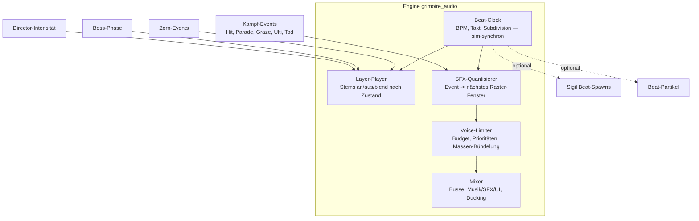

# PRD-0012: Audio-System — Metal-Hybrid, Beat-Clock & generierter Sound

- **Status:** Entwurf
- **Datum:** 2026-09-14
- **Autor:** Lupus Malus Deviant (PO) / Claude (Ausarbeitung)
- **Stakeholder:** Lupus Malus Deviant (PO), Coding-Agenten
- **Index:** [PRD-0000](0000-index-fiends-n-patrons.md)

## Problem / Motivation

10.000 Bullets, 100 Gegner und ein Metal-Soundtrack sind akustisch nicht naiv addierbar — das
Ergebnis wäre Brei. Die gewählte Antwort ist radikal: **SFX werden auf das Musik-Raster
quantisiert** (Just-Shapes-&-Beats-Richtung) und die Musik eskaliert in **vertikalen Layern** mit
dem Kampfgeschehen. Dazu kommt der konsequenteste Teil des Projekts: **alles Audio wird generiert**
(DSP-Synthese/prozedurale Komposition) — kein Sample-Pack, keine Lizenzmusik. Das macht Audio zum
Engine-Subsystem MIT Content-Pipeline, nicht zur nachgelagerten Asset-Liste.

## Ziele

- **Beat-Clock als Engine-Primitive:** ein musikalisches Zeitraster (BPM, Takt, Subdivisionen), an dem Musik-Layer, SFX-Quantisierung, VFX (PRD-0003 FR-06) und optional Sigil-Spawns (OF-4.3) hängen.
- **Vertikales Layer-System:** Musik-Stems blenden nach Director-Intensität, Boss-Phase und Zorn-Zustand.
- **Musik-synchronisierte SFX:** Kampfereignisse klingen quantisiert (nächstes Subdivisions-Fenster), Masse wird zu rhythmischen Akzenten gebündelt.
- **Voll generierte Audio-Inhalte:** Metal-Hybrid-Stems und SFX entstehen aus der Audio-Werkstatt (C#-Tooling, DSP-Rezepte) — reproduzierbar aus Quelldaten.

## Non-Goals

- Kein Live-DSP-Komponieren zur Laufzeit im Spiel: Die Engine spielt gerenderte Stems/Samples ab, die offline aus Rezepten generiert wurden (Laufzeit-Synthese nur für parametrische SFX-Varianten, wo günstig).
- Keine Middleware (FMOD/Wwise) — eigenes Audio-Subsystem (from-scratch-Anspruch).
- Kein 3D-/HRTF-Audio und keine Richtungs-Cues als Gameplay-Information (bewusst abgewählt); Stereo-Panning nach Bildschirmposition genügt.
- Kein dynamisches Umkomponieren (horizontale Übergänge) in v1.0 — vertikale Layer + harte, taktquantisierte Trackwechsel reichen.

## Systemmodell

**Quantisierungs-Grammatik (v1-Vorschlag):** Spieler-kritisches Feedback (eigener Treffer, Parade)
klingt sofort (Latenz schlägt Rhythmus); Welt-Feedback (Gegner-Tode, Massen-Hits, Spawns)
quantisiert auf 1/8 bzw. 1/16; Großereignisse (Ulti, Phasenwechsel, Verwandlung) landen auf
Taktgrenzen und dürfen den Track-Wechsel triggern.

## Funktionale Anforderungen

| ID | Anforderung | Priorität |
|----|-------------|-----------|
| FR-01 | Beat-Clock: sim-getaktetes Raster (BPM/Takt/Subdivision pro Track), abonnierbar von Audio, VFX, UI; deterministisch (Sim-Ticks, nicht Wallclock). | Must |
| FR-02 | Layer-Player: pro Musikstück 3–6 vertikale Stems (z.B. Drone → Percussion → Riffs → Lead → Chor), zustandsgesteuert ein-/ausblendbar (Blendzeiten taktbewusst). | Must |
| FR-03 | SFX-Quantisierer: Ereignisklassen mit Sofort-/Raster-Politik (Grammatik oben als Daten konfigurierbar). | Must |
| FR-04 | Voice-Limiter: Stimmen-Budget (Ziel ≤ 48 gleichzeitige Voices), Prioritätsklassen, Massen-Bündelung (N gleiche Events im Fenster ⇒ 1 skalierter Akzent). | Must |
| FR-05 | Mixer: Busse (Musik/SFX/UI), Lautstärken pro Bus in Settings, Sidechain-Ducking (Großereignis duckt Musik kurz). | Must |
| FR-06 | Musik-Zustandsmaschine: Stage-Track, Boss-Track (Phasen-Eskalation), Shop/Altar-Stimmung, Todesscreen — Wechsel taktquantisiert. | Must |
| FR-07 | Audio-Content-Pipeline: Musik-Stems + SFX werden aus Rezept-Dateien (DSP-Graphen, Synth-Parameter, Sequenzen) offline in der Audio-Werkstatt gerendert und ins Pack kompiliert (E07). | Must |
| FR-08 | Parametrische SFX-Varianten: Tonhöhen-/Timbre-Streuung zur Laufzeit (seed-deterministisch) gegen Maschinengewehr-Monotonie. | Should |
| FR-09 | Alle Trigger-Zuordnungen (Event → SFX-Rezept, Zustand → Stem-Set) sind Pack-Daten. | Must |
| FR-10 | Beat-Grid-Debug: Overlay + Debug-Link-Ansicht (Tooling) zeigen Raster, Quantisierungs-Fenster und Voice-Auslastung live. | Should |

## Nicht-Funktionale Anforderungen

- **Latenz:** Sofort-Klasse-SFX ≤ 20 ms ab Ereignis (Ausgabepuffer eingerechnet); Audio-Thread-Mix-Budget ≤ 1 ms/Frame-Äquivalent (PRD-0002).
- **Musikalische Kohärenz:** Alle Quantisierungs-Subdivisionen leiten sich vom Track-Tempo ab; kein SFX klingt „neben dem Beat", messbar über Beat-Grid-Debug.
- **Stil:** Metal-Hybrid (Riffs + düstere Elektronik + okkulte Elemente wie Chor/Glocken); Stil-Referenzblatt in `docs/art/klangbibel.md` vor Massenproduktion (analog Text-/Stilbibel).
- **Reproduzierbarkeit:** Jedes Audio-Asset ist aus seinem Rezept bit-reproduzierbar (Rezept + Renderer-Version im Pack-Manifest).

## User Stories

- **US-01:** Als Spieler möchte ich hören, wie beim Eskalieren einer Welle Percussion und Riffs dazukommen, damit die Musik den Druck erzählt, den der Director aufbaut.
- **US-02:** Als Spieler möchte ich, dass eine sterbende Gegner-Masse wie ein rhythmischer Schlag auf den Beat klingt, damit Kampf sich wie Musik anfühlt statt wie Lärm.
- **US-03:** Als Sound-Designer möchte ich ein SFX-Rezept in der Audio-Werkstatt tweaken und per Live-Link im laufenden Kampf hören, damit Iteration Minuten dauert.
- **US-04:** Als Parade-Spieler möchte ich mein Parade-Feedback verzögerungsfrei hören, damit Timing-Gameplay nie dem Rhythmus geopfert wird.

## Akzeptanzkriterien / Success Metrics

- P2: Beat-Clock + Mixer + Voice-Limiter stehen; Platzhalter-Stems (generiert) laufen mit 2 Layer-Stufen; Sofort-SFX-Latenz gemessen ≤ 20 ms.
- P3 (Slice): Stage-Track (3+ Stems) + Boss-Track (Phasen-Eskalation), Quantisierungs-Grammatik v1 aktiv, Todesscreen-Musik.
- P5: kompletter generierter Soundtrack (min. 3 Stage-, 3 Boss-, 2 Menü-/Hub-Stücke) + SFX-Vollausstattung aus Rezepten; Klangbibel vom PO abgenommen.
- Beat-Treue-Messung: automatisierte Analyse eines Replay-Mitschnitts zeigt ≥ 95% der Raster-Klasse-SFX innerhalb ±10 ms ihres Quantisierungs-Fensters.
- A/B-Feel-Gate (PO): Quantisierung an vs. aus — an muss hörbar „musikalischer" sein, sonst Grammatik nachschärfen.

## Offene Fragen

- **OF-12.1:** DSP-Rezept-Format und Synthese-Ansatz für Metal-Gitarren (Karplus-Strong + Amp-Sim? Wavetable? Hybrid mit gerenderten MIDI-Sequenzen?) — Spike in der Audio-Werkstatt (P2), Ergebnis als ADR.
- **OF-12.2:** Tempo-Politik: ein globales BPM pro Stage vs. Track-individuell mit Clock-Umschaltung (Übergangs-Regeln)? Entscheidung beim Musik-Zustandsmaschinen-Bau (P3).
- **OF-12.3:** Kopplung Director ↔ Musik: reagiert Musik nur auf Intensität oder darf Musik umgekehrt Spawn-Fenster vorgeben (Sigil-Beat-Spawns, OF-4.3)? Experiment P4.

## Referenzen

- [PRD-0002 Engine](0002-grimoire-engine-architektur.md) (Budgets, Determinismus) · [PRD-0003 Rendering](0003-rendering-und-art.md) (Beat-VFX) · [PRD-0007 Director](0007-gegner-und-director.md) (Intensität) · [PRD-0016 Tooling](0016-tooling-suite.md) (Audio-Werkstatt)
