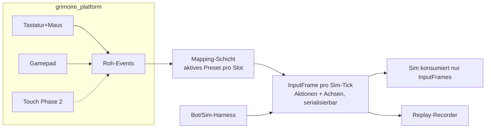

# PRD-0013: Input-System

- **Status:** Entwurf
- **Datum:** 2026-09-14
- **Autor:** Lupus Malus Deviant (PO) / Claude (Ausarbeitung)
- **Stakeholder:** Lupus Malus Deviant (PO), Coding-Agenten
- **Index:** [PRD-0000](0000-index-fiends-n-patrons.md)

## Problem / Motivation

Das Spiel ist Desktop-first (v1.0: Tastatur+Maus, Gamepad), aber Mobile mit Touch ist beschlossenes
Phase-2-Ziel — und Touch **nachträglich anzuflanschen** ist der klassische Portierungs-Tod.
Zusätzlich verlangen Determinismus (InputFrames als Replay-Quelle) und die Co-op-Tür (Input-Slots)
eine saubere Abstraktion von Tag 1. Input ist damit Architektur, nicht Peripherie.

## Ziele

- **Aktions-basierte Abstraktion:** Gameplay konsumiert semantische Aktionen (Move-Vektor, Dash, Melee, Skillshot-Richtung, Ulti, Item 1/2, Bombe, Pause) — nie Gerätedaten.
- v1.0: Tastatur+Maus und Gamepad vollständig, je 2–3 kuratierte **Presets**; freies Remapping später (Interface dafür steht).
- **InputFrames** sind serialisierbar und deterministisch: Grundlage für Replays, Golden-Master und Bot-Einspeisung.
- Touch-Bereitschaft: die zwei beschlossenen Touch-Profile (Stick+Gesten, Ein-Finger) sind als Mapping-Spezifikation definiert und die Aktions-Schicht hält sie aus — Implementierung in Phase 2.

## Non-Goals

- Kein Touch-Code in v1.0 (nur architektonische Bereitschaft + kompilierfähige Plattform-Stubs ab P4, PRD-0002 NFR).
- Kein freies Remapping-UI in v1.0 (Presets first, E-Antwort); die Datenstruktur (Mapping-Profile) ist aber von Anfang an remapping-fähig.
- Keine Lenk-/Gyro-/Maus-Gesten-Steuerung; kein Twin-Stick-Zielen (Auto-Aim-Design, PRD-0005).
- Keine Online-Input-Synchronisation (Fernziel-Tür, nicht mehr).

## Systemmodell

**InputFrame (Inhalt):** Move-Vektor (analog), Aim-Richtung (für Skillshot: Maus-Weltposition bzw.
Stick-Richtung), Buttons (gedrückt/losgelassen) für Dash, Melee, Skillshot, Ulti, Item1, Item2,
Bombe, Interact, Pause. Ein Frame pro Sim-Tick, Slot-indiziert (E16-Tür: Slot 0..n).

## Funktionale Anforderungen

| ID | Anforderung | Priorität |
|----|-------------|-----------|
| FR-01 | Aktions-Schicht: vollständige Aktionsliste als Engine-Contract; Gameplay-Code referenziert ausschließlich Aktionen. | Must |
| FR-02 | InputFrames: deterministisch, serialisierbar, pro Sim-Tick und Slot; Replays speichern Seed + InputFrame-Log (PRD-0002 FR-07). | Must |
| FR-03 | Tastatur+Maus: Bewegung WASD (analogisiert mit Momentum-Verträglichkeit), Skillshot-Zielen per Maus-Weltposition; 2 Presets (WASD-Standard, Linkshänder). | Must |
| FR-04 | Gamepad: XInput-/Standard-Layouts (Xbox/PS/generisch), Bewegung linker Stick, Skillshot-Richtung rechter Stick ODER Auto-Richtung; 2 Presets; Hot-Plug (Verbinden/Trennen zur Laufzeit, Pause bei Trennung im Run). | Must |
| FR-05 | Rumble: Ereignis-basiertes Haptik-Interface (Nahtreffer, Parade, Graze-Voll, Ulti-ready — PRD-0014-Gefahr-Grammatik), Intensität regelbar/abschaltbar. | Must |
| FR-06 | Geräte-Wechsel nahtlos: aktives Gerät bestimmt UI-Glyphen (Tasten vs. Buttons); Wechsel jederzeit ohne Menü-Umweg. | Must |
| FR-07 | Mapping-Profile sind Daten (Config-Datei, PRD-0015): Presets sind mitgelieferte Profile; „frei belegbar" ist damit Datenpflege, kein Systemumbau (Remapping-UI = Should, Post-v1.0). | Must |
| FR-08 | Menü-/UI-Navigation vollständig mit jedem Gerät (Gamepad-Fokus-Navigation, PRD-0014). | Must |
| FR-09 | Touch-Spezifikation (Phase 2, dokumentiert jetzt): Profil A „Stick+Gesten" (virtueller Stick links; Tap=Skillshot Richtung, Swipe=Dash, Halten=Ulti, Auto-Melee-Nähe), Profil B „Ein-Finger" (Figur folgt Finger, Fähigkeiten auto/Kontext-Tap); wählbar pro Spieler. | Must (Spez.) / Phase 2 (Impl.) |
| FR-10 | Bot-Einspeisung: Sim-Harness kann InputFrames programmatisch erzeugen (Replay-Format-kompatibel) — Bots sind Erstklass-Input-Quelle. | Must |
| FR-11 | Input-Slots 0..n im gesamten Stack (Mapping, Frames, Sim) — v1.0 nutzt nur Slot 0, Co-op-Tür bleibt offen. | Should |

## Nicht-Funktionale Anforderungen

- **Latenz:** Roh-Event → InputFrame des nächsten Sim-Ticks (keine gepufferte Zusatzverzögerung); Gesamtpfad Eingabe→Bild ≤ 2 Frames (PRD-0005 NFR).
- **Robustheit:** Alt-Tab/Fokusverlust: Aktionen werden neutralisiert (kein hängender Move); Pause-Verhalten gemäß PRD-0014.
- **Dead-Zones/Kurven:** Stick-Deadzone und Response-Kurven pro Preset als Daten, Default sorgfältig getuned (Feel-Gate P2).

## User Stories

- **US-01:** Als Desktop-Spieler möchte ich mit der Maus zielen und mit WASD durch Vorhänge weben, damit sich der Skillshot präzise anfühlt.
- **US-02:** Als Couch-Spieler möchte ich jederzeit vom Keyboard zum Gamepad greifen, und das Spiel folgt inklusive korrekter Button-Glyphen.
- **US-03:** Als Replay-System möchte ich ausschließlich Seed + InputFrames speichern, damit Replays winzig und bit-genau sind.
- **US-04:** Als späterer Mobile-Port möchte ich nur die Mapping-Schicht implementieren müssen, damit kein Gameplay-Code angefasst wird.

## Akzeptanzkriterien / Success Metrics

- P0/P1: Aktions-Schicht + InputFrames stehen; Determinismus-Test nutzt Bot-Frames.
- P2: KBM + Gamepad vollständig inkl. Presets, Hot-Plug, Rumble; Feel-Gate (PO) für Deadzones/Kurven bestanden.
- Replay-Beweis: 20-Minuten-Run als Seed+InputLog < 500 KB, Wiedergabe bit-identisch.
- Architektur-Beweis (P4): Touch-Stub-Plattform kompiliert; Mapping-Spezifikation FR-09 im Review als implementierbar bestätigt (keine Gameplay-Änderung nötig).

## Offene Fragen

- **OF-13.1:** Skillshot mit Gamepad: rechter Stick zielt frei vs. Auto-Richtung mit Stick-Override — was fühlt sich mit Auto-Aim-Primär besser an? A/B in P2.
- **OF-13.2:** Halten vs. Tippen für Melee-Dauerangriff (Mash-Vermeidung)? Feel-Test P2.
- **OF-13.3:** Steam-Input-Unterstützung, wenn Steam kommt (Phase 2+)? Notiert für PRD-0017.

## Referenzen

- [PRD-0002 Engine](0002-grimoire-engine-architektur.md) (Plattform-Traits, InputFrames) · [PRD-0005 Kampfsystem](0005-kampfsystem-spieler.md) (Aktionsliste) · [PRD-0014 UI/UX](0014-ui-ux.md) (Glyphen, Navigation) · [PRD-0018 Tests](0018-teststrategie.md) (Bot-Frames)
