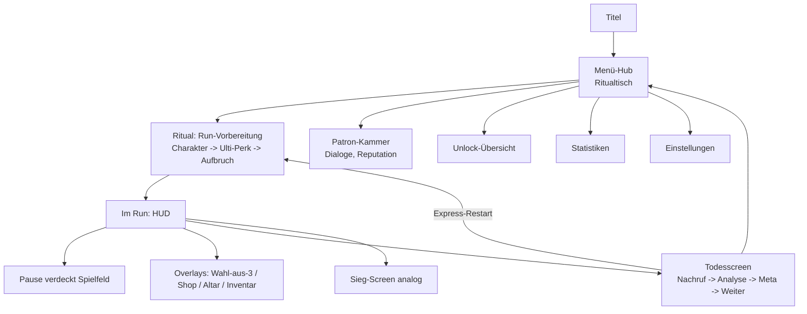

# PRD-0014: UI/UX — HUD, Menüs, Todesscreen & Accessibility

- **Status:** Entwurf
- **Datum:** 2026-09-14
- **Autor:** Lupus Malus Deviant (PO) / Claude (Ausarbeitung)
- **Stakeholder:** Lupus Malus Deviant (PO), Coding-Agenten
- **Index:** [PRD-0000](0000-index-fiends-n-patrons.md)

## Problem / Motivation

In einem Bullet-Hell entscheidet das UI mit über Leben und Tod: Der Blick darf die Spielfigur nie
verlassen müssen. Gleichzeitig soll das Spiel seine okkulte Identität auch in Menüs tragen
(**Ritual-Inszenierung** statt Listen) und der Todesscreen ist ein narratives Ereignis (Nachruf +
Analyse), kein Game-Over-Schild. Dazu kommen harte A11y-Zusagen (E-Antworten) und die Mobile-Zukunft
(Skalierung). UI ist hier Produkt-Feature, nicht Chrome.

## Ziele

- **Spielernahes HUD:** kritische Zustände (HP, Graze/Ulti-Ladung) um die Spielfigur; Sekundäres dezent am Rand — Blick bleibt beim Dodging.
- **Ritual-Menüs:** Run-Vorbereitung als inszenierter Ablauf (Charakter weihen, Ulti-Perk wählen, aufbrechen) im Menü-Hub (E-Antwort „Erst Menü, später begehbar").
- **Todesscreen als Ereignis:** hämischer Nachruf, Todesursachen-Analyse mit Pattern-Replay der letzten Sekunden, Statistiken, gefeierter Meta-Fortschritt, Patron-Reaktion.
- Volle A11y-Zusagen: Fotosensitivitäts-Schutz, Farbfehlsichtigkeits-Modi, regelbares Screen-Feedback, UI-/Schrift-Skalierung.

## Non-Goals

- Kein begehbarer Hub in v1.0 (späteres Ausbauziel; Menü-Hub so bauen, dass der Tausch möglich bleibt — Interface zwischen Hub-Logik und Hub-Präsentation).
- Keine Minimap, kein Questlog, kein Kompass — lineare Ketten brauchen keine Navigation.
- Kein diegetisches HUD-Experiment auf Kosten der Lesbarkeit: spielernahe Anzeigen sind funktional-klar, Ritual-Ästhetik lebt in Menüs/Screens.
- Keine Schwierigkeitsmenüs (E14: eine Basis-Schwierigkeit) — A11y-Optionen sind Komfort, werden nie als „Easy Mode" gerahmt.

## Screen-Flow

## Funktionale Anforderungen

### HUD (im Run)

| ID | Anforderung | Priorität |
|----|-------------|-----------|
| FR-01 | Spielernahe Anzeigen: HP (Herzen/Ring) + Graze-/Ulti-Ladung als dezente Ringe/Sigillen um die Figur; ausblendend, wenn voll/inaktiv. | Must |
| FR-02 | Rand-HUD: Item-Slots (2), Bomben, Währung, Pakt-Symbol + Level, Zorn-Omen (Stufenanzeige, OF-6.3), Boss-Leiste mit Phasen-Segmenten (PRD-0008 FR-07). | Must |
| FR-03 | Run-Einblendungen (Patron-Sprüche, Synergie-Entdeckung, Zorn-Warnung): feste Zonen abseits der Spielfigur, ≤ 12 Wörter, nie über Bullets (Ebenen-Regel PRD-0003). | Must |
| FR-04 | HUD kollidiert nie mit Ebene 6/7 des Renderers; alle HUD-Elemente sind in Größe skalierbar (A11y + Mobile-Basis). | Must |

### Menüs & Screens

| ID | Anforderung | Priorität |
|----|-------------|-----------|
| FR-05 | Menü-Hub als Ritualtisch-Inszenierung: Bereiche (Ritual, Patron-Kammer, Unlocks, Statistiken, Einstellungen) als Objekte/Karten, nicht als Listen-Menü. | Must |
| FR-06 | Run-Vorbereitung als Ritual-Sequenz (Charakter → Ulti-Perk → Aufbruch) mit Inszenierung; **Express-Restart** vom Todesscreen wiederholt die letzte Konfiguration mit einem Input. | Must |
| FR-07 | Todesscreen-Sequenz: (1) Nachruf (PRD-0011 FR-04), (2) Todesursache + Pattern-Replay der letzten ~5 s (Snapshot-Puffer, scrubbing-fähig), (3) Run-Statistik, (4) Meta-Gewinne zelebriert, (5) Patron-Reaktion; jede Sektion überspringbar. | Must |
| FR-08 | Sieg-Screen: analoge Sequenz mit triumphaler Färbung (und hämischen Untertönen der zornigen Patrone). | Must |
| FR-09 | Pause: jederzeit möglich, verdeckt das Spielfeld vollständig (E-Antwort — kein Pattern-Studium in Pause); Fokusverlust pausiert automatisch. | Must |
| FR-10 | Overlays im Run (Wahl-aus-3, Shop, Altar, Inventar): pausieren die Sim, konsistente Navigations-Grammatik, vollständig gamepad-navigierbar. | Must |
| FR-11 | Einstellungen: Grafik (Presets + granular, live), Audio (Bus-Lautstärken), Input (Preset-Wahl), Sprache (DE/EN), A11y — alle sofort wirksam (PRD-0002 FR-18). | Must |

### Accessibility & Komfort

| ID | Anforderung | Priorität |
|----|-------------|-----------|
| FR-12 | Fotosensitivitäts-Schutz: reduziert Blitze/Flackern global (Render-Kopplung PRD-0003 FR-12); beim Erststart aktiv anbietbar. | Must |
| FR-13 | Farbfehlsichtigkeits-Modi: alternative geprüfte Paletten für Gefahr-Farbräume (Protan/Deutan/Tritan); Silhouetten-Regeln tragen die Hauptlast (PRD-0003). | Must |
| FR-14 | Screenshake/Hitstop/Blitz-Intensität: getrennt regelbar 0–100%. | Must |
| FR-15 | UI-Skalierung (80–150%) + Schriftgrößen-Stufen; Mindest-Schriftgröße erzwungen. | Must |
| FR-16 | Gefahr-Grammatik-Konsistenz: Telegraphie-Zeitklassen (PRD-0007 FR-11), Silhouetten-Regeln, Rumble-Ereignisse (PRD-0013 FR-05) — im UI-Styleguide dokumentiert und im Review geprüft. | Must |

## Nicht-Funktionale Anforderungen

- **Blick-Ökonomie:** Kritische Information (HP, Ulti-ready, Zorn-Warnung) ist ≤ 10° Blickwinkel von der Spielfigur entfernt wahrnehmbar (spielernahe Ringe + Rand nur für Sekundäres).
- **Menü-Tempo:** Trotz Ritual-Inszenierung: Titel → im Run ≤ 30 s beim ersten Mal, Express-Restart ≤ 3 s.
- **Konsistenz:** Ein UI-Styleguide (`docs/art/ui-styleguide.md`, entsteht P2) definiert Zonen, Typografie, Sigillen-Sprache, Navigations-Grammatik; alle Screens folgen ihm.
- **Lokalisierungs-Robustheit:** Layouts vertragen DE/EN-Längenvarianz (+30%) ohne Umbruch-Bruch.

## User Stories

- **US-01:** Als Spieler möchte ich HP und Ulti-Stand sehen, ohne den Blick von meiner Figur zu nehmen, damit Information nie Dodging kostet.
- **US-02:** Als Spieler möchte ich nach dem Tod im Replay sehen, welches Pattern mich erwischt hat, damit ich lerne statt zu fluchen — und der Nachruf darf dabei ruhig gemein sein.
- **US-03:** Als Wiederholungs-Spieler möchte ich per Express-Restart in Sekunden im nächsten Run sein, damit „ein Run noch" reibungslos bleibt.
- **US-04:** Als Spieler mit Farbfehlsichtigkeit möchte ich einen geprüften Modus wählen, damit Gefahr-Lesbarkeit für mich gleichwertig ist.

## Akzeptanzkriterien / Success Metrics

- P2: HUD v1 (spielernahe Ringe + Rand-Basis), Pause, Settings-Grundgerüst mit Live-Übernahme.
- P3 (Slice): kompletter Screen-Flow inkl. Todesscreen-Sequenz mit Replay-Scrubbing, Ritual-Kurzfassung, Express-Restart, Overlays.
- P5: Ritual-Vollinszenierung, Patron-Kammer, alle A11y-Modi; UI-Styleguide abgenommen.
- Messungen: Menü-Tempo-Ziele erfüllt (gemessen); Lesbarkeits-Audit inkl. Colorblind-Sim (Tooling-Checker) bestanden; Blindtest — Tester findet jede Einstellung ohne Hilfe in < 60 s.

## Offene Fragen

- **OF-14.1:** Zorn-Omen-Darstellung (Symbolstufen vs. Randeffekte vs. beides)? Design-Exploration P3 (koppelt OF-6.3).
- **OF-14.2:** Pattern-Replay im Todesscreen: reine Wiedergabe oder mit Bullet-Highlight des tödlichen Projektils? Empfehlung: Highlight. Aufwandsentscheidung P3.
- **OF-14.3:** Erststart-Flow: A11y-Abfrage (Fotosensitivität) vor dem Titel? Empfehlung: ja, einmalig. PO-Entscheidung.

## Referenzen

- [PRD-0003 Rendering](0003-rendering-und-art.md) (Ebenen, A11y-Kopplung) · [PRD-0011 Narrativ](0011-narrativ-und-lore.md) (Nachrufe, Dialoge) · [PRD-0013 Input](0013-input-system.md) (Navigation, Glyphen) · [PRD-0015 Persistenz](0015-persistenz-und-saves.md) (Settings) · [PRD-0010 Progression](0010-progression-und-meta.md) (Overlays)
