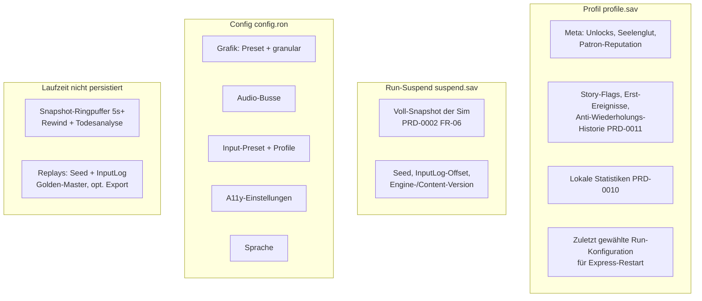

# PRD-0015: Persistenz — Saves, Snapshots & Konfiguration

- **Status:** Entwurf
- **Datum:** 2026-09-14
- **Autor:** Lupus Malus Deviant (PO) / Claude (Ausarbeitung)
- **Stakeholder:** Lupus Malus Deviant (PO), Coding-Agenten
- **Index:** [PRD-0000](0000-index-fiends-n-patrons.md)

## Problem / Motivation

Drei Systeme hängen an derselben Fähigkeit, Spielzustand zuverlässig zu konservieren: das
**Rewind-Item** (3s-Snapshot), der **Run-Suspend** (20-Minuten-Runs unterbrechen können) und die
**Todesanalyse** (Replay der letzten Sekunden). Die Entscheidung lautet **Voll-Snapshots** als
Engine-Garantie (PRD-0002 FR-06) — Persistenz wird damit zum Konsumenten einer Kernfähigkeit statt
zum Sonderfall. Dazu kommt das Profil (Unlocks, Reputation, Story-Flags, Statistiken), das **nie**
durch Absturz oder Update verloren gehen darf.

## Ziele

- **Profil-Save:** Meta-Zustand versioniert, migrationsfähig, korruptionssicher — überlebt jedes Update ab v1.0-Format (Migrationskette).
- **Run-Suspend:** laufender Run jederzeit beendbar und exakt fortsetzbar (Voll-Snapshot); genau ein Suspend-Slot.
- **Duales Format:** Dev = menschenlesbar (RON), Release = versioniertes Binärformat — gleiche Datenmodelle, zwei Serialisierer.
- **Konfiguration als sichtbare Datei**, menschenlesbar, mit Presets + granularen Optionen (E-Settings-Antworten).

## Non-Goals

- Kein Cloud-Save in v1.0 (Steam-Cloud = Phase 2+, Interface-Tür über Save-Pfad-Abstraktion).
- Kein Schutz gegen Save-Manipulation (E-Antwort „Manipulations-Toleranz"): Single-Player, offene Formate — wer editiert, spielt sein eigenes Spiel.
- Kein Mehr-Profil-System in v1.0 (ein lokales Profil; Struktur hält mehrere aus, UI dafür später).
- Keine Autosave-Checkpoints im Run (Permadeath-Integrität): Suspend ersetzt Speichern, Tod löscht den Suspend.

## Datenmodell-Übersicht



## Funktionale Anforderungen

| ID | Anforderung | Priorität |
|----|-------------|-----------|
| FR-01 | Profil-Save: alle Meta-Daten (Diagramm) in einer versionierten Datei; Schema-Version im Header; Migrationskette ab v1.0-Format (jede Formatänderung liefert Migration mit). | Must |
| FR-02 | Atomare Schreibvorgänge: write-to-temp → fsync → rename; plus rotierende Backups (letzte 3 Stände); Recovery-Logik beim Laden (Backup-Fallback mit Nutzer-Hinweis). | Must |
| FR-03 | Run-Suspend: Voll-Snapshot + Run-Metadaten in einem Slot; Fortsetzen stellt bit-identischen Sim-Zustand her; Tod oder Run-Ende löscht den Slot; Suspend bei App-Exit im Run automatisch. | Must |
| FR-04 | Version-Guard: Suspend, der mit anderer Engine-/Content-Version entstand, wird nicht geladen (klare Meldung, Run gilt als beendet ohne Tod-Malus). | Must |
| FR-05 | Duale Serialisierung: identisches Datenmodell als RON (Dev-Builds, debugbar) und kompaktes Binärformat (Release); Format per Build-Profil, Konvertier-Tool im Tooling. | Must |
| FR-06 | Config-Datei: menschenlesbar (RON) neben den Saves; enthält Grafik-Presets + granulare Werte, Audio, Input-Profile, A11y, Sprache; defekte Config ⇒ Defaults + Sicherungskopie statt Crash. | Must |
| FR-07 | Save-Pfade über `grimoire_platform` (plattformgerechte User-Verzeichnisse Win/Mac/Linux; Mobile Phase 2); Pfad-Abstraktion hält Cloud-Sync-Tür offen. | Must |
| FR-08 | Snapshot-Ringpuffer (Laufzeit): letzte ≥ 5 s für Rewind-Item (PRD-0005 FR-07) und Todesscreen-Replay (PRD-0014 FR-07); Speicherbudget dokumentiert und begrenzt. | Must |
| FR-09 | Replay-Export: abgeschlossene Runs optional als Replay-Datei (Seed + InputLog + Versionsstempel) exportierbar — Debug-/Golden-Master-/Teilen-Grundlage. | Should |
| FR-10 | Alle Formate (Profil, Suspend, Config, Replay) in `docs/formats/` dokumentiert (E17). | Must |

## Nicht-Funktionale Anforderungen

- **Verlustsicherheit:** Kein reproduzierbarer Weg (Absturz/Stromausfall zu beliebigem Zeitpunkt), der das Profil zerstört — Crash-Injection-Tests (PRD-0018) beweisen es.
- **Performance:** Suspend-Schreibvorgang ≤ 500 ms; Profil-Save ≤ 50 ms (asynchron, nie im Sim-Tick blockierend); Ringpuffer-Snapshot-Aufnahme innerhalb Sim-Budget (Copy-on-Write/inkrementell falls nötig — OF-2.3).
- **Größe:** Suspend-Datei Zielgröße < 10 MB; Profil < 1 MB; Replays < 500 KB pro 20-Min-Run (PRD-0013).
- **Transparenz:** Alle Dateien liegen in einem auffindbaren, dokumentierten Ordner; keine Registry, keine versteckten Nebenorte.

## User Stories

- **US-01:** Als Spieler möchte ich Minute 15 eines Runs abends beenden und morgens exakt dort weitermachen, damit 20-Minuten-Runs in mein Leben passen.
- **US-02:** Als Spieler möchte ich nach einem Stromausfall mein Profil unversehrt vorfinden (schlimmstenfalls den letzten Backup-Stand), damit Vertrauen nie bricht.
- **US-03:** Als Entwickler möchte ich Dev-Saves im Texteditor lesen und patchen, damit Debugging von Meta-Zuständen trivial ist.
- **US-04:** Als Update möchte ich alte Profile über die Migrationskette heben, damit kein Release je Spielstände kostet.

```
Given ein laufender Run bei Sim-Tick 42.000, App wird geschlossen
When der Spieler das Spiel neu startet und "Fortsetzen" wählt
Then wird der Voll-Snapshot geladen und Tick 42.001 verhält sich bit-identisch
     zu einem nie unterbrochenen Lauf (Golden-Master-Vergleich)
```

## Akzeptanzkriterien / Success Metrics

- P2: Snapshot-Ringpuffer + Rewind-Item funktionieren; Config-Datei mit Live-Übernahme.
- P3 (Slice): Profil-Save + Run-Suspend + Todesscreen-Replay vollständig; Atomarität + Backup-Rotation implementiert.
- Crash-Injection-Suite grün: 1.000 simulierte Abbrüche an zufälligen Schreibpunkten ⇒ 0 verlorene Profile (CI, PRD-0018).
- Suspend-Roundtrip-Golden-Master (Given/When/Then oben) in CI.
- Migrationstest: Profil aus Format v1 lädt in v2-Build (sobald erste Migration existiert; Test-Infrastruktur ab P3 bereit).

## Offene Fragen

- **OF-15.1:** Snapshot-Technik für den Ringpuffer: Voll-Kopie pro Intervall vs. inkrementell (koppelt an OF-2.3) — Spike P2.
- **OF-15.2:** Suspend-Missbrauch (Save-Scumming durch Datei-Kopie): tolerieren (Manipulations-Toleranz) oder Suspend-Datei an Profil-Nonce binden? Empfehlung: tolerieren. PO-Bestätigung.
- **OF-15.3:** Replay-Dateien versionieren wie Suspends (Version-Guard) — reicht Verwerfen bei Mismatch? Vorschlag: ja.

## Referenzen

- [PRD-0002 Engine](0002-grimoire-engine-architektur.md) (Snapshot-Garantie) · [PRD-0005 Kampfsystem](0005-kampfsystem-spieler.md) (Rewind) · [PRD-0010 Progression](0010-progression-und-meta.md) (Meta-Daten) · [PRD-0011 Narrativ](0011-narrativ-und-lore.md) (Flags) · [PRD-0014 UI/UX](0014-ui-ux.md) (Settings, Todesscreen) · [PRD-0018 Tests](0018-teststrategie.md) (Crash-Injection)
