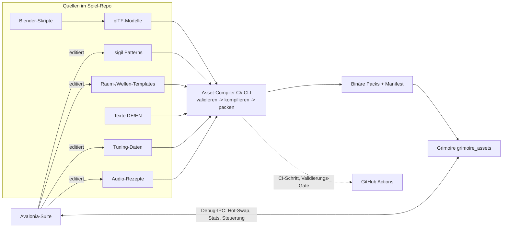

# PRD-0016: Tooling-Suite & Asset-Pipeline (C#/Avalonia)

- **Status:** Entwurf
- **Datum:** 2026-09-14
- **Autor:** Lupus Malus Deviant (PO) / Claude (Ausarbeitung)
- **Stakeholder:** Lupus Malus Deviant (PO), Coding-Agenten
- **Index:** [PRD-0000](0000-index-fiends-n-patrons.md) · ADRs: [0001](../adr/0001-rust-kern-csharp-tooling.md), [0007](../adr/0007-offline-asset-kompilierung.md), [0008](../adr/0008-avalonia-fuer-tooling.md)

## Problem / Motivation

Ein Content-getriebenes Spiel (hunderte Sigil-Patterns, Wellen, Items, Texte, Audio-Rezepte) ist
nur so gut wie seine Iterationsschleife. Ohne Werkzeuge heißt Pattern-Tuning: Datei editieren,
kompilieren, Run starten, Situation nachstellen — Minuten pro Versuch. Die Tooling-Suite drückt
das auf Sekunden (**Live-Link** in die laufende Engine) und ist zugleich die **Asset-Fabrik**:
Offline-Kompilierung aller Quell-Assets in binäre Packs (E07) und Generierungs-Pipelines für
Modelle (Blender-Skripte) und Audio (DSP-Rezepte).

## Ziele

- Eine **Avalonia-Suite** (Win/Mac/Linux) mit den Kern-Editoren: Sigil-Editor, Stage-/Wellen-Editor, Balancing-Dashboard, Audio-Werkstatt — plus Zusatzwerkzeuge (unten).
- **Live-Link:** Tools verbinden sich zur laufenden Engine (Debug-IPC, PRD-0002 FR-11); Änderung → sichtbar/hörbar < 1 s.
- **Asset-Compiler** (CLI + von der Suite genutzt): Quell-Assets → validierte binäre Packs; in CI als Build-Schritt.
- **Generierungs-Pipelines:** Blender-Skript-Pipeline für 3D-Modelle (Claude baut Modelle nach PO-Vorgaben), Audio-Rezept-Renderer (PRD-0012 FR-07).

## Non-Goals

- Kein In-Engine-Editor, keine Editor-UI in Rust (klare Trennung, E08).
- Kein eingebetteter Engine-Viewport im C#-Tool (technisch heikelste Variante wurde abgewählt): Vorschau läuft in der echten, live verbundenen Engine-Instanz.
- Keine Workshop-/Mod-Manager-Funktionen (E17: Modding nur per Format-Doku).
- Die Suite ist Entwickler-Werkzeug — kein Endnutzer-Polish, keine Lokalisierung der Tool-UI (Englisch only ok).

## Werkzeug-Katalog

| Tool | Zweck | Live-Link-Nutzung |
|------|-------|-------------------|
| **Sigil-Editor** | Patterns visuell komponieren (Bausteine, Modifikatoren, Transformationen), 2D-Preview im Tool (eigene einfache Canvas-Sim), Validierung | Pattern-Hot-Swap in laufende Engine, Kamera auf Test-Emitter |
| **Stage-/Wellen-Editor** | Raum-Templates, Wellen-Templates, Director-Parameter, Biom-/Mutations-Zuordnung | Raum laden/neu würfeln per Seed, Welle live triggern |
| **Balancing-Dashboard** | Alle Tuning-Daten (Kit, Ökonomie, Patron-Kurven, Drop-Tabellen) als Tabellen/Kurven; Anbindung Sim-Harness („1.000 Bot-Runs mit diesem Stand") mit Report-Ansicht | Werte live in laufende Session patchen |
| **Audio-Werkstatt** | DSP-Rezepte bauen (Synthese-Graphen, Sequenzen), Stems/SFX rendern, Beat-Grid-Vorschau | SFX/Stem-Hot-Swap, Beat-Grid-/Voice-Monitor |
| **Replay-Viewer** | Replays laden, scrubben, Frame-Inspektion, Vergleich zweier Replays (Golden-Master-Diagnose) | Replay in Engine abspielen/steppen |
| **Pack-Inspektor** | Pack-Inhalte browsen, Asset-Metadaten, Größen-Reports, Format-Doku-Links | — |
| **Synergie-Graph** | Upgrades/Synergien als Graph visualisieren, Erreichbarkeits-/Verwaisungs-Analyse | — |
| **Kontrast-Checker** | Bullet-Paletten gegen Biom-Hintergründe prüfen (Lesbarkeits-Regel PRD-0003, inkl. Colorblind-Simulation) | Screenshot-Grab über Debug-Link |

## Pipeline-Architektur

## Funktionale Anforderungen

| ID | Anforderung | Priorität |
|----|-------------|-----------|
| FR-01 | Asset-Compiler als C#-CLI: validiert (Schema, Referenzen, Sigil-Statik, Loka-Key-Parität) und kompiliert alle Quelltypen in versionierte Packs mit Manifest (Hashes, Versionen). | Must |
| FR-02 | Compiler-Fehler sind präzise (Datei, Pfad, Zeile/Knoten, Ursache, Fix-Hinweis) — agenten- und menschenlesbar; Exit-Codes CI-tauglich. | Must |
| FR-03 | Live-Link-Client-Bibliothek (C#): Verbindungs-Management, typisierte Messages (versioniertes Schema, geteilt mit `grimoire_debug`), Reconnect. | Must |
| FR-04 | Sigil-Editor: visuelles Komponieren + Text-Ansicht (Roundtrip-fähig), Tool-interne 2D-Preview, statische Validierung, Hot-Swap (< 1 s Roundtrip). | Must |
| FR-05 | Stage-/Wellen-Editor: Templates + Director-Parameter editieren; Seeds testen; Welle in verbundener Engine triggern. | Must |
| FR-06 | Balancing-Dashboard: Daten-Editing mit Diff-Ansicht (was ändert dieser Patch?), Sim-Harness-Ansteuerung, Ergebnis-Reports (Win-Rates, TTK, Ökonomie-Korridor). | Must |
| FR-07 | Audio-Werkstatt: Rezept-Editor, Offline-Rendering, Abhör-Player, Beat-Grid-Vorschau, Hot-Swap in Engine. | Must |
| FR-08 | Replay-Viewer, Pack-Inspektor, Synergie-Graph, Kontrast-Checker gemäß Katalog. | Should |
| FR-09 | Blender-Pipeline: Python-Skripte pro Asset-Typ (Charakter, Gegner, Boss, Props) mit parametrischen Vorgaben; Headless-Blender-Aufruf durch den Asset-Compiler; Ausgabe glTF nach Stilbibel. | Must |
| FR-10 | Alle Datei-Formate der Pipeline in `docs/formats/` dokumentiert (Sigil, Templates, Tuning, Rezepte, Pack) — Modding-by-documentation (E17). | Must |
| FR-11 | Dev-Loop-Integration: Suite startet/verbindet Engine-Dev-Build mit einem Klick (Launch-Profil). | Should |

## Nicht-Funktionale Anforderungen

- **Roundtrip:** Speichern im Editor → Wirkung in Engine < 1 s (Hot-Swap-Pfad); voller Pack-Rebuild des Spiel-Contents < 60 s (CI und lokal).
- **Zuverlässigkeit:** Live-Link-Abriss darf weder Tool noch Engine crashen (degradiert zu Datei-Workflow).
- **Plattform:** Suite läuft auf Win/Mac/Linux (Avalonia); Blender + .NET SDK als dokumentierte Dev-Abhängigkeiten (Versionen gepinnt).
- **Agenten-Tauglichkeit:** Jede Editor-Funktion hat ein CLI-/dateibasiertes Äquivalent (Agenten arbeiten headless über Dateien + Compiler, Menschen über die UI).

## User Stories

- **US-01:** Als Pattern-Designer möchte ich im Sigil-Editor einen Parameter schieben und die Änderung sofort im laufenden Boss-Kampf sehen, damit Tuning ein Flow-Zustand ist.
- **US-02:** Als Balancing-Agent möchte ich einen Tuning-Patch als Diff sehen und 1.000 Bot-Runs dagegen laufen lassen, damit Zahlenänderungen Evidenz haben.
- **US-03:** Als PO möchte ich Claude Modell-Vorgaben geben („gehörnter Kettenschmied-Altar, 2k Tris") und ein regeneriertes glTF im nächsten Pack sehen, damit Asset-Erzeugung reproduzierbar bleibt.
- **US-04:** Als CI möchte ich den Asset-Compiler als Gate ausführen, damit kein kaputtes Asset je main erreicht.

## Akzeptanzkriterien / Success Metrics

- P1: Asset-Compiler v1 (Sigil + Packs) + Live-Link-Basis (Stats, Hot-Swap); Sigil-Editor MVP mit Preview.
- P2: Audio-Werkstatt MVP (Rezept → gerenderter SFX → Hot-Swap); Balancing-Dashboard MVP (Kit-Parameter).
- P3: Stage-Editor MVP; Blender-Pipeline erzeugt die Slice-Modelle; Roundtrip-Messungen erfüllt.
- P5: Werkzeug-Katalog vollständig (inkl. Should-Tools); Format-Doku komplett.
- Dogfood-Metrik: 100% des Slice-Contents (P3) entstand durch die Pipeline (kein handkopiertes Einzel-Asset am Compiler vorbei).

## Offene Fragen

- **OF-16.1 (= OF-2):** Repo-Ort der Suite: eigenes Repo vs. Ordner im Engine-Repo. **Empfehlung: `grimoire`-Repo, Ordner `tools/`** — Debug-Protokoll und Formate sind engine-versioniert, ein Repo weniger zu pinnen. PO-Entscheidung vor P0.
- **OF-16.2:** Geteilte Schema-Definitionen Rust↔C#: Codegen aus einer Quelle (z.B. Schema-Dateien → Rust + C#) oder Hand-Sync mit Versionstest? Empfehlung: Codegen. ADR in P1.
- **OF-16.3:** Blender-Versionspolitik (gepinnte LTS?) und Fallback, wenn Blender fehlt (Pack nutzt letzte gebaute Modelle?). Entscheidung P2.

## Referenzen

- [ADR-0001](../adr/0001-rust-kern-csharp-tooling.md) · [ADR-0007](../adr/0007-offline-asset-kompilierung.md) · [ADR-0008](../adr/0008-avalonia-fuer-tooling.md) · [PRD-0002 Engine](0002-grimoire-engine-architektur.md) (Debug-IPC) · [PRD-0004 Sigil](0004-sigil-bullet-system.md) · [PRD-0012 Audio](0012-audio-system.md) · [PRD-0018 Tests](0018-teststrategie.md) (Sim-Harness)
