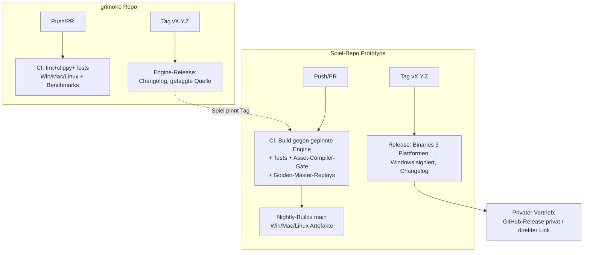

# PRD-0017: Plattform, CI & Distribution

- **Status:** Entwurf
- **Datum:** 2026-09-14
- **Autor:** Lupus Malus Deviant (PO) / Claude (Ausarbeitung)
- **Stakeholder:** Lupus Malus Deviant (PO), Coding-Agenten
- **Index:** [PRD-0000](0000-index-fiends-n-patrons.md) · ADR: [0002](../adr/0002-engine-eigenes-repo.md)

## Problem / Motivation

Zwei Repos, drei Desktop-Plattformen, später zwei Mobile-Plattformen, ein Engine-Produkt mit
SemVer und ein Spiel, das Versionen pinnt: Ohne automatisierte Build-/Test-/Release-Maschinerie
frisst Plattformpflege das Hobby-Zeitbudget. Zudem gilt die Arbeitsregel des PO:
**Ein Push ohne Nachsehen zählt nicht als fertig** — CI ist Teil des Workflows, nicht Beiwerk.
Verteilt wird zunächst **privat an Freunde**; Steam und Mobile-Stores sind spätere Phasen mit
heute schon absehbaren Schnittstellen.

## Ziele

- **Volle CI-Matrix** (GitHub Actions) für beide Repos: Build + Tests auf Windows/macOS/Linux bei jedem Push; Golden-Master-Replays und Benchmarks als Gates.
- **Automatische Releases:** Version aus git-Tags, generierter Changelog, Nightly-Builds von main, signierte Windows-Binaries (vorhandenes Zertifikat, Signier-Skript des PO).
- **Engine-SemVer-Disziplin:** Grimoire released getaggte Versionen; das Spiel pinnt exakt; Upgrade = bewusster Commit.
- **Performance-Ziele als Messwerte in CI:** 60 FPS fix / 144+-fähig / Frame-Budgets (PRD-0002) als Benchmark-Trends, Mobile-Ziel ab Phase 2 definiert (60 FPS Mittelklasse-SoC, Preset Low).

## Non-Goals

- Kein Steam-/Store-Release in v1.0 (privater Vertrieb); Steamworks-Integration (Achievements, Cloud) nur als Interface-Tür dokumentiert.
- Keine Telemetrie-/Crash-Server: Crash-Reports bleiben lokal (Dump + Session-Log als Datei, Spieler teilt manuell).
- Kein itch.io-Kanal (bewusst abgewählt).
- Keine Konsolen-Ziele (nie Teil dieser Planung gewesen; erst recht kein v1.0-Thema).

## Build- & Release-Topologie

## Funktionale Anforderungen

| ID | Anforderung | Priorität |
|----|-------------|-----------|
| FR-01 | Beide Repos: GitHub Actions mit Matrix (windows-latest, macos-latest, ubuntu-latest): Format-Check, Clippy (deny warnings), Unit-/Integrationstests. | Must |
| FR-02 | Spiel-CI zusätzlich: Asset-Compiler-Gate (alle Quell-Assets validieren + kompilieren), Headless-Sim-Tests, Golden-Master-Replay-Vergleich. | Must |
| FR-03 | Benchmark-Jobs (mind. Linux): Bullet-Stress, Boss-Worst-Case, Kollisions-Benchmarks — Ergebnisse als Trend gespeichert; Regression > 10% bricht den Lauf. | Must |
| FR-04 | Engine-Releases: Tag ⇒ Changelog-Generierung (Conventional Commits), GitHub-Release; Spiel referenziert Engine über git-Tag-Pin in Cargo ([ADR-0009](../adr/0009-engine-pin-ueber-git-tag.md)). | Must |
| FR-05 | Spiel-Releases: Tag ⇒ Build aller 3 Desktop-Plattformen, Artefakt-Upload; Windows-Exe wird mit Zertifikat `CN=Lupus Malus Deviant` signiert (Signier-Skript des PO im Workflow bzw. lokaler Release-Schritt). | Must |
| FR-06 | Nightly-Builds: automatischer Dev-Build von main (3 Plattformen) mit Kurz-Changelog seit letzter Nightly. | Must |
| FR-07 | Versionsschema: SemVer beide Repos; Spiel-Version im Titel-/Todesscreen sichtbar; Build-Metadaten (git-Hash, Engine-Pin) im Log und in Save-/Replay-Headern (PRD-0015 FR-04). | Must |
| FR-08 | Crash-Handling: Panic-Hook + Minidump/Backtrace + Session-Log in lokalen Crash-Ordner; Spiel zeigt beim Neustart Hinweis mit Pfad. | Must |
| FR-09 | macOS: ad-hoc-Signierung + Anleitung für Gatekeeper (privater Vertrieb ohne Developer-Account dokumentiert); Linux: AppImage oder tar.gz (Entscheidung OF-17.2). | Must |
| FR-10 | Mobile-Kompilierfähigkeit: ab P4 CI-Job, der `grimoire_platform`/`grimoire_gpu` für Android (und iOS soweit ohne Mac-Signing möglich) kompiliert — Ehrlichkeits-Gate für Phase 2. | Should |
| FR-11 | Steam-Tür: Plattform-Dienste (Achievements, Cloud-Save, ggf. Steam-Input) als Trait definiert, Implementierung „None" in v1.0. | Should |

## Nicht-Funktionale Anforderungen

- **CI-Laufzeit:** Standard-Push-Pipeline < 15 Min pro Plattform (Cache-Strategie für Cargo + Assets); Nightly darf länger.
- **Workflow-Regel (PO-global):** Jeder Push mit CI wird bis zum Ende überwacht (`gh run watch --exit-status`); rote Läufe werden vor jeder weiteren Arbeit analysiert (`gh run view --log-failed`) und die Ursache benannt (Code/Vorrichtung/extern).
- **Reproduzierbarkeit:** Toolchain-Versionen gepinnt (rust-toolchain.toml, .NET SDK-Version, Blender-Version); Builds aus sauberem Checkout reproduzierbar.
- **Sicherheit:** Keine Secrets im Repo; Signing-Zertifikat bleibt lokal/als geschütztes Secret; private Releases nur für eingeladene Accounts.

## User Stories

- **US-01:** Als Entwickler möchte ich bei jedem Push sehen, ob Mac und Linux noch grün sind, damit Plattform-Bugs Stunden alt sind statt Monate.
- **US-02:** Als Freundeskreis-Tester möchte ich einen Link zur aktuellen Nightly für meine Plattform, damit Testen keine Anleitung braucht.
- **US-03:** Als Windows-Nutzer möchte ich eine signierte Exe ohne SmartScreen-Drama, damit Installation vertrauenswürdig wirkt.
- **US-04:** Als Engine-Konsument möchte ich bewusst per Commit auf Grimoire vX.Y+1 heben, damit Breaking Changes nie überraschend durchschlagen.

## Akzeptanzkriterien / Success Metrics

- P0: beide Repos existieren mit CI-Matrix (FR-01) grün; Determinismus-Test läuft plattformübergreifend in CI.
- P1: Benchmark-Jobs mit Trend; Asset-Compiler-Gate aktiv.
- P3: erste Nightly-Builds an Tester verteilt; Crash-Handling aktiv.
- P6 (v1.0): Release-Pipeline vollständig (3 Plattformen, signiert, Changelog); Golden-Master-Suite als Release-Gate; Performance-Ziele durch CI-Benchmarks belegt.
- Prozess-Metrik: 0 „vergessene" rote CI-Läufe (jeder rote Lauf hat eine Analyse im PR/Commit-Verlauf).

## Offene Fragen

- ~~**OF-17.1:** Engine-Pin technisch: git-Tag-Dependency vs. eigene private Registry vs. git-Submodule?~~ **Entschieden** durch [ADR-0009](../adr/0009-engine-pin-ueber-git-tag.md) (akzeptiert, 2026-09-14): Cargo-git-Dependency mit Tag, Read-only-Deploy-Key für die CI, lokaler `[patch]` für die Engine-Iteration.
- **OF-17.2:** Linux-Paketformat (AppImage vs. tar.gz vs. beides)? Entscheidung vor ersten Nightlies (P3).
- **OF-17.3:** Benchmark-Stabilität auf geteilten CI-Runnern (Rauschen) — dedizierte Schwellen/Median-Strategie oder Self-Hosted-Runner? Spike P1.
- **OF-17.4:** Wo werden private Releases gehostet (privates GitHub-Release + Invite vs. eigener Server auf eigener Server-Infrastruktur)? PO-Entscheidung P3.

## Referenzen

- [ADR-0002](../adr/0002-engine-eigenes-repo.md) · [PRD-0002 Engine](0002-grimoire-engine-architektur.md) (Budgets) · [PRD-0016 Tooling](0016-tooling-suite.md) (Asset-Compiler in CI) · [PRD-0018 Teststrategie](0018-teststrategie.md) (Gates) · Arbeitsregeln des PO (CI-Überwachung, Code-Signing)
