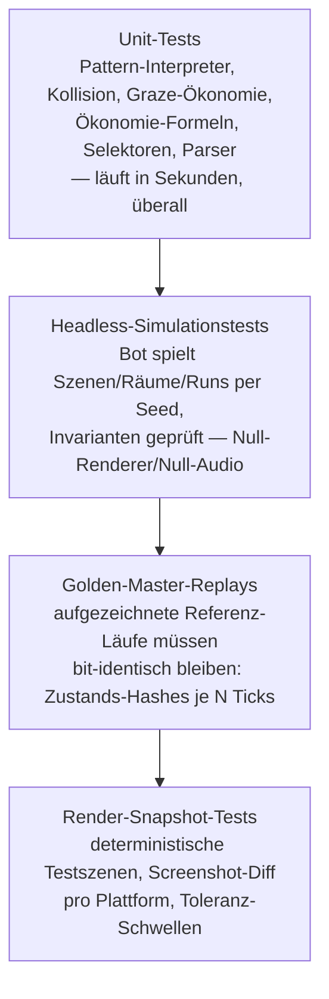

# PRD-0018: Teststrategie & Determinismus-Absicherung

- **Status:** Entwurf
- **Datum:** 2026-09-14
- **Autor:** Lupus Malus Deviant (PO) / Claude (Ausarbeitung)
- **Stakeholder:** Lupus Malus Deviant (PO), Coding-Agenten
- **Index:** [PRD-0000](0000-index-fiends-n-patrons.md) · ADR: [0005](../adr/0005-voll-deterministische-simulation.md)

## Problem / Motivation

Ein Solo-Hobby-Projekt hat keine QA-Abteilung — die Testinfrastruktur IST die QA-Abteilung.
Gleichzeitig ruht das halbe Design auf einer einzigen Eigenschaft: **Determinismus** (Replays,
Rewind, Suspend, Seeds, Golden-Master). Diese Eigenschaft ist zerbrechlich — ein einziges
unsortiertes HashMap-Iterieren zerstört sie still. Die Teststrategie muss Determinismus
**strukturell verteidigen** und Gameplay-Regressionen ohne manuelles Nachspielen fangen.
Interface-First zahlt hier aus: Alles Testbare ist gegen Traits/Mocks testbar.

## Ziele

- **Vier Testebenen** etabliert und in CI verdrahtet: Unit-Tests, Headless-Simulationstests, Golden-Master-Replays, Render-Snapshot-Tests.
- **Bot-Spieler als Erstklass-Werkzeug:** Sim-Harness spielt komplette Runs headless (Seeds × Profile) — für Regression UND Balancing (PRD-0016 FR-06).
- Determinismus wird von CI **bewiesen**, nicht behauptet (Hash-Vergleiche, plattformübergreifend).
- Persistenz-Härte per **Crash-Injection** (PRD-0015 NFR).

## Non-Goals

- Keine UI-E2E-Klickpfad-Automatisierung (Menü-Flows werden manuell + per Unit-Logik getestet; Aufwand/Nutzen im Solo-Projekt schlecht).
- Keine 100%-Coverage-Religion: getestet wird nach Risiko (Sim-Kern, Ökonomie, Persistenz zuerst); Coverage wird gemessen, aber nicht als Gate erzwungen.
- Keine Fuzzing-Vollausbaustufe in frühen Phasen (Sigil-Compiler-Fuzzing = Could, später).

## Test-Pyramide des Projekts



**Invarianten-Beispiele (Headless-Ebene):** kein Softlock (Raum immer abschließbar, Validator
PRD-0009 FR-11), HP nie < 0 ohne Todes-Event, Ökonomie im Korridor (PRD-0010), Ulti-Ladung
monoton korrekt, Zorn-Kurven im Definitionsbereich, keine Entity-Leaks über Raumwechsel.

## Funktionale Anforderungen

| ID | Anforderung | Priorität |
|----|-------------|-----------|
| FR-01 | Unit-Test-Standard: jedes Engine-Subsystem und jedes Gameplay-Modul liefert Tests gegen seine Trait-Verträge; Mocks/Headless-Impls existieren für alle Subsysteme (PRD-0002 FR-15). | Must |
| FR-02 | Sim-Harness (`fnp_sim_harness`): führt Szenen/Räume/komplette Runs headless aus — Eingaben: Seed, Bot-Profil, Content-Stand; Ausgaben: Metriken, Invarianten-Ergebnisse, Zustands-Hashes, Event-Log. | Must |
| FR-03 | Bot-Profile: mindestens „Zufalls-Dodger", „Radius-Grazer", „Aggressiver Parierer", „Pattern-Kenner" (nutzt aufgezeichnete Lösungswege) — als InputFrame-Erzeuger (PRD-0013 FR-10). | Must |
| FR-04 | Determinismus-Gates in CI: (a) Doppellauf-Hash-Vergleich pro Push, (b) plattformübergreifender Hash-Vergleich Win/Mac/Linux (nightly), (c) Snapshot-Roundtrip- und Suspend-Roundtrip-Tests (PRD-0002/0015). | Must |
| FR-05 | Golden-Master-Verwaltung: Referenz-Replays versioniert im Repo; bewusste Gameplay-Änderungen erneuern Master per dokumentiertem Kommando (Diff-Report zeigt, WAS sich änderte); CI bricht bei unerklärten Abweichungen. | Must |
| FR-06 | Render-Snapshot-Suite: deterministische Testszenen pro Render-Feature (PRD-0003 FR-14); Vergleich mit per-Plattform-Referenzen und Toleranzmetrik (SSIM/Pixel-Schwelle). | Must |
| FR-07 | Crash-Injection-Suite: simulierte Prozessabbrüche an randomisierten Punkten der Save-Schreibpfade; Erfolgskriterium 0 Profilverluste über 1.000 Injektionen (PRD-0015). | Must |
| FR-08 | Balancing-Reports: Sim-Harness produziert maschinenlesbare Reports (Win-Rate, TTK, Ökonomie, Graze-Lade-Parität PRD-0005) — konsumiert vom Balancing-Dashboard und als CI-Artefakt archiviert. | Must |
| FR-09 | Determinismus-Lint: eigenes Prüfwerkzeug/Clippy-Lints gegen bekannte Fallen in Sim-Code (HashMap-Iteration, Wallclock-Zugriff, thread_rng, nicht-deterministische Parallelität) — als CI-Check. | Should |
| FR-10 | Sigil-Compiler-Fuzzing (Parser-Robustheit). | Could |

## Nicht-Funktionale Anforderungen

- **Geschwindigkeit:** Unit-Ebene < 30 s lokal; Headless-Standard-Suite < 5 Min in CI; komplette Bot-Run-Batches (1.000 Runs) als paralleler Nightly-/On-Demand-Job.
- **Diagnostik:** Jeder Golden-Master-Bruch liefert automatisch: ersten abweichenden Tick, System-Verursacher (per Subsystem-Hash), Replay-Datei für den Replay-Viewer (PRD-0016).
- **Pflegbarkeit:** Golden-Master-Erneuerung ist ein bewusster, geloggter Ein-Kommando-Akt — nie ein stilles „Update der Erwartung" im Rauschen.

## User Stories

- **US-01:** Als Entwickler möchte ich beim Refactoring der Kollision von Golden-Mastern gehalten werden, damit „funktioniert noch exakt gleich" beweisbar ist.
- **US-02:** Als Balancing-Agent möchte ich nach jedem Tuning-Patch automatisch Win-Rate-Deltas pro Patron sehen, damit Balance-Drift sofort sichtbar ist.
- **US-03:** Als Engine-Entwickler möchte ich einen versehentlichen Determinismus-Bruch als präzise CI-Diagnose bekommen (Tick, Subsystem), damit die Suche Minuten dauert, nicht Tage.
- **US-04:** Als PO möchte ich vor jedem Release eine grüne Gesamt-Suite sehen, damit „fertig" etwas bedeutet.

```
Given Golden-Master-Replay GM-007 (Boss 1, Seed 4242, Bot "Pattern-Kenner")
When ein PR die Kollisions-Broadphase umbaut
Then vergleicht CI Zustands-Hashes alle 60 Ticks; bei Abweichung ab Tick 18.600
     grenzt der Report je System je Tick über das erste abweichende Fenster ein
     (Engine-ADR-0018), meldet "grimoire_collide" als ersten abweichenden
     Subsystem-Hash und hängt das Diff-Replay als Artefakt an
```

## Akzeptanzkriterien / Success Metrics

- P0: Unit-Standard + Doppellauf-Determinismus-Gate aktiv; Null-Implementierungen vorhanden.
- P1: Sim-Harness v1 (Szenen), erste Golden-Master, Benchmark-Trends (PRD-0017 FR-03).
- P3: Bot spielt den kompletten Mini-Run; Crash-Injection-Suite; Render-Snapshots für Materialien/Schatten/Lights/Bullets.
- P5: Balancing-Report-Pipeline in Nutzung (nachweislich ≥ 1 Tuning-Entscheidung pro Woche datengestützt in dieser Phase).
- Dauerkriterium: main ist nie länger als 24 h rot (Prozess-Metrik, koppelt an PO-CI-Regel).

## Offene Fragen

- **OF-18.1:** Subsystem-Hash-Granularität (pro System pro Tick vs. alle N Ticks) — Kosten/Nutzen-Spike in P1. **Entschieden am 2026-09-18 mit Engine-ADR-0018** (Plan 0002 WP7.2, Engine-PR #56): erkennen alle **60 Ticks**, bei einer Abweichung je System je Tick über das erste abweichende Fenster eingrenzen; Golden Master speichern keine System-Hashes, die Referenz wird im Fehlerfall neu gebaut.
  *Gemessen im Spike (CI-Lauf 35247178166, 10.000 Geschosse):* ein Zustands-Hash alle 60 Ticks kostet die 1,03-fache Instruktionszahl eines Simulationsschritts, je System je Tick die 6,07-fache. Das Beispiel oben ist entsprechend von 600 auf 60 Ticks nachgezogen.
- **OF-18.2:** Render-Snapshot-Referenzen pro GPU-Treiber-Familie nötig (CI-Runner-Varianz)? **Beantwortet in P1 (Plan 0002 WP3.6, M2).**
  *Erste Daten (Plan 0002, WP2.1, Engine-PR #5, CI-Lauf 35015614138, Stand 2026-09-15):* Die Offscreen-Tests melden den gewählten Adapter je Runner im Job-Summary.

  | Runner | Adapter | Backend | Gerätetyp | Treiber | übersprungene GPU-Tests |
  |--------|---------|---------|-----------|---------|--------------------------|
  | ubuntu-latest | llvmpipe (LLVM 20.1.2, 256 bits) | Vulkan | Cpu | Mesa 25.2.8 (LLVM 20.1.2) | 0 |
  | macos-latest | Apple Paravirtual device | Metal | IntegratedGpu | unbekannt | 0 |
  | windows-latest | Microsoft Basic Render Driver (WARP) | Dx12 | Cpu | unbekannt | 0 |

  Damit ist OP-3 aus Plan 0001 beantwortet: Der gehostete macOS-Runner stellt einen paravirtualisierten Metal-Adapter bereit, die GPU-Tests laufen dort und werden nicht übersprungen. Für OF-18.2 heißt das: drei Treiberfamilien (Software-Vulkan, paravirtualisiertes Metal, WARP), die Referenzbilder vermutlich je Plattform brauchen; entschieden wird mit den ersten Snapshot-Szenen (WP2.8).
  *Befund (Engine-PRs #45 und #50, Stand 2026-09-17):* Gemessen wurden drei Treiberfamilien: WARP unter Windows, lavapipe (llvmpipe, Mesa 25.2.8, LLVM 20.1.2) unter Linux und das paravirtualisierte Metal-Gerät unter macOS. Grundlage sind die zehn Render-Testszenen `pbr_materials`, `shadows_keylight`, `shadows_blob`, `camera_tilt_35/60/75/90`, `lights_256`, `bullets_on_top` und `overlay`, gerendert bei 160×90.

  - **Wiederholung im selben Lauf:** Der Test `scene_variance` rendert jede Szene dreimal je Adapter, zweimal mit demselben Renderer und einmal mit einem neuen Gerät. In 13 CI-Läufen lag die Abweichung auf allen drei Adaptern in jeder Szene bei 0,000 im Mittel und 0 im Maximum. Jeder Adapter reproduziert also bitgenau.
  - **Wiederholung über Läufe gegen die eingecheckte Referenz:** WARP war in 30 CI-Läufen in jeder Szene bitgleich. lavapipe war in 11 von 12 Läufen bitgleich; ein Lauf wich in allen Szenen minimal ab (Mittel höchstens 0,016, Maximum höchstens 2), bei gleichem Runner-Abbild, gleicher Mesa-Fassung und gleicher Region. Die Host-CPU wurde damals nicht protokolliert; wahrscheinlichste Ursache ist, dass llvmpipe seinen Maschinencode passend zur Host-CPU erzeugt. Seit Engine-PR #50 nennt der CI-Bericht die Host-CPU je Runner.
  - **Abstand zwischen den Treiberfamilien:** lavapipe gegen die WARP-Referenzen im Mittel 0,051 bis 0,188 je Szene, im Maximum bis 26 (`bullets_on_top`). Metal gegen die WARP-Referenzen im Mittel 0,000 bis 0,011, im Maximum bis 20 (`lights_256`).
  - **Toleranz:** mittlere absolute Kanalabweichung höchstens 3,0 und größte Kanalabweichung höchstens 60, unverändert seit WP2.8. Alle gemessenen Abstände liegen darin. Echte Regressionen liegen darüber: Blob- statt Key-Light-Schatten ergibt 3,26 im Mittel und 121 im Maximum, eine um 15 Grad falsche Kameraneigung 2,92 und 123.

  *Antwort:* Referenzen je Treiberfamilie, ja. Eine gemeinsame Referenz läge zwar noch in der Toleranz, würde aber bis zu 26 der 60 Stufen Spielraum im Maximum verbrauchen, den die Toleranz für echte Regressionen braucht; gegen die eigene Referenz bleibt der Abstand bei 0 oder höchstens 2. Windows und Linux haben eigene Referenzen; die Linux-Referenzen stammen unverändert aus einem CI-Artefakt. macOS hat in P1 keine Referenzen, weil der Runner keinen CPU-Adapter anbietet und die Szenen dort übersprungen werden. Metal ist gemessen und reproduziert bitgenau; macOS-Referenzen gehören zum P3-Gate (FR-06).

  *Blockierregel je Plattform (seit M2, Engine-PR #50):* Unter Windows (WARP) und Linux (lavapipe) lässt eine Abweichung über der Toleranz oder eine fehlende Referenz den CI-Lauf scheitern. Unter macOS bleibt der Vergleich bis P3 im Warnmodus. Ein Test ohne GPU belegt die Regel in jedem `cargo test` an den eingecheckten Referenzen. Neue Szenen brauchen vor dem Merge eine Referenz für Windows und Linux; der Kandidat liegt im CI-Artefakt `snapshot-candidates-<runner>`.
- **OF-18.3:** „Pattern-Kenner"-Bot: aufgezeichnete Lösungswege vs. einfacher Lookahead-Solver? Spike P3.

## Referenzen

- [ADR-0005](../adr/0005-voll-deterministische-simulation.md) · [PRD-0002 Engine](0002-grimoire-engine-architektur.md) · [PRD-0013 Input](0013-input-system.md) (Bot-Frames) · [PRD-0015 Persistenz](0015-persistenz-und-saves.md) (Crash-Injection) · [PRD-0016 Tooling](0016-tooling-suite.md) (Replay-Viewer, Dashboard) · [PRD-0017 CI](0017-plattform-ci-distribution.md)
